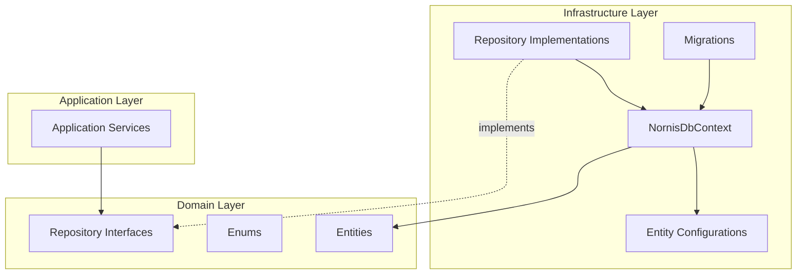
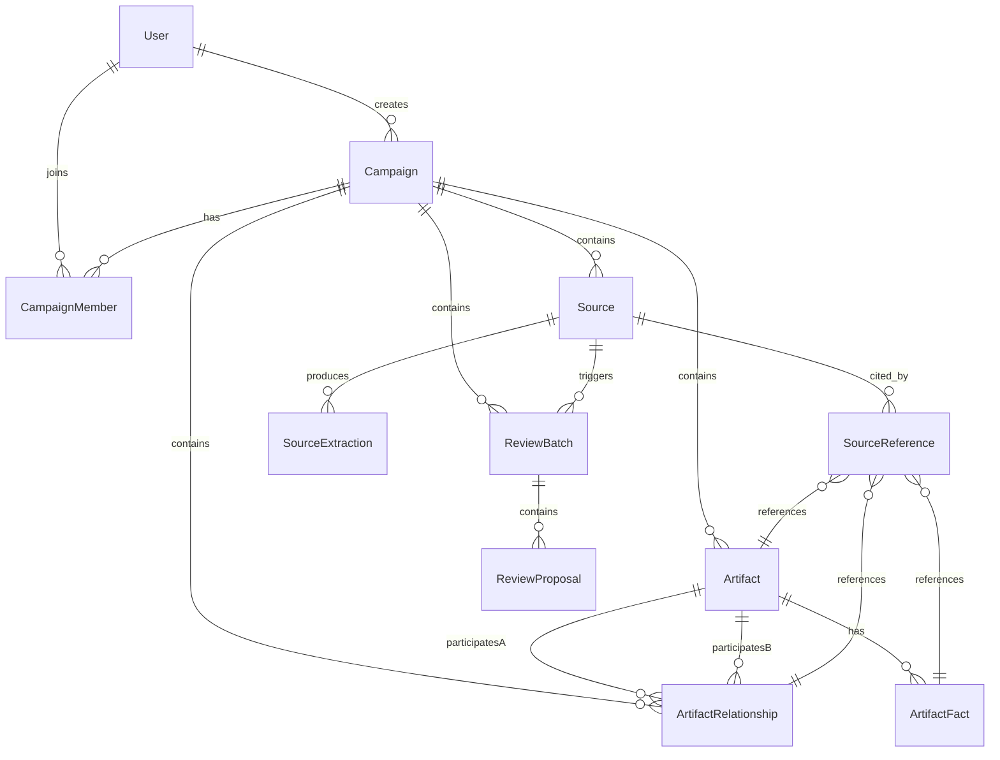

# Design Document: Domain Data Layer

## Overview

This design defines the core domain model, repository interfaces, EF Core persistence layer, and initial database migration for the Nornis application. The domain data layer provides the foundational data structures and access patterns that all higher layers depend on.

The implementation follows clean architecture principles:
- **Nornis.Domain** — Entity classes, enums, and repository interfaces. Zero infrastructure dependencies.
- **Nornis.Infrastructure** — EF Core DbContext, entity configurations, repository implementations, and migrations.

The design targets .NET 8, Azure SQL via EF Core, and uses the repository pattern to decouple domain/application logic from persistence concerns.

## Architecture



**Key Design Decisions:**

1. **Repository pattern over direct DbContext** — Application services depend on interfaces, not EF Core. This keeps the domain testable and allows swapping persistence strategies.
2. **Enums stored as strings** — All enum columns use EF Core value converters to store as `nvarchar`. This makes the database self-documenting and simplifies debugging queries.
3. **Optimistic concurrency via RowVersion** — Mutable entities use SQL Server's `rowversion` column for conflict detection without pessimistic locking.
4. **DateTimeOffset everywhere** — All timestamps use `DateTimeOffset` mapped to SQL Server's `datetimeoffset` type to preserve timezone context.
5. **Restrict/NoAction for cross-aggregate deletes** — Prevents accidental cascade deletes across campaign boundaries while allowing EF Core to track relationships.

## Components and Interfaces

### Domain Layer (`Nornis.Domain`)

**Folder Structure:**
```
Nornis.Domain/
├── Enums/
│   ├── CampaignRole.cs
│   ├── SourceType.cs
│   ├── SourceProcessingStatus.cs
│   ├── ArtifactType.cs
│   ├── ArtifactStatus.cs
│   ├── TruthState.cs
│   ├── VisibilityScope.cs
│   ├── ReviewBatchStatus.cs
│   ├── ReviewProposalStatus.cs
│   ├── ReviewChangeType.cs
│   ├── ReviewTargetType.cs
│   ├── SourceExtractionType.cs
│   ├── SourceReferenceTargetType.cs
│   ├── AiOperationType.cs
│   └── ConversationRole.cs
├── Entities/
│   ├── User.cs
│   ├── Campaign.cs
│   ├── CampaignMember.cs
│   ├── Source.cs
│   ├── SourceExtraction.cs
│   ├── Artifact.cs
│   ├── ArtifactFact.cs
│   ├── ArtifactRelationship.cs
│   ├── SourceReference.cs
│   ├── ReviewBatch.cs
│   ├── ReviewProposal.cs
│   └── AiUsageRecord.cs
└── Repositories/
    ├── ICampaignRepository.cs
    ├── ICampaignMemberRepository.cs
    ├── ISourceRepository.cs
    ├── IArtifactRepository.cs
    ├── IArtifactFactRepository.cs
    ├── IArtifactRelationshipRepository.cs
    ├── IReviewBatchRepository.cs
    ├── IReviewProposalRepository.cs
    ├── ISourceReferenceRepository.cs
    ├── IAiUsageRecordRepository.cs
    └── IUserRepository.cs
```

### Infrastructure Layer (`Nornis.Infrastructure`)

**Folder Structure:**
```
Nornis.Infrastructure/
├── Persistence/
│   ├── NornisDbContext.cs
│   ├── Configurations/
│   │   ├── UserConfiguration.cs
│   │   ├── CampaignConfiguration.cs
│   │   ├── CampaignMemberConfiguration.cs
│   │   ├── SourceConfiguration.cs
│   │   ├── SourceExtractionConfiguration.cs
│   │   ├── ArtifactConfiguration.cs
│   │   ├── ArtifactFactConfiguration.cs
│   │   ├── ArtifactRelationshipConfiguration.cs
│   │   ├── SourceReferenceConfiguration.cs
│   │   ├── ReviewBatchConfiguration.cs
│   │   ├── ReviewProposalConfiguration.cs
│   │   └── AiUsageRecordConfiguration.cs
│   ├── Repositories/
│   │   ├── CampaignRepository.cs
│   │   ├── CampaignMemberRepository.cs
│   │   ├── SourceRepository.cs
│   │   ├── ArtifactRepository.cs
│   │   ├── ArtifactFactRepository.cs
│   │   ├── ArtifactRelationshipRepository.cs
│   │   ├── ReviewBatchRepository.cs
│   │   ├── ReviewProposalRepository.cs
│   │   ├── SourceReferenceRepository.cs
│   │   ├── AiUsageRecordRepository.cs
│   │   └── UserRepository.cs
│   └── Migrations/
│       └── <timestamp>_InitialCreate.cs
```

### Repository Interface Design

All repository interfaces follow consistent patterns:

```csharp
public interface ICampaignRepository
{
    Task<Campaign> CreateAsync(Campaign campaign, CancellationToken cancellationToken = default);
    Task<Campaign?> GetByIdAsync(Guid id, CancellationToken cancellationToken = default);
    Task<Campaign> UpdateAsync(Campaign campaign, CancellationToken cancellationToken = default);
    Task<IReadOnlyList<Campaign>> ListByUserAsync(Guid userId, CancellationToken cancellationToken = default);
}
```

Key interface conventions:
- All I/O methods return `Task` or `Task<T>`
- All I/O methods accept `CancellationToken`
- Query methods that may return nothing use nullable return types (`T?`)
- Collection queries return `IReadOnlyList<T>`
- Create/update methods return the persisted entity

### NornisDbContext Design

```csharp
public class NornisDbContext : DbContext
{
    public DbSet<User> Users => Set<User>();
    public DbSet<Campaign> Campaigns => Set<Campaign>();
    public DbSet<CampaignMember> CampaignMembers => Set<CampaignMember>();
    public DbSet<Source> Sources => Set<Source>();
    public DbSet<SourceExtraction> SourceExtractions => Set<SourceExtraction>();
    public DbSet<Artifact> Artifacts => Set<Artifact>();
    public DbSet<ArtifactFact> ArtifactFacts => Set<ArtifactFact>();
    public DbSet<ArtifactRelationship> ArtifactRelationships => Set<ArtifactRelationship>();
    public DbSet<SourceReference> SourceReferences => Set<SourceReference>();
    public DbSet<ReviewBatch> ReviewBatches => Set<ReviewBatch>();
    public DbSet<ReviewProposal> ReviewProposals => Set<ReviewProposal>();
    public DbSet<AiUsageRecord> AiUsageRecords => Set<AiUsageRecord>();

    protected override void OnModelCreating(ModelBuilder modelBuilder)
    {
        modelBuilder.ApplyConfigurationsFromAssembly(typeof(NornisDbContext).Assembly);
    }
}
```

## Data Models

### Entity Relationship Diagram



### Enum Definitions

| Enum | Values |
|------|--------|
| CampaignRole | GM, Player, Observer |
| SourceType | SessionNote, JournalEntry, Transcript, Upload, Image, HandwrittenNotes, WebLink, GMNote, ImportedNote |
| SourceProcessingStatus | Draft, Ready, Queued, Processing, Processed, Failed |
| ArtifactType | Character, Location, Item, Faction, Event, Thread, Concept, Document |
| ArtifactStatus | Active, Dormant, Resolved, Archived |
| TruthState | Confirmed, Likely, Rumor, Disputed, False, Hidden |
| VisibilityScope | Private, GMOnly, PartyVisible |
| ReviewBatchStatus | Pending, InReview, Completed, Canceled, Failed |
| ReviewProposalStatus | Pending, Accepted, Rejected, Edited |
| ReviewChangeType | CreateArtifact, UpdateArtifact, MergeArtifact, AddFact, UpdateFact, AddRelationship, UpdateRelationship |
| ReviewTargetType | Artifact, ArtifactFact, ArtifactRelationship |
| SourceExtractionType | Manual, OCR, VisionSummary, Transcription, WebPageText |
| SourceReferenceTargetType | Artifact, ArtifactFact, ArtifactRelationship, ReviewProposal |
| AiOperationType | SourceExtraction, ArtifactSummary, AskLoremaster, SourceExtractionRepair |
| ConversationRole | User, Assistant |

### Entity Details

#### User
| Property | Type | Constraints |
|----------|------|-------------|
| Id | Guid | PK |
| Auth0SubjectId | string | Required, max 200, unique index |
| Username | string | Required, max 200 |
| Email | string | Required, max 200 |
| CreatedAt | DateTimeOffset | Required |
| UpdatedAt | DateTimeOffset | Required |
| RowVersion | byte[] | Concurrency token |

#### Campaign
| Property | Type | Constraints |
|----------|------|-------------|
| Id | Guid | PK |
| Name | string | Required, max 200 |
| Description | string? | Max 2000 |
| GameSystem | string? | Max 200 |
| CreatedAt | DateTimeOffset | Required |
| UpdatedAt | DateTimeOffset | Required |
| CreatedByUserId | Guid | FK → User, Restrict |
| RowVersion | byte[] | Concurrency token |

#### CampaignMember
| Property | Type | Constraints |
|----------|------|-------------|
| Id | Guid | PK |
| CampaignId | Guid | FK → Campaign, Cascade |
| UserId | Guid | FK → User, Restrict |
| Role | CampaignRole | Required, stored as string |
| DisplayName | string? | Max 200 |
| CharacterName | string? | Max 200 |
| JoinedAt | DateTimeOffset | Required |

**Index:** Unique composite on (CampaignId, UserId)

#### Source
| Property | Type | Constraints |
|----------|------|-------------|
| Id | Guid | PK |
| CampaignId | Guid | FK → Campaign, Cascade |
| Type | SourceType | Required, stored as string |
| Title | string | Required, max 200 |
| Body | string? | nvarchar(max) |
| Uri | string? | Max 2000 |
| OccurredAt | DateTimeOffset? | |
| CreatedAt | DateTimeOffset | Required |
| CreatedByUserId | Guid | FK → User, Restrict |
| Visibility | VisibilityScope | Required, stored as string |
| ProcessingStatus | SourceProcessingStatus | Required, stored as string |

**Index:** (CampaignId, ProcessingStatus)

#### SourceExtraction
| Property | Type | Constraints |
|----------|------|-------------|
| Id | Guid | PK |
| SourceId | Guid | FK → Source, Cascade |
| ExtractionType | SourceExtractionType | Required, stored as string |
| Text | string | Required, nvarchar(max) |
| Confidence | decimal? | |
| CreatedAt | DateTimeOffset | Required |

#### Artifact
| Property | Type | Constraints |
|----------|------|-------------|
| Id | Guid | PK |
| CampaignId | Guid | FK → Campaign, Cascade |
| Type | ArtifactType | Required, stored as string |
| Name | string | Required, max 200 |
| Summary | string? | Max 2000 |
| Visibility | VisibilityScope | Required, stored as string |
| Confidence | decimal? | |
| Status | ArtifactStatus | Required, stored as string |
| CreatedAt | DateTimeOffset | Required |
| UpdatedAt | DateTimeOffset | Required |
| RowVersion | byte[] | Concurrency token |

#### ArtifactFact
| Property | Type | Constraints |
|----------|------|-------------|
| Id | Guid | PK |
| ArtifactId | Guid | FK → Artifact, Cascade |
| Predicate | string | Required, max 200 |
| Value | string | Required, max 2000 |
| Confidence | decimal? | |
| TruthState | TruthState | Required, stored as string |
| Visibility | VisibilityScope | Required, stored as string |
| CreatedAt | DateTimeOffset | Required |
| UpdatedAt | DateTimeOffset | Required |
| RowVersion | byte[] | Concurrency token |

#### ArtifactRelationship
| Property | Type | Constraints |
|----------|------|-------------|
| Id | Guid | PK |
| CampaignId | Guid | FK → Campaign, Cascade |
| ArtifactAId | Guid | FK → Artifact, Restrict |
| ArtifactBId | Guid | FK → Artifact, Restrict |
| Type | string | Required, max 200 |
| Description | string? | Max 2000 |
| Confidence | decimal? | |
| TruthState | TruthState | Required, stored as string |
| Visibility | VisibilityScope | Required, stored as string |
| CreatedAt | DateTimeOffset | Required |
| UpdatedAt | DateTimeOffset | Required |
| RowVersion | byte[] | Concurrency token |

**Indexes:** (ArtifactAId), (ArtifactBId)

#### SourceReference
| Property | Type | Constraints |
|----------|------|-------------|
| Id | Guid | PK |
| SourceId | Guid | FK → Source, Cascade |
| TargetType | SourceReferenceTargetType | Required, stored as string |
| TargetId | Guid | Required |
| Quote | string? | Max 2000 |
| Notes | string? | Max 2000 |
| CreatedAt | DateTimeOffset | Required |

#### ReviewBatch
| Property | Type | Constraints |
|----------|------|-------------|
| Id | Guid | PK |
| CampaignId | Guid | FK → Campaign, Cascade |
| SourceId | Guid | FK → Source, Restrict |
| Status | ReviewBatchStatus | Required, stored as string |
| CreatedAt | DateTimeOffset | Required |
| CompletedAt | DateTimeOffset? | |

#### ReviewProposal
| Property | Type | Constraints |
|----------|------|-------------|
| Id | Guid | PK |
| ReviewBatchId | Guid | FK → ReviewBatch, Cascade |
| ChangeType | ReviewChangeType | Required, stored as string |
| TargetType | ReviewTargetType | Required, stored as string |
| TargetId | Guid? | |
| ProposedValueJson | string | Required, nvarchar(max) |
| Rationale | string? | Max 2000 |
| Confidence | decimal? | |
| Status | ReviewProposalStatus | Required, stored as string |
| CreatedAt | DateTimeOffset | Required |
| ReviewedAt | DateTimeOffset? | |
| ReviewedByUserId | Guid? | FK → User, Restrict |
| RowVersion | byte[] | Concurrency token |

**Index:** (ReviewBatchId, Status)

#### AiUsageRecord
| Property | Type | Constraints |
|----------|------|-------------|
| Id | Guid | PK |
| CampaignId | Guid? | FK → Campaign, SetNull |
| UserId | Guid? | FK → User, SetNull |
| OperationType | AiOperationType | Required, stored as string |
| Model | string | Required, max 200 |
| InputTokens | int | Required |
| OutputTokens | int | Required |
| TotalTokens | int | Required |
| EstimatedCostUsd | decimal | Required |
| SourceId | Guid? | FK → Source, SetNull |
| ReviewBatchId | Guid? | FK → ReviewBatch, SetNull |
| DurationMs | int | Required |
| Succeeded | bool | Required |
| ErrorCode | string? | Max 200 |
| CreatedAt | DateTimeOffset | Required |


## Correctness Properties

*A property is a characteristic or behavior that should hold true across all valid executions of a system — essentially, a formal statement about what the system should do. Properties serve as the bridge between human-readable specifications and machine-verifiable correctness guarantees.*

### Property 1: Entity Persistence Round-Trip

*For any* valid domain entity (with all required properties populated including enum fields), creating it via the repository and then retrieving it by ID should return an entity with all properties — including enum values — equivalent to the original.

**Validates: Requirements 5.4, 7.4**

### Property 2: Update Persistence

*For any* valid domain entity that has been persisted, modifying a mutable property and calling the repository update method, then retrieving the entity by ID, should reflect the modified value.

**Validates: Requirements 7.5**

### Property 3: Optimistic Concurrency Detection

*For any* mutable entity (Campaign, User, Artifact, ArtifactFact, ArtifactRelationship, ReviewProposal), if two concurrent modifications are attempted against the same row version, the second save should fail with a concurrency exception.

**Validates: Requirements 6.9**

### Property 4: Bidirectional Relationship Query

*For any* artifact that participates in relationships (as either ArtifactAId or ArtifactBId), listing relationships for that artifact should return all relationships where the artifact appears on either side, regardless of position.

**Validates: Requirements 7.6**

## Error Handling

### Concurrency Conflicts
- Repository update methods that encounter a `DbUpdateConcurrencyException` should propagate it to the calling application service. The application layer decides whether to retry, merge, or report the conflict to the user.

### Duplicate Key Violations
- Attempting to create a `CampaignMember` with a duplicate (CampaignId, UserId) combination will result in a `DbUpdateException` due to the unique index constraint. The application layer should catch this and return a meaningful domain error.

### Foreign Key Violations
- Attempting to create an entity with a non-existent foreign key (e.g., a Source with an invalid CampaignId) will result in a `DbUpdateException`. Repository implementations do not validate FK existence — that's enforced by the database.

### Cancellation
- All repository methods accept `CancellationToken` and propagate it to EF Core operations. When cancelled, `OperationCanceledException` is thrown. Callers should handle graceful shutdown.

### Nullable Navigation Properties
- Navigation properties may be null if not explicitly loaded via `.Include()`. Repository query methods document which navigations they eagerly load. Callers should not assume navigations are populated unless the method contract guarantees it.

## Testing Strategy

### Unit Tests (Nornis.Domain.Tests)

Focus areas:
- Verify all enums have expected values (reflection-based assertions)
- Verify all entity classes have expected properties with correct types
- Verify all repository interfaces define required method signatures
- Verify all repository interface methods accept CancellationToken
- Verify all repository interface methods return Task/Task<T>
- Verify Domain project has no infrastructure package references

These are structural "contract" tests that guard against accidental refactoring breakage.

### Integration Tests (Nornis.Infrastructure.Tests)

Focus areas:
- Entity persistence round-trips using SQLite in-memory provider or SQL Server LocalDB
- EF Core model validation (table names, column types, max lengths, indexes)
- Concurrency token behavior under concurrent updates
- Repository query behavior (filtering, visibility, bidirectional relationship lookup)
- Migration applies cleanly to a fresh database

### Property-Based Tests (Nornis.Infrastructure.Tests)

**Library:** FsCheck.NUnit (FsCheck integrated with NUnit)

**Configuration:** Minimum 100 iterations per property test.

**Tag format:** Feature: domain-data-layer, Property {number}: {property_text}

Property tests will use EF Core's SQLite in-memory provider to execute quickly without requiring a live database. Custom Arbitrary generators will produce valid entity instances respecting required field constraints.

Properties to implement:
1. **Entity persistence round-trip** — Generate random valid entities across all 12 entity types with random enum values. Persist via repository, retrieve by ID, assert equivalence.
2. **Update persistence** — Generate random valid entities, persist, mutate a random mutable field, update via repository, retrieve, assert the mutation is reflected.
3. **Optimistic concurrency detection** — Generate a random mutable entity, persist, load two copies via separate DbContext instances, modify both, save one, assert second save throws DbUpdateConcurrencyException.
4. **Bidirectional relationship query** — Generate an artifact with relationships on both sides (as ArtifactA and ArtifactB), persist all, query relationships for the artifact, assert all relationships are returned.

### Test Data Conventions

Per project steering, use realistic campaign examples in tests:
- Campaign: "Black Harbor Investigation"
- Characters: Captain Voss, Tavrin
- Locations: Black Harbor
- Items: Silver Key
- Threads: Missing Caravan
