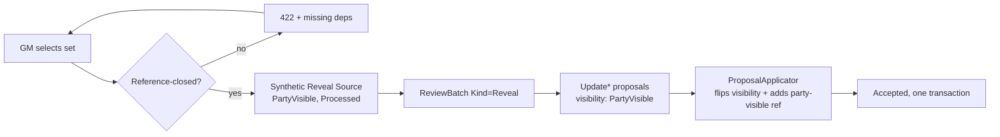

# Design Document

## Overview

Reveal is a thin service over machinery that already exists. Reading the applicator settles
the core question: **changing visibility is already a solved operation.** `ApplyUpdateArtifact`,
`ApplyUpdateFact`, and `ApplyUpdateRelationship` each honor a `visibility` field in the
payload ([ProposalApplicator.cs:232](../../../src/Nornis.Application/Application/ProposalApplicator.cs),
`:441`, `:543`), and `ResolveVisibility` uses an explicitly-supplied scope verbatim — the
source-visibility clamp is only a fallback. So a reveal is nothing more than:

> a synthetic `PartyVisible` reveal source + a `Kind = "Reveal"` batch + one `Update*`
> proposal per element carrying `{ "visibility": "PartyVisible" }`, applied and accepted in
> one transaction — the exact confirm-and-apply shape `ArtifactMergeService` and
> `StorylineRetrospectiveService` already use.

No new `ReviewChangeType`. No applicator change. The new code is a service that (1) validates
the set is reference-closed, (2) builds the provenance, (3) drives the applicator. Phase 2
adds the one genuinely missing capability — flipping a *source's* visibility past the 409.



## Why flip-in-place, not copy

An earlier sketch worried that flipping a GM-only element to `PartyVisible` would expose its
GM-only provenance. The applicator makes that a non-issue: on every `Update*` apply it writes
a **new** `SourceReference` from the batch's source to the element
([ProposalApplicator.cs:451](../../../src/Nornis.Application/Application/ProposalApplicator.cs)).
Because the reveal source is `PartyVisible`, the revealed element gains player-visible
provenance ("learned via the reveal"), while its original `GMOnly` references remain for the
GM and stay filtered from players by `CanSeeSource`. So we flip in place — no artifact/fact
duplication, no dangling identity.

## Phase 1 — Canon reveal

### Service

New Application service `RevealService : IRevealService`:

```csharp
Task<AppResult<RevealResult>> RevealAsync(RevealCommand command, CancellationToken ct);

public record RevealCommand(
    Guid WorldId,
    Guid ActingUserId,
    WorldRole ActingUserRole,
    IReadOnlyList<Guid> ArtifactIds,
    IReadOnlyList<Guid> FactIds,
    IReadOnlyList<Guid> RelationshipIds,
    IReadOnlyList<FactCorrection> Corrections,   // Requirement 5, may be empty
    string? Note);                               // optional GM framing for the reveal source body

public record FactCorrection(Guid FactId, TruthState TruthState);

public record RevealResult(
    Guid BatchId, int RevealedArtifacts, int RevealedFacts,
    int RevealedRelationships, int Corrections);
```

Flow:

1. **Gate.** `role != GM` → 403. Load every referenced element; anything not in `WorldId`,
   or not currently `GMOnly` (for promotions) → 404/400. Already-`PartyVisible` promotions
   are dropped as no-ops (Requirement 1.5).
2. **Closure check** (Requirement 2). Build the post-reveal visible set = (already
   `PartyVisible` artifacts) ∪ (artifacts in the request). For each fact in the set, its
   `ArtifactId` must be in that set; for each relationship, both `ArtifactAId` and
   `ArtifactBId` must be. Missing ids are collected and returned as `422 reveal_not_closed`
   with the dependency list. No silent expansion.
3. **Provenance.** Mint the reveal `Source` (`SourceType.Reveal`, `PartyVisible`,
   `Processed`, title `Reveal — {date}`, body = `command.Note` plus a rendered list of what
   was revealed) and a `ReviewBatch { Kind = "Reveal", Status = Completed }`.
4. **Apply.** For each element, create the matching `Update*` `ReviewProposal` with
   `ProposedValueJson = { "visibility": "PartyVisible" }` (corrections use `UpdateFact` with
   `{ "truthState": "..." }`), call `_proposalApplicator.ApplyAsync`, and on success mark the
   proposal `Accepted` with `ReviewedByUserId`/`ReviewedAt`. All inside one
   `IUnitOfWork` transaction; any failure rolls the whole reveal back.
5. Return `RevealResult`.

This mirrors `ArtifactMergeService.MergeAsync` almost line for line, including the
transaction and accept-stamping.

### API

```text
POST /api/worlds/{worldId}/reveal      → RevealResponse   (GM-only)
```

- Request body: the id lists + optional corrections + optional note.
- `422 reveal_not_closed` returns `{ missingArtifactIds, missingFactIds }` so the client can
  offer "reveal these too" and resubmit.
- Response: the `RevealResult` counts + `batchId` (the client can deep-link to the batch).
- A read to *populate* the GM's selection UI reuses existing artifact/fact/relationship reads
  under the GM's `VisibilityFilter` — no new read model in Phase 1.

### Enum + display

- Add `SourceType.Reveal`. Enums are stored as strings, so the migration is additive.
- Map it in [`SourceTypeDisplay`](../../../src/Nornis.Web/Services/SourceTypeDisplay.cs)
  (e.g. "Reveal") so the sources ledger renders it.

### UI

- A GM-only **Reveal** action on artifact / fact / relationship detail, supporting a
  single element and a multi-select set.
- A confirm dialog that, when the set isn't closed, shows the required dependencies (from the
  `422`) and lets the GM add them before confirming — the one place the "reveal the place vs
  its secrets" choice is made visible.
- The dedicated reveal queue / session-wrap-up integration is intentionally **not** here; the
  convergence gauge (future) is what will feed a queue. Phase 1 is the manual primitive.

## Phase 2 — Source reveal

The one capability with no existing mechanism: a source's visibility cannot change after
processing (the 409). Phase 2 adds a sanctioned path.

- Extend `RevealService` (or a sibling method `RevealSourceAsync`) to flip a `GMOnly`
  source to `PartyVisible`, GM-gated, recording the change with provenance (the reveal is
  itself a note; the simplest form updates the source in a small transaction and logs an
  `AiUsageRecord`-free audit row — no proposal is needed because a source is not a canon
  proposal target).
- Attachments (the map image) inherit the source's visibility at read time, so revealing the
  source is sufficient to surface the image; confirm this against `MapViewService`'s gating
  during build.
- The `SourceService` 409 stays as the guard for *ordinary* edits; only the reveal path may
  raise a processed source's visibility. Add a focused carve-out (a dedicated
  `RaiseVisibilityAsync` on the source repo/service used only by reveal) rather than loosening
  the general update.
- `POST /api/worlds/{worldId}/sources/{sourceId}/reveal` (GM-only).

Revealing a source and revealing its derived canon stay independent (Requirement 6.3): the
map worked example is "reveal the source (image) in Phase 2" + "reveal the chosen locations
via Phase 1," composed by the UI.

## Reconciliation (noted, not built here)

When a revealed GM-only artifact duplicates a party-visible one, the fix is the existing
merge — and crucially `ApplyMergeArtifact` already reassigns the duplicate's facts by
changing only `ArtifactId`, never their visibility
([ProposalApplicator.cs:295](../../../src/Nornis.Application/Application/ProposalApplicator.cs)),
so merging a GM-only place into a party-visible one yields exactly the intended
public-artifact-with-private-facts. The reveal UI may offer "this looks like an existing
artifact — merge instead" by handing the pair to `ArtifactMergeService`. *Detecting* the pair
automatically is out of scope (see requirements).

## Correctness Properties

*A property is a characteristic that should hold across all valid executions — the bridge
between the spec and machine-verifiable tests.*

### Property 1: Reveal only raises visibility

*For any* reveal command, every element it changes ends `PartyVisible`, and no element's
visibility is lowered; `Private` elements are never touched. **Validates: Req 1.4.**

### Property 2: Post-reveal closure

*For any* accepted reveal, the resulting graph contains no `PartyVisible` fact whose artifact
is `GMOnly`, and no `PartyVisible` relationship with a `GMOnly` endpoint. **Validates: Req 2.1.**

### Property 3: Non-closed sets are rejected whole

*For any* set that is not reference-closed, the operation changes nothing and returns the
missing dependencies. **Validates: Req 2.2, 2.3, 1.6.**

### Property 4: Player-visible provenance after reveal

*For any* revealed element, a player caller sees at least one source reference (the reveal
source) and no `GMOnly` source reference. **Validates: Req 3.3.**

### Property 5: Reveal is GM-only and idempotent

*For any* non-GM caller the operation 403s and mutates nothing; *for any* element already
`PartyVisible`, re-revealing is a no-op. **Validates: Req 1.3, 1.5.**

### Property 6: Selective

*For any* reveal of an artifact, its facts and relationships not named in the set keep their
prior visibility. **Validates: Req 4.1.**

## Error Handling

- Non-GM → `403 insufficient_role`.
- Element not found / wrong world → `404`.
- Non-closed set → `422 reveal_not_closed` with the missing dependency ids.
- Applicator failure on any element → whole transaction rolls back; `RevealResult` is not
  returned; the batch and reveal source do not persist.
- Concurrency: `Update*` applies load-then-save inside the transaction; a `RowVersion`
  conflict surfaces as the standard concurrency error and rolls back.

## Testing

Per repo testing strategy (NUnit; authorization/visibility and proposal application are top
priorities; Voss / Black Harbor / Silver Key / Missing Caravan as data):

- `RevealServiceTests`: GM gate (403); GMOnly→PartyVisible for each element kind; already-
  PartyVisible no-op; not-closed rejection returns exact missing set and mutates nothing;
  closure satisfied when a dependency is included in the same set; corrections re-truth-state
  a party-visible fact in the same batch; transactional rollback when one element fails;
  accepted proposals carry the acting GM + batch `Kind = "Reveal"`; reveal source is
  `PartyVisible`.
- Property tests (FsCheck, mirroring the domain-layer property suite) for Properties 1–6 over
  random valid GM-only subgraphs.
- Controller/authorization tests: non-member 404, player/observer 403, GM round-trip proving
  a Black Harbor GM-only fact becomes visible to a player caller afterward, with reveal
  provenance and no GM-only reference leaking.
- Phase 2: source 409 still blocks ordinary edits; the reveal path raises a processed GM-only
  source to `PartyVisible`; a player can then load the previously GM-only map source; derived
  GM-only locations stay hidden until separately revealed.

## Design decisions to confirm before build

1. **Non-closed handling: reject-with-deps (chosen) vs auto-include.** Rejecting keeps the GM
   in explicit control of scope (aligns with "reveal the place, not its secrets"); the UI adds
   the deps and resubmits. Leaning reject.
2. **`SourceType.Reveal` (chosen) vs reuse `GMNote` at `PartyVisible`.** A dedicated type reads
   correctly in the ledger and is a trivial additive enum. Leaning new type.
3. **Phase 2 source reveal: no proposal (chosen) vs a proposal path.** A source is not a canon
   proposal target; a direct gated `RaiseVisibilityAsync` with an audit note is simpler than
   inventing a source-visibility proposal. Leaning direct.
4. **Corrections in Phase 1 (chosen) vs deferred.** Cheap (reuse `UpdateFact` truthstate) and
   completes the believed→learned story; detection stays out of scope regardless.
