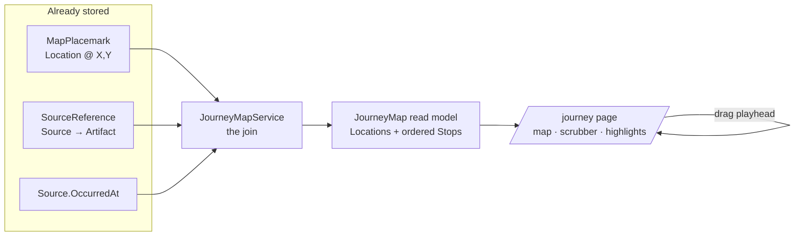

# Design Document

## Overview

The Journey view answers one question the record already contains but never shows:
**where has the party been, and in what order?** Nornis already knows *where* places sit
(map pins) and *when* sessions happened (`Source.OccurredAt`); it just never crosses the two.
This feature crosses them. A map on top, a session timeline below, and a draggable playhead
that walks the trail — as you scrub, the path lights up pin by pin and the current session's
artifacts and events surface beside it.

Like Reveal (feature 17), this is **assembly of mechanisms that already exist**, not new
machinery. The read model joins three things Nornis already stores:

> **pinned Locations** (`MapPlacemark` → `Location` artifact at X/Y) **⋈**
> **the sessions that touched each Location** (`SourceReference` → `Source`) **⋈**
> **the calendar** (`Source.OccurredAt`)

No new entities, no migration in Phase 1. `MapViewService` already produces the "where" layer;
the storyline timeline already orders sessions by `OccurredAt`. The new service is the join,
and the new UI is a map + a single-axis scrubber.



## What the user sees

```text
┌──────────────────────────────────────────────────────────────────┐
│  Journey — Voss campaign                       [ map: Regional ▾ ] │
│ ┌──────────────────────────────────────────────────────────────┐ │
│ │        ◍ Black Harbor                                         │ │
│ │         \                                                     │ │
│ │          \──────────── ◉ Saltmere   ← current stop            │ │
│ │                         \                                     │ │
│ │              ● Silverreach          ○ Cinderfell (not yet)    │ │
│ │                                                               │ │
│ │      ● traveled     ◉ current     ○ not yet reached           │ │
│ └──────────────────────────────────────────────────────────────┘ │
│                                                                    │
│  Session 5 · "The Saltmere Bargain" · Apr 12                       │
│    ├─ Event     A deal struck with the harbourmaster            →  │
│    ├─ Location  Saltmere — first visit                          →  │
│    └─ Item      Tide-glass compass                              →  │
│                                                                    │
│  Jan ──●────────●─────●──────────[◉]───────○──────────○────── Jun  │
│        S1       S2    S3          S5        S6         S8           │
│                                    ▲ drag                           │
└──────────────────────────────────────────────────────────────────┘
```

Three zones: **map** (pins + cumulative trail), **stop panel** (the current session's
highlights, each a link to its artifact/source), **scrubber** (sessions on a real-calendar
axis with a draggable playhead). Dragging the playhead is the whole interaction — everything
else is a projection of where it sits.

## The read model

A new Application read model, mirroring `MapView`'s shape so the "where" layer is literally
reusable:

```csharp
public sealed record JourneyMap(
    Guid MapAttachmentId,
    string ImageUrl,
    IReadOnlyList<JourneyLocation> Locations,   // the pins = graph nodes
    IReadOnlyList<JourneyStop> Stops);          // one per dated, visible session, OccurredAt order

public sealed record JourneyLocation(
    Guid ArtifactId, string Name, decimal X, decimal Y, string? Label);

public sealed record JourneyStop(
    Guid SourceId,
    string Title,
    DateTimeOffset OccurredAt,
    IReadOnlyList<Guid> VisitedLocationIds,      // pinned Locations this session touched
    IReadOnlyList<JourneyHighlight> Highlights); // what to show in the stop panel

public sealed record JourneyHighlight(
    Guid ArtifactId, string Name, string Type, bool FirstSeen);
```

The client needs nothing more to render every frame: `Stops[i]` is the playhead position, the
trail is `Stops[0..i]` connected through each stop's visited-pin centroid, and the current pins
are `Stops[i].VisitedLocationIds`.

## The service

```csharp
public interface IJourneyMapService
{
    /// The world's journey over one map: the map image, its visible location pins, and
    /// the visible dated sessions in order, each carrying the pins it visited. 404 when
    /// the world has no map with visible pins (or the requested map is invisible/absent).
    Task<AppResult<JourneyMap>> GetJourneyAsync(
        Guid worldId, Guid? mapSourceId, Guid userId, WorldRole role, CancellationToken ct);
}
```

Flow:

1. **Pick the canvas.** If `mapSourceId` is given, resolve that source's `MapImage`
   attachment (reusing `MapViewService`'s gate); else auto-pick the world's **richest visible
   map** — the `MapImage` attachment with the most caller-visible placemarks, ties broken by
   most recent `OccurredAt`/`CreatedAt`. No visible map → `404 no_map`.
2. **Build the Locations layer.** This is exactly `MapViewService.GetMapAsync` output: image
   SAS URL + placemarks filtered through `VisibilityFilter.ForRole(role, userId)`. A pin only
   exists when the caller may see the artifact it points at (dangling/archived/invisible pins
   drop silently — the existing behavior).
3. **Walk the sessions.** For each pinned Location, load its `SourceReference`s
   (`TargetType = Artifact`) to get the sessions that touched it. Union across pins, keep only
   sessions that are caller-visible (`CanSeeSource`, same predicate `MapViewService` uses) and
   have a non-null `OccurredAt`. Order by `OccurredAt`, then `CreatedAt` as a stable tiebreak.
4. **Assemble stops.** Each surviving session becomes a `JourneyStop`: its visited pins are the
   subset of the map's pins it referenced; its highlights are the visible artifacts that session
   introduced or advanced (the same `SourceReference` walk, widened past Locations to Events,
   Items, Characters). `FirstSeen` = this is the earliest visible session referencing that
   artifact.
5. Return `JourneyMap`.

Steps 1–2 are `MapViewService` verbatim; steps 3–4 are the session walk the continuity and
wrap-up services already do over `SourceReference`. The service is the join, nothing more.

### API

```text
GET /api/worlds/{worldId}/journey?mapSourceId={optional}   → JourneyResponse
```

- Any world member; the response is shaped by the caller's role and id, so a player and a GM
  get **different journeys from the same request** — GM-only pins and sessions simply aren't in
  the player's stops. This is the same visibility contract as the map viewer, not a new one.
- `404 no_map` when there is no visible map with pins, so the client can show the coming-soon
  state.
- `mapSourceId` lets the map picker switch canvases; an invisible or non-map source → `404`.

## Reusing what's built

| Need | Reused from |
| --- | --- |
| Image URL + visible pins | `MapViewService` / `MapView` (lift the pin-filter loop) |
| "Which sessions touched this artifact" | `SourceReference` walk (as in `StorylineDevelopmentReader`, continuity/wrap-up) |
| Calendar X-axis math (`MinDate`/`MaxDate`/`X()`) | `StorylineTimelineChart` — extract into a shared helper both charts call |
| Draggable pointer interaction | `nornis-timeline.js` drag pattern (grab → move → release) |
| Visibility filtering | `VisibilityFilter` + `CanSeeSource` (unchanged) |
| Empty / undated messaging | `StorylineTimelineChart`'s "sessions need an occurred-at date" copy |

## UI

A new page `/journey` (and a **Journey** toggle alongside the map on `SourceDetail`, so a GM
looking at a map can jump straight into its journey). One component, `JourneyMap.razor`:

- **Map layer** — `MapViewer`'s image + percentage-positioned pins, extended with three pin
  states (traveled / current / not-yet-reached) driven by the playhead index, and an SVG
  `<polyline>` trail through visited-pin centroids for stops `0..i`. Pin position math is
  unchanged (`X * 100%`, invariant culture).
- **Scrubber** — a slim single-lane SVG reusing the calendar axis: session ticks positioned by
  `OccurredAt`, a draggable playhead that snaps to the nearest stop. Pointer-based, same
  init/destroy lifecycle as `nornisTimeline`. Keyboard: left/right arrows step stops (the
  playhead is a `role="slider"` with `aria-valuenow`).
- **Stop panel** — `Stops[i].Highlights` as a compact list, each a link to the artifact or the
  session source. `FirstSeen` renders the "first visit" affordance.

State is a single `int _stopIndex`; every visual is a pure function of it, so scrubbing is
local and allocation-free — no server round-trips while dragging.

## Correctness Properties

*A property is a characteristic that should hold across all valid executions — the bridge
between the spec and machine-verifiable tests.*

### Property 1: The trail is visibility-honest

*For any* caller, every pin the journey plots points at an artifact that caller may see, and
every stop is a session that caller may see. A GM-only location or a GM-only session never
appears in a player's journey. **Mirror of `MapViewService`'s pin gate + `CanSeeSource`.**

### Property 2: Chronological monotonicity

*For any* journey, `Stops` is non-decreasing in `OccurredAt`, and the trail rendered at
playhead index *i* is exactly stops `0..i` — no stop is skipped, reordered, or double-counted.

### Property 3: Undated sessions are excluded, not silently dropped

*For any* session with a null `OccurredAt`, it is absent from `Stops` (it cannot be placed in
time) **and** counted in an "N sessions not shown" note, so absence is visible, never silent.

### Property 4: Canvas determinism

*For any* world + caller with no `mapSourceId`, the auto-picked map is deterministic —
most caller-visible pins, ties broken by recency — so repeated loads render the same backdrop.
A supplied `mapSourceId` yields that exact map or a 404, never a different one.

### Property 5: A visited location is a real, single pin

*For any* stop, each id in `VisitedLocationIds` is present in the journey's `Locations` (no
dangling references), and a session that references one location twice yields one membership,
not two.

### Property 6: No fabricated intra-session order

*For any* stop that visited several locations, the journey asserts no order among them (sessions
have no sub-`OccurredAt` granularity). They are one cluster at one stop; the trail only orders
*between* stops. This is a correctness boundary, not a gap to paper over.

## Error Handling

- Non-member → `404` (world not visible), consistent with the rest of the API.
- No visible map with pins, or requested `mapSourceId` invisible/absent/not a map → `404 no_map`;
  the page shows the coming-soon state ("Load a map and pin a few places to see your journey").
- A map exists but no dated visible sessions → `200` with `Stops` empty; the page shows the map
  statically plus the "sessions need an occurred-at date" note (Property 3).
- Blob SAS generation failure → surfaces as the standard `MapViewService` error path; unchanged.

## Testing

Per repo strategy (NUnit; visibility and read-model shape are top priorities; Voss / Black
Harbor / Silver Key / Missing Caravan as fixture data):

- `JourneyMapServiceTests`: auto-pick chooses the richest visible map; `mapSourceId` override
  resolves or 404s; player vs GM get different stop/pin sets from identical data (Property 1);
  stops are `OccurredAt`-ordered with a stable tiebreak (Property 2); undated sessions excluded
  and counted (Property 3); a location referenced twice in one session yields one membership
  (Property 5); dangling/archived pins drop (reuses the `MapViewService` gate); `FirstSeen`
  marks the earliest visible referencing session.
- Property tests (FsCheck, mirroring the domain suite): Properties 2, 4, 5 over random visible
  subgraphs of pins × sessions.
- Controller/authorization tests: non-member 404; `no_map` 404 when the world has a map whose
  only pins are GM-only and the caller is a player; a GM round-trip proving a GM-only stop is
  present for the GM and absent for a player on the same map.
- The client component is exercised by making every frame a pure function of `_stopIndex`
  (unit-testable projection helpers: `TrailThrough(i)`, `PinState(locationId, i)`), so the drag
  interaction itself needs no browser test.

## Phasing

- **Phase 1 — the join, on one map.** Everything above: `JourneyMapService`, the read model,
  `/journey`, auto-pick canvas + `mapSourceId` override. No schema change. This is the whole
  primitive and is independently useful the moment any map has a few pinned, dated visits.
- **Phase 2 — designated world map + richer visits (later).** A GM "set as world map" action
  (a nullable `World.PrimaryMapAttachmentId`, or a flag on `SourceAttachment`) so the canvas is
  explicit rather than heuristic; and optionally widen "visited" to include locations reached
  transitively (a session's `Event` that has an `ArtifactRelationship` to a `Location`). Both
  are refinements the Phase 1 read model can absorb without reshaping.

## Design decisions to confirm before build

1. **Canvas: auto-pick richest map (chosen) vs GM-designated world map.** Auto-pick needs no
   migration and works immediately; the `mapSourceId` param already lets the UI switch maps.
   Explicit designation is cleaner but is schema + an action — deferred to Phase 2. *Leaning
   auto-pick now.*
2. **"Visited" = direct Location reference (chosen) vs relationship-expanded.** Direct
   `SourceReference`-to-Location is reliable (the applicator always writes it) and easy to
   reason about; expanding through Event→Location relationships is more complete but noisier and
   depends on relationship coverage. *Leaning direct now, expansion in Phase 2.*
3. **Trail shape: cumulative (chosen) vs windowed.** "How they've moved around the world" wants
   the whole path so far, with the current stop emphasized. A "just this session" toggle is a
   cheap addition if wanted. *Leaning cumulative with an optional toggle.*
4. **Multi-location sessions: cluster, no intra-order (chosen).** We don't have sub-session
   timing, so we won't invent it (Property 6). Confirm this is acceptable vs, say, ordering by
   pin proximity — which would be a fabricated narrative. *Leaning cluster.*
5. **Home for the view: dedicated `/journey` page (chosen) vs a third mode on `/timeline`.** The
   journey is map-anchored and the storyline timeline is lane-anchored; they share axis math but
   not layout, so a separate page reads cleaner than a third toggle. *Leaning dedicated page,
   with an entry point from `SourceDetail`'s map.*
</content>
</invoke>
