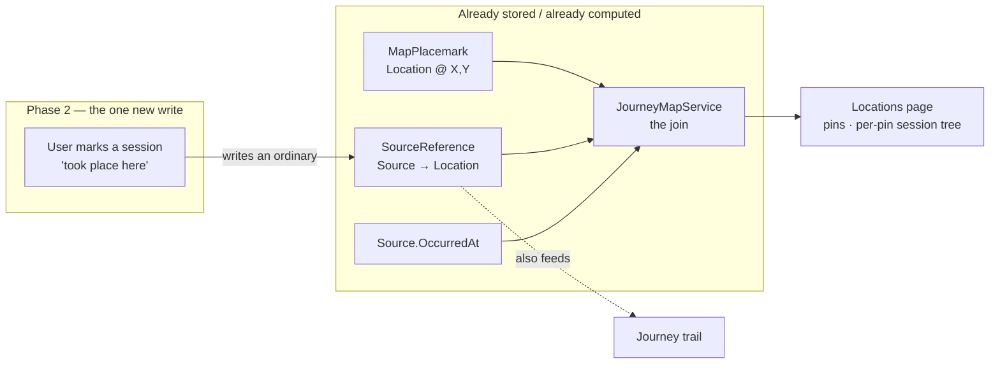

# Design Document

## Overview

Locations is the **place-first dual** of the Journey view. Journey pivots on *time* — drag a
playhead across the sessions and the map answers with the pins each one touched. Locations pivots
on *place* — click a pin and the record answers with the sessions that happened there, in order,
each expanding to its artifacts. Same join, read from the other end:

> pinned **Location** (`MapPlacemark` → Location artifact @ X/Y) **⋈**
> the **sessions** that reference it (`SourceReference`) **⋈**
> the **calendar** (`Source.OccurredAt`)

The whole read is already computed. `JourneyMapService.GetJourneyAsync` returns the pins
(`Locations`) and the dated, caller-visible sessions (`Stops`), each stop carrying the pins it
visited (`VisitedLocationIds`) and the artifacts to show (`Highlights`, complete with `Summary`
for the hover card). The Journey component already turns a pin click into the exact tree this
feature wants (`JourneyMap.razor`, place mode). So **Phase 1 is a promotion, not a build**: lift
that map-and-tree into its own top-level page, drop the time-scrubber, and let the pins lead.

Crucially, Locations is **not time-bound**. Journey treats the map as a projection of time — a
playhead drives each pin's state (traveled / current / not-yet-reached) and draws a cumulative
trail. Locations treats the map as a static *index of places*: pins have exactly two states,
unselected and selected, and there is no playhead and no trail. Time survives only as the
`OccurredAt` sort *inside* a selected pin's session list. And a session's subtree is everything
that session touched — its whole highlight set, not scoped to the selected place — the same content
`JourneyMap` already renders, which is why the existing read model suffices unchanged.

**Phase 2** closes the one gap the derived data leaves. Every `SourceReference` today is authored
by the extraction pipeline, so "this session visited this place" is only ever a guess the AI got
right. Phase 2 adds the first *user-authored* reference — a manual `Source → Location` link set on
the session page — reusing the existing reference rather than a new association type. Because both
this page and Journey read "visited" from the same `SourceReference` rows, one manual link corrects
both surfaces at once.



## What the user sees

```text
┌──────────────────────────────────────────────────────────────────────┐
│  Locations — Voss campaign                          [ map: Regional ▾ ]│
│ ┌────────────────────────────────────┐  ┌──────────────────────────┐  │
│ │       ◉ Black Harbor               │  │  Saltmere                │  │
│ │        \                           │  │  3 dated notes visited   │  │
│ │         ◉ Saltmere ← selected      │  │  ▾ The Saltmere Bargain  │  │
│ │                                    │  │      · Apr 12            │  │
│ │    ● Silverreach   ● Cinderfell    │  │     ├ Event  A deal…   → │  │
│ │                                    │  │     ├ Loc    Saltmere  → │  │
│ │                                    │  │     └ Item   Tide-glass→ │  │
│ │   ● pinned place   ◉ selected      │  │  ▸ Low Tide    · May 3   │  │
│ │   click a pin to read its history  │  │  ▸ The Reckoning· Jun 1  │  │
│ └────────────────────────────────────┘  └──────────────────────────┘  │
└──────────────────────────────────────────────────────────────────────┘
```

Two zones: **map** (pins, one selected) and **place panel** (the selected pin's name, a visit
count, and a tree of dated sessions each expanding to its artifacts — every artifact a link with
an `ArtifactTip` summary). No scrubber, no trail, no temporal pin states. Selecting a pin is the
whole interaction.

## Phase 1 — the view

### Data: reuse the Journey read model verbatim

The page needs, per pin: the dated sessions that visited it, in order, each with its artifacts.
Every byte of that is in `JourneyDto` already:

```csharp
// src/Nornis.Web/ApiClient/Contracts.cs — existing, unchanged
record JourneyDto(Guid MapAttachmentId, string ImageUrl,
    IReadOnlyList<JourneyLocationDto> Locations,   // the pins
    IReadOnlyList<JourneyStopDto> Stops,           // dated, visible sessions in OccurredAt order
    int UndatedSessionCount);
record JourneyStopDto(Guid SourceId, string Title, DateTimeOffset OccurredAt,
    IReadOnlyList<Guid> VisitedLocationIds,        // pins this session touched
    IReadOnlyList<JourneyHighlightDto> Highlights);
record JourneyHighlightDto(Guid ArtifactId, string Name, string Type, bool FirstSeen, string? Summary);
```

The per-pin tree is a pure projection: `Stops.Where(s => s.VisitedLocationIds.Contains(pinId))` is
already `OccurredAt`-ordered, and each stop's `Highlights` are its subtree — the session's whole
touched set, not filtered to the pin. This is precisely `JourneyMap.NotesForLocation(artifactId)`
today. So Phase 1 calls the **existing** `GET /api/worlds/{worldId}/journey` and adds no server
code. (Per-place artifact scoping is the one thing that would break this reuse — and it is
explicitly out of scope, so the reuse holds.)

> **Decision (see below):** reuse `/journey` (chosen) vs a bespoke `/locations` read model. Reuse
> ships now; a dedicated endpoint is only worth it if the two views' payloads diverge.

### UI: extract the shared map-and-tree, then host it place-first

The map layer (percentage-positioned pins over an ``, invariant-culture CSS) and the place
tree (`nornis-journey-tree` markup + the `HashSet<Guid>` expand/collapse toggle + `ArtifactTip`
rows) already live inside `JourneyMap.razor`. Rather than duplicate them:

1. **Extract** the pin-map + place-tree into a reusable component
   (`LocationMap.razor` / `LocationTree.razor`) parameterized by `JourneyDto` + a selected pin.
   `JourneyMap` then renders it in "place mode"; the new page renders it standalone. The
   pin-state logic must be parameterized, not lifted verbatim: Journey drives three temporal states
   from the playhead (`PinClass` reads `CurrentStop`), whereas Locations passes **no** current stop
   and renders only unselected/selected (Requirement 1.5). The extracted component takes the
   selected-pin id and knows nothing about a timeline.
2. **New page** `src/Nornis.Web/Components/Pages/Locations.razor`, `@page "/locations"`, injecting
   `WorldState Worlds` (no `worldId` route param — the app's convention, e.g. `Timeline.razor`).
   It fetches `Api.GetJourneyAsync(Worlds.Current.Id)`, handles the `no_map` code as the coming-soon
   state (as `Timeline.razor` already does), and renders the map with the tree beside it. Pin
   selection is a single `Guid? _selectedPin`; the tree is a pure function of it.
3. **Nav**: one `<MudNavLink Href="/locations" Icon="@Icons.Material.Outlined.Place">Locations
   </MudNavLink>` in `NavMenu.razor`.

State is `Guid? _selectedPin` + the `HashSet<Guid>` of expanded sessions. No server round-trip on
selection or expand — the whole `JourneyDto` is in hand.

> **Sequencing:** the extraction touches `JourneyMap.razor`, which is mid-rework on this branch.
> The clean order is: land the Journey rework, then extract the shared component, then build the
> page. If the page is wanted before the rework lands, Phase 1 may copy the ~30-line tree block and
> the extraction becomes a follow-up cleanup — noted, not recommended.

## Phase 2 — marking sessions with locations

### The write

A manual link is an ordinary `SourceReference` — the model the maintainer chose over a new
association type or a "primary vs mentioned" discriminator:

```
SourceReference { SourceId = session, TargetType = Artifact, TargetId = <Location artifact>,
                  Quote = null, Notes = null, CreatedAt = now }
```

No new entity, no discriminator column. It reuses `ISourceReferenceRepository` and slots into the
same "visited" derivation both this page and Journey already read (Requirement 5.4) — so the moment
a user links a session to Saltmere, that session appears under Saltmere here *and* on the Journey
trail, with zero new read code.

**This is the first user-authored `SourceReference` in a system where every existing row is
extractor-authored.** Two consequences the build must handle:

- **Idempotency.** Before inserting, check for an existing `(SourceId, TargetType=Artifact,
  TargetId)` row; if present, no-op. The read path already de-dupes (`Distinct` on `TargetId`), so a
  stray duplicate would not double-render — but not writing one keeps the table honest.
- **Provenance shape.** Manual links carry no `Quote` (there is no extracted passage). Provenance
  UIs that render references already treat `Quote` as nullable, so a quote-less row displays
  cleanly; no change needed. What the row *cannot* today tell anyone is *who* authored it —
  `SourceReference` has no `CreatedByUserId`. That is the crux of the removal question below.

### The API

Two endpoints under the source (the link is a property *of the session*, edited from the session):

```text
GET    /api/worlds/{worldId}/sources/{sourceId}/locations   → [{ artifactId, name, summary }]
POST   /api/worlds/{worldId}/sources/{sourceId}/locations   { artifactId }   → 200 (idempotent)
DELETE /api/worlds/{worldId}/sources/{sourceId}/locations/{artifactId}        → 204
```

- On `SourcesController`, guarded by the existing `WorldMemberActionFilter`, and further gated to
  callers who may **edit the source** (creator or GM) — the same permission `UpdateAsync` enforces.
- `POST` validates the target is a `Location` artifact in the same world (`400 not_a_location` /
  `404`); it does not require the location to be pinned (a session may sit at an unpinned place —
  it simply won't surface on the map, consistent with today).
- The write lives behind a small Application method (e.g. `ISourceService.LinkLocationAsync` /
  `UnlinkLocationAsync`) so the controller stays thin and the idempotency/validation is unit-tested
  at the service, mirroring the rest of `SourceService`.

### The UI

A "Locations" editor on `SourceDetail.razor`, beside the existing Campaign field: the session's
currently linked places as removable chips, plus an artifact search
(`Api.SearchArtifactsAsync(worldId, term)` filtered to `Type == Location`) to add one. Add/remove
call the endpoints above and refresh the chip list. This is explicitly **not** on the Locations
page (Requirement 5.1) — you mark a session where you edit the session.

## Reusing what's built

| Need | Reused from |
| --- | --- |
| Pins + image URL, visibility-filtered | `JourneyMapService` → `MapViewService` / `MapView` (unchanged) |
| Dated visiting-session list per pin | `JourneyMap.NotesForLocation` projection over `JourneyDto` |
| Map pin rendering (0..1 → `%`, invariant culture) | `JourneyMap` / `MapViewer` percentage positioning |
| Expandable session→artifact tree | `nornis-journey-tree` markup + `HashSet` toggle (`app.css:3050-3108`) |
| Artifact link + hover summary | `ArtifactTip` + the `<a href="/artifacts/{id}" class="nornis-link">` pattern |
| Coming-soon (`no_map`) empty state | `Timeline.razor`'s existing `_journeyNoMap` branch |
| Phase 2 write + permission | `ISourceReferenceRepository` + `SourceService`'s source-edit gate |
| Read visibility | `VisibilityFilter` + `CanSeeSource` (unchanged) |

## Correctness Properties

*A property is a characteristic that should hold across all valid executions — the bridge between
the spec and machine-verifiable tests.*

### Property 1: The view is visibility-honest

*For any* caller, every pin points at a `Location` that caller may see, every session in a tree is
one that caller may see, and every artifact in a subtree is visible to them. A GM-only place,
session, or artifact never appears in a player's view. **Inherited wholesale from the Journey read
model's gates** — this feature adds no visibility logic of its own.

### Property 2: The tree is exactly the per-pin projection

*For any* selected pin *p*, the tree's top level is `{ stop ∈ Stops : p ∈ stop.VisitedLocationIds }`
in `OccurredAt` order, and each session's children are that stop's `Highlights`. No session is
added, dropped, reordered, or shown under a pin it did not visit.

### Property 3: A session appears under a place at most once

*For any* pin, a session that references that place more than once contributes one node, not
several — the read model already de-dupes visits.

### Property 4: Canvas determinism

*For any* world + caller with no map selector, the auto-picked map is deterministic (most
caller-visible pins, ties by recency); a supplied selector yields that exact map or a `404`, never
a different one. **Same rule as Journey.**

### Property 5: Manual linking is idempotent and derivation-transparent (Phase 2)

*For any* session and `Location`, linking when a reference already exists is a no-op (no duplicate
row); after a successful link the session is a visit everywhere "visited" is derived — this page
*and* Journey — via the same `SourceReference`, with no second code path. Unlinking removes exactly
that membership and no other.

### Property 6: The link adds no visibility surface (Phase 2)

*For any* manual link, reads remain gated on the source's and the artifact's own visibility; the
reference itself grants nothing. A player linking their party-visible session to a place cannot make
a GM-only artifact visible, and vice versa.

## Error Handling

- Non-member → `404` (world not visible), consistent with the rest of the API.
- No caller-visible map with pins → the page shows the coming-soon state ("Load a map and pin a few
  places to explore them here"); the `/journey` call's `no_map` code drives it — not an error toast.
- A pin with no dated visiting session → an inline "No dated note has visited *Name* yet" in the
  panel (Requirement 1.4), never a blank tree.
- Phase 2 `POST` to a non-`Location` or cross-world target → `400 not_a_location` / `404`; caller
  may not edit the source → `403`; re-linking an existing pair → `200` (idempotent, not `409`).

## Testing

Per repo strategy (NUnit; visibility and read-model shape first; Voss / Black Harbor / Saltmere /
Silver Key as fixtures):

- **Projection helpers** (`SessionsForPin(dto, pinId)`): returns only stops that visited the pin,
  in `OccurredAt` order, de-duped (Properties 2, 3); a pin absent from `Stops` yields an empty tree,
  not an error. Made pure so the page needs no browser test — every frame is a function of
  `_selectedPin`.
- **Visibility** (inherited): a GM-only place/session/artifact is absent from a player's projection
  and present for the GM over identical data (Property 1) — asserted through the existing Journey
  service tests plus a page-projection test over a mixed-visibility `JourneyDto`.
- **Phase 2 service** (`LinkLocationAsync`/`UnlinkLocationAsync`): links write one
  `SourceReference`; re-linking is a no-op (Property 5); non-`Location`/cross-world target rejected;
  non-editor caller rejected (Property 6-adjacent permission); a linked session then appears in the
  Journey read model's `VisitedLocationIds` (Property 5, the "feeds both" guarantee) — a single test
  proving the two surfaces share the signal.
- **Controller/authorization**: `GET/POST/DELETE .../locations` member-gated and source-edit-gated;
  idempotent `POST` returns `200`.

## Phasing

- **Phase 1 — the Locations view.** Extract the shared map-and-tree, add `/locations` + the nav
  item, reuse `/journey`. No schema change, no new endpoint. Independently useful the moment any map
  has pinned, visited places.
- **Phase 2 — marking sessions with locations.** The `SourceReference`-backed link: three endpoints
  on `SourcesController`, the service methods with idempotency + validation, and the `SourceDetail`
  editor. Enriches Journey for free. The one open design point below rides here.

## Design decisions to confirm before build

1. **Read path: reuse `/journey` (chosen) vs a dedicated `/locations` endpoint.** Reuse ships Phase
   1 with zero server code and one source of truth for "visited." A bespoke endpoint is only worth
   its weight if Locations later needs data Journey doesn't carry (e.g. unpinned-location sessions,
   or a place's artifacts independent of sessions). *Leaning reuse; revisit only on divergence.*
2. **Share the map-and-tree by extraction (chosen) vs duplicate.** Extraction gives one
   implementation for both surfaces but edits the in-flight `JourneyMap.razor`; sequence it after
   the Journey rework lands. *Leaning extract-after-rework.*
3. **Link removal, given the chosen undifferentiated reference — the one real consequence.** Because
   a manual link and an extractor link are the *same* `SourceReference` shape (no author, no origin
   flag), the unlink UI cannot, as built, tell "a place I added" from "a place the AI found." Two
   ways to resolve, both honoring "no new table":
   - **(a) Remove-any (lightest).** The `SourceDetail` editor lists all of a session's `Location`
     references and lets an editor remove any. Simple and symmetric, but a careless unlink drops
     extractor-authored provenance for an accepted artifact. *Acceptable if link-editing is a
     GM/curator affordance and provenance loss here is judged low-stakes.*
   - **(b) Add a nullable `SourceReference.CreatedByUserId` (a column, not a table).** Distinguishes
     user links from extractor links, so unlink can be restricted to user-added rows (and provenance
     display can label "linked by a person"). One small migration; still no new entity. *Cleaner and
     future-proofs provenance; the recommended path if removal must be provenance-safe.*

   *This is the single decision to settle before Phase 2 code — it's the only place the "manual
   reference, no new table" choice has a visible edge.*
4. **Who may link.** Source editors (creator or GM), matching `UpdateAsync`. Confirm this isn't
   GM-only, since players correcting their own sessions' places is a plausible want. *Leaning
   source-editor parity.*
5. **Link target: any `Location` (chosen) vs pinned-only.** Allowing any Location keeps the record
   truthful even before a place is pinned; the map simply shows only pinned ones. *Leaning any
   Location.*
