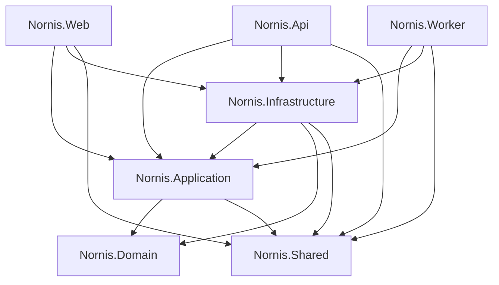

# Design Document: Project Scaffolding

## Overview

This design describes the scaffolding of the Nornis .NET solution — establishing the foundational project structure, dependency graph, test projects, CI pipeline, Dockerfiles, health endpoint, and formatting configuration. The goal is a solution that builds cleanly from day one, passes tests, enforces formatting, and produces containerized deployable services ready for Kubernetes.

The scaffolding is a one-time setup operation. Once complete, all subsequent feature work builds on top of this structure.

### Key Design Decisions

1. **Single solution file at root** — All projects are managed from `Nornis.sln` in the repository root. This simplifies `dotnet` CLI commands and CI configuration.
2. **Directory.Build.props for shared settings** — Common MSBuild properties (target framework, nullable, implicit usings) are defined once rather than repeated in each `.csproj`.
3. **Multi-stage Dockerfiles with solution-root context** — Dockerfiles live alongside their project but use the solution root as build context to support multi-project restore.
4. **ASP.NET Core built-in health checks** — The health endpoint uses the `Microsoft.Extensions.Diagnostics.HealthChecks` middleware rather than a custom controller.
5. **EditorConfig at repository root** — A single `.editorconfig` applies formatting rules to all projects consistently.
6. **Placeholder test per project** — Each test project ships with one passing test to verify the framework wiring works end-to-end in CI.

## Architecture

### Solution Layout

```text
/
├── Nornis.sln
├── .editorconfig
├── Directory.Build.props
├── .github/
│   └── workflows/
│       └── ci.yml
├── src/
│   ├── Nornis.Domain/
│   ├── Nornis.Application/
│   ├── Nornis.Infrastructure/
│   ├── Nornis.Shared/
│   ├── Nornis.Api/
│   │   └── Dockerfile
│   ├── Nornis.Web/
│   │   └── Dockerfile
│   └── Nornis.Worker/
│       └── Dockerfile
└── tests/
    ├── Nornis.Domain.Tests/
    ├── Nornis.Application.Tests/
    ├── Nornis.Infrastructure.Tests/
    ├── Nornis.Shared.Tests/
    ├── Nornis.Api.Tests/
    ├── Nornis.Web.Tests/
    └── Nornis.Worker.Tests/
```

### Dependency Graph



Key constraints:
- **Nornis.Domain** has zero project references and zero infrastructure package references
- **Nornis.Shared** has zero project references (utility/cross-cutting only)
- **Web, Api, Worker** do not reference each other

## Components and Interfaces

### Source Projects

| Project | SDK | Purpose |
|---------|-----|---------|
| Nornis.Domain | Microsoft.NET.Sdk | Domain entities, enums, value objects, repository interfaces |
| Nornis.Application | Microsoft.NET.Sdk | Use case services, DTOs, application interfaces |
| Nornis.Infrastructure | Microsoft.NET.Sdk | EF Core, Azure SDK implementations, external service clients |
| Nornis.Shared | Microsoft.NET.Sdk | Cross-cutting utilities, extension methods, constants |
| Nornis.Api | Microsoft.NET.Sdk.Web | ASP.NET Core API host, controllers, middleware, health endpoint |
| Nornis.Web | Microsoft.NET.Sdk.Web | Blazor Web App host, pages, components |
| Nornis.Worker | Microsoft.NET.Sdk.Worker | Background service host for async job processing |

### Test Projects

Each test project uses `Microsoft.NET.Sdk` targeting `net8.0` with the following package references:
- `NUnit` (test framework)
- `NUnit3TestAdapter` (test discovery/execution)
- `Microsoft.NET.Test.Sdk` (test platform)

Each references its corresponding source project.

### Health Endpoint

The health endpoint is implemented using ASP.NET Core's built-in health check middleware:

```csharp
// Program.cs in Nornis.Api
builder.Services.AddHealthChecks();

app.MapHealthChecks("/health", new HealthCheckOptions
{
    ResponseWriter = WriteHealthResponse
});
```

The endpoint:
- Maps to `GET /health`
- Returns `200 OK` with `{"status": "Healthy"}` when the service can process requests
- Returns `503 Service Unavailable` with `{"status": "Unhealthy"}` when it cannot
- Uses `Content-Type: application/json`
- Requires no authentication (explicit `AllowAnonymous`)
- Custom `ResponseWriter` formats the JSON response

### EditorConfig

The `.editorconfig` file at the repository root defines:
- `indent_style = space`
- `indent_size = 4`
- `end_of_line = crlf`
- `charset = utf-8-bom`
- C# file-scoped namespaces (`csharp_style_namespace_declarations = file_scoped`)
- System usings sorted first (`dotnet_sort_system_directives_first = true`)
- Expression-bodied member preferences for single-line members

### Directory.Build.props

Shared MSBuild properties applied to all projects:

```xml
<Project>
  <PropertyGroup>
    <TargetFramework>net8.0</TargetFramework>
    <Nullable>enable</Nullable>
    <ImplicitUsings>enable</ImplicitUsings>
    <TreatWarningsAsErrors>true</TreatWarningsAsErrors>
  </PropertyGroup>
</Project>
```

Individual `.csproj` files override the SDK type where needed (e.g., `Microsoft.NET.Sdk.Web`) but inherit common properties.

### Dockerfiles

Each deployable service (Api, Web, Worker) has a Dockerfile following this pattern:

```dockerfile
# Build stage
FROM mcr.microsoft.com/dotnet/sdk:8.0 AS build
ARG IMAGE_SOURCE=""
ARG IMAGE_REVISION=""
WORKDIR /src
COPY ["Nornis.sln", "."]
COPY ["src/Nornis.Api/Nornis.Api.csproj", "src/Nornis.Api/"]
# ... all project files for restore
RUN dotnet restore
COPY . .
RUN dotnet publish "src/Nornis.Api/Nornis.Api.csproj" -c Release -o /app/publish --no-restore

# Runtime stage
FROM mcr.microsoft.com/dotnet/aspnet:8.0 AS runtime
LABEL org.opencontainers.image.source="${IMAGE_SOURCE}"
LABEL org.opencontainers.image.revision="${IMAGE_REVISION}"
WORKDIR /app
EXPOSE 8080
RUN adduser --disabled-password --gecos "" appuser
USER appuser
COPY --from=build /app/publish .
ENTRYPOINT ["dotnet", "Nornis.Api.dll"]
```

Differences by service:
- **Nornis.Api** and **Nornis.Web**: Use `mcr.microsoft.com/dotnet/aspnet:8.0` runtime image, expose port 8080
- **Nornis.Worker**: Uses `mcr.microsoft.com/dotnet/runtime:8.0` runtime image, does not expose ports

All Dockerfiles:
- Use multi-stage builds (SDK for build, minimal runtime for execution)
- Run as non-root user
- Accept `IMAGE_SOURCE` and `IMAGE_REVISION` build arguments for OCI labels
- Use solution root as build context

### CI Workflow

The GitHub Actions workflow (`.github/workflows/ci.yml`) runs on:
- Pull requests targeting `main`
- Pushes to `main`

Steps executed in order:
1. Checkout code
2. Setup .NET SDK (pinned version: `8.0.x`)
3. `dotnet restore`
4. `dotnet build --no-restore`
5. `dotnet test --no-build`
6. `dotnet format --verify-no-changes`

Failure at any step fails the workflow. The build step uses `--no-restore` to avoid redundant restore. The test step uses `--no-build` to avoid redundant compilation.

## Data Models

This feature does not introduce runtime data models. The scaffolding produces project files, configuration files, and build artifacts.

### Configuration Artifacts

| File | Purpose |
|------|---------|
| `Nornis.sln` | Solution file grouping all projects |
| `Directory.Build.props` | Shared MSBuild properties |
| `.editorconfig` | Formatting rules |
| `.github/workflows/ci.yml` | CI pipeline definition |
| `src/Nornis.Api/Dockerfile` | API container build |
| `src/Nornis.Web/Dockerfile` | Web container build |
| `src/Nornis.Worker/Dockerfile` | Worker container build |
| `global.json` | Pinned SDK version for deterministic builds |

## Error Handling

### Build Errors
- `TreatWarningsAsErrors` is enabled in `Directory.Build.props`. Any compiler warning becomes a build failure, caught in CI before merge.

### Health Endpoint Errors
- If ASP.NET Core health checks report degraded or unhealthy status, the endpoint returns HTTP 503 with `{"status": "Unhealthy"}`.
- The health check middleware has a built-in timeout. Responses exceeding 5 seconds indicate the service is unresponsive and Kubernetes should restart the pod.

### CI Failures
- Each CI step depends on the previous step succeeding. If `dotnet build` fails, test and format steps are skipped.
- Formatting violations are caught by `dotnet format --verify-no-changes` and fail the workflow with a descriptive error.

### Docker Build Errors
- Missing project references during restore will fail the build stage early with a clear NuGet error.
- The multi-stage approach ensures runtime images never contain the SDK or source code, reducing attack surface.

## Testing Strategy

### Approach

This feature is primarily infrastructure scaffolding — project files, configuration, Dockerfiles, and CI pipeline. Property-based testing does not apply here because:
- The outputs are declarative configuration files, not functions with variable inputs
- Correctness is verified by the build system itself (`dotnet build`, `dotnet test`, `dotnet format`)
- The CI pipeline acts as the automated validation layer

### Unit Tests

Each test project includes one placeholder test to verify:
- NUnit framework is correctly referenced and discovered
- The test project compiles and references its source project
- `dotnet test` discovers and executes tests across all 7 projects

Example placeholder test:

```csharp
namespace Nornis.Domain.Tests;

[TestFixture]
public class SanityTests
{
    [Test]
    public void Framework_IsConfiguredCorrectly()
    {
        Assert.That(true, Is.True);
    }
}
```

These placeholder tests will be replaced by meaningful tests as feature code is added.

### Integration Tests

The CI workflow itself serves as the integration test for scaffolding correctness:
- `dotnet restore` validates package references and project dependencies
- `dotnet build` validates compilation and dependency graph
- `dotnet test` validates test framework wiring across all projects
- `dotnet format --verify-no-changes` validates formatting compliance

### Docker Build Verification

Docker builds are verified manually or in a separate deployment workflow. The CI workflow does not build containers (that happens on main branch merge per the CI/CD steering document).

### Dependency Rule Verification

Project dependency rules are enforced structurally through `.csproj` `<ProjectReference>` elements. If someone adds a disallowed reference, the architectural violation becomes visible in code review. For future enforcement, an architecture test (e.g., using NetArchTest) can be added to `Nornis.Domain.Tests` to programmatically verify that `Nornis.Domain` has no forbidden dependencies.
