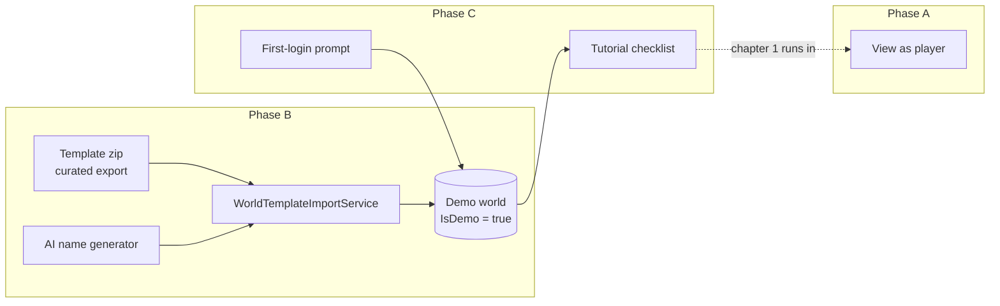

# Design Document

## Overview

Three deliverables, built in dependency order:

- **Phase A — View as player.** Standalone GM feature; nothing else depends on its absence,
  but the tutorial depends on its presence. Smallest phase, ships first.
- **Phase B — Demo world.** Template package + import service + AI naming + dialog changes
  + guardrails. Useful on its own (a sandbox world) before any tutorial exists.
- **Phase C — Onboarding.** First-login prompt + tutorial checklist. Consumes A and B.

The template's *content* is already authored: campaign notes, GM secrets, and the map
generator live in [docs/demo-world](../../demo-world). This design covers the machinery.

## Phase A — View as player

### Server: request-scoped role downgrade

Every read already flows through `VisibilityFilter.ForRole(role, userId)`
([VisibilityFilter.cs:26](../../../src/Nornis.Domain/Models/VisibilityFilter.cs)), and the
role comes from the resolved world membership (`HttpContext.GetWorldMember()`). The design
is one interception point, not per-endpoint work:

- The client sends header `X-Nornis-View-As: Player` on API requests while the toggle is on.
- The downgrade happens **inside the two membership filters**
  ([WorldMemberActionFilter](../../../src/Nornis.Api/Filters/WorldMemberActionFilter.cs),
  [WorldMemberFilter](../../../src/Nornis.Api/Filters/WorldMemberFilter.cs)) via
  `HttpContextExtensions.ApplyViewAs`: IF the header value is `Player` AND the member's
  real role is `GM`, a **detached Player copy** of the membership is stored on the context
  (never the mutated tracked entity). Any other sender or value is ignored — the header can
  only ever downgrade.
- Consequence, chosen deliberately: for that request the GM *is* a player everywhere —
  reads are player-shaped, and every GM-gated endpoint (reads and writes alike, all ~80
  `GetWorldMember()` consumers untouched) **fails closed with 403**. There is no dual-role
  bookkeeping and no per-callsite audit that could miss a spot; a stray GM call from
  not-yet-hidden chrome fails loudly instead of leaking. This mirrors what
  [PublicController](../../../src/Nornis.Api/Controllers/PublicController.cs) already does
  by fiat with `PublicRole = WorldRole.Observer`.
- The client simply avoids GM-only calls while the view is active (e.g. `WorldState` skips
  the continuity fetch), the same way it already skips them for real players.

### Client

`WorldState` gains `bool ViewingAsPlayer` (ephemeral, never persisted) and
`string EffectiveRole => ViewingAsPlayer ? "Player" : Current?.MyRole`. Every UI gate that
reads `MyRole == "GM"` ([NavMenu.razor:56](../../../src/Nornis.Web/Components/Layout/NavMenu.razor),
`:62`, and equivalents elsewhere) switches to `EffectiveRole`. `NornisApiClient` attaches
the header whenever the flag is set.

Nav treatment (quiet entry, loud exit):

- The world card's sub-label ("World") becomes "World · **GM**" — the role chip. Players
  see a plain, non-interactive chip; for GMs it is clickable with tooltip "See this world
  as your players do". A "View as player" item in the world dropdown menu is the second,
  discoverable entry point.
- Active state: world card background tinted, chip swaps to "Viewing as player · back to
  GM". Because Admin, World Memory, and GM-only content *disappear* in this mode, the exit
  affordance must be the most prominent thing in the nav — same pattern as an admin
  impersonation banner.

## Phase B — Demo world

### Template package: curated export, new import

The export pipeline ([WorldExportService](../../../src/Nornis.Application/Services/WorldExportService.cs),
one JSON file per [WorldExportCategory](../../../src/Nornis.Domain/Enums/WorldExportCategory.cs)
plus blob-backed attachments) already serializes everything the snapshot needs — sources,
attachments (the map), codex, map pins, reviews. **No import exists**; that is the new
capability: `WorldTemplateImportService`.

Authoring workflow (manual, rare, GM-is-the-vendor):

1. Seed a private master world: upload the map, paste sessions 1–5 and the two GM notes
   (GM visibility), run real extraction, vet every proposal, accept the map placemarks.
2. Export with the categories the template needs: `Sources`, `Attachments`, `Codex`,
   `MapPins`, `Characters`, `Campaigns`. Excluded: `Members`, `Reviews` (decided history is
   noise for a fresh copy), `Health`, `AiUsage`.
3. Check the zip into the repo (`docs/demo-world/template/vespergale-reach.zip`) and embed
   it in the API deployment (embedded resource or content file). The template is versioned
   by the zip; regenerating it is repeating steps 1–2. Existing demo worlds never migrate —
   a new template only affects new copies.

Import semantics (the interesting parts):

- **ID remapping.** Every entity gets a fresh `Guid`; a single old→new map is built up
  front and applied while materializing, covering FK columns *and* loose references
  (`MapPlacemark.ArtifactId` is a soft reference per
  [MapPlacemark.cs](../../../src/Nornis.Domain/Entities/MapPlacemark.cs); `SourceReference`
  rows; any artifact-to-artifact links serialized in Codex).
- **User remapping.** All `CreatedByUserId`/actor columns collapse to the creating user,
  who becomes the sole `WorldMember` with role GM.
- **Blob copy.** Attachment and library files are copied to new blob paths under the new
  world id — no shared blobs between worlds, so delete-world stays simple.
- **Timestamps.** Source `OccurredAt` values shift so "Session 5" lands near creation time
  (keeps the timeline plausible); relative spacing between sessions is preserved.
- **Transactionality.** One DB transaction for rows; blobs copied first, and blob orphans
  from a failed transaction are acceptable (same posture as existing upload failure paths).
- The world is created with `IsDemo = true` (new `bool` column on
  [World](../../../src/Nornis.Domain/Entities/World.cs), default false).

### AI-generated world name

A single completion against the existing AI client infrastructure (same plumbing as
[IMapExtractionClient](../../../src/Nornis.Application/Ai/IMapExtractionClient.cs) siblings):
"Invent a short evocative fantasy campaign-world name; 1–3 words; no real-world IP" plus a
seed of adjectives to vary output. Constraints from Requirement 2.4: a ~3s timeout and a
static fallback list (`"The Vespergale Reach — {adjective} {noun}"` style combinations) so
creation never blocks or fails on the AI path. Name collisions across users are acceptable
and unchecked; the point is flavor, not uniqueness guarantees.

### Dialog

[CreateWorldDialog.razor](../../../src/Nornis.Web/Components/Shared/CreateWorldDialog.razor)
keeps its exact current flow as the primary path, and adds below a divider:

> **Or start with the demo world** — a ready-made campaign to explore.
> ☑ Walk me through it
> [Create demo world]

One new endpoint (`POST /worlds/demo`, body: `{ tutorial: bool }`) → instantiate → return
`WorldSummary`; the dialog closes and selects it like any created world. Rate limit
(Requirement 6.4) enforced server-side: one demo creation per user per rolling day, 429
with a friendly message otherwise.

### Guardrails

- **Kill switch**: server config `DemoWorlds:PublicAccessEnabled` (default `true`). When
  false: the publish toggle rejects for `IsDemo` worlds, and public reads
  ([PublicController](../../../src/Nornis.Api/Controllers/PublicController.cs)) return 404
  for demo worlds — slugs are kept, so re-enabling restores links, matching
  `World.PublicSlug` semantics.
- **Metrics**: wherever usage metrics are computed, `IsDemo` worlds are excluded at the
  query level.
- Public Ask needs no new work: it already defaults off per world
  (`PublicAskMonthlyBudgetUsd = null`).

## Phase C — Onboarding

### State model

Deliberately tiny. Two nullable timestamps on [User](../../../src/Nornis.Domain/Entities/User.cs):

| Column | Meaning |
|---|---|
| `OnboardingPromptSeenAt` | First-login prompt shown or dismissed; never show again |
| `TutorialDismissedAt` | User cancelled the tutorial outright; never show any tutorial UI again |

Plus one small table `TutorialProgress (UserId, WorldId, StepKey, CompletedAt)` used as a
**cache of detections** — each step's truth lives in world state (sources exist, proposals
decided…), but caching avoids re-running detector queries for steps already seen complete,
and records completion of steps whose state could later regress (e.g. the demo world's
proposals get bulk-cleared). Tutorial-complete = all step keys present. No "current step"
pointer: steps complete in any order (Requirement 4.6).

### First-login prompt

Home page component, rendered when `OnboardingPromptSeenAt == null`; renders, then marks
seen server-side (fire-and-forget — showing it once is the contract, twice is a bug we
accept over blocking the page). Two layouts by membership count (invited users have ≥1
membership by the time they reach home, per
[Invite.razor](../../../src/Nornis.Web/Components/Pages/Invite.razor) accept flow):

- No memberships: "New here? **Start with the demo world** — a ready-made campaign with a
  guided tour." primary → `POST /worlds/demo { tutorial: true }`; "start blank" secondary.
- Has memberships: "You've joined ***{world}*** — jump in." primary (selects the world);
  demo world offer secondary.

### Tutorial checklist

A collapsible panel component hosted in the main layout, visible only when: the current
world `IsDemo`, the world was created with `tutorial: true`, and `TutorialDismissedAt` is
null. Header: chapter progress; body: steps with deep links; footer: "Dismiss tutorial"
(one confirm dialog, writes `TutorialDismissedAt`, panel unmounts — permanent per
Requirement 4.4).

Steps and their detectors (all detectors are existing read models — no new writes):

| # | Step | Deep link | Completes when |
|---|---|---|---|
| **Chapter 1 — Playing in a world** (runs in player view; step 1 turns it on) ||||
| 1.1 | See it as a player | — | `ViewingAsPlayer` turned on once |
| 1.2 | Meet the cast | `/artifacts` | Any artifact detail viewed (client event) |
| 1.3 | Walk the journey | `/timeline` | Journey/timeline page visited |
| 1.4 | Stand somewhere | `/locations` | A pin selected once |
| 1.5 | Ask the Loremaster | `/` | An Ask question answered in this world |
| **Chapter 2 — Running a campaign** ||||
| 2.1 | Back to GM view | — | `ViewingAsPlayer` turned off |
| 2.2 | Add Session 6 | `/capture` | A new source exists post-creation |
| 2.3 | Watch it think | `/sources` | That source reaches `Processed` |
| 2.4 | Vet the extraction | `/review` | ≥1 proposal decided by the user |
| 2.5 | Reveal a secret | `/artifacts` | ≥1 reveal batch exists (feature 17) |
| 2.6 | See what they see | — | `ViewingAsPlayer` on again after 2.5 |

Two detector notes: the page-visit steps (1.2–1.4) are client-reported (a `StepKey` POST on
route visit) because there is no server state to detect — acceptable self-report for
low-stakes steps; the state-backed steps (1.5, 2.2–2.5) are detected by querying existing
services and are the ones that must never false-positive. Session 6's paste text is served
in-app within step 2.2's description (copy button), sourced from the template package so
content and instructions version together.

The 2.2→2.3→2.4 chain is the product's centerpiece and the one real AI spend per demo
(one source extraction, on the world's default budget). Step 2.5 leans on
[RevealService](../17-knowledge-reveal/design.md): the template ships "The Castellan's
design" and its `GMOnly` elements precisely so there is something satisfying to reveal.

## Testing

Per repo convention: unit tests around the import service's remapping (loose references
especially — a placemark whose `ArtifactId` fails to remap must fail the import, not
silently orphan), the role-downgrade point (header + non-GM ignored; write gates use real
role), name-generation fallback on AI timeout, rate limiting, kill-switch read behavior,
and detector queries. The Web checklist detectors get component tests around
resume/out-of-order completion. Note for local verification: extraction for step 2.3 runs
through the deployed worker (local dev points at prod infrastructure — deploy the worker
before testing the live-extraction step end to end).

## Open items

- Whether `Characters`/`Campaigns` export categories carry everything the snapshot needs or
  the template master world should simply not use campaign-scoped features; settle when
  building the import by diffing a trial export against the master.
- Exact copy for prompts/steps — written at build time; the step table above fixes intent,
  not wording.
