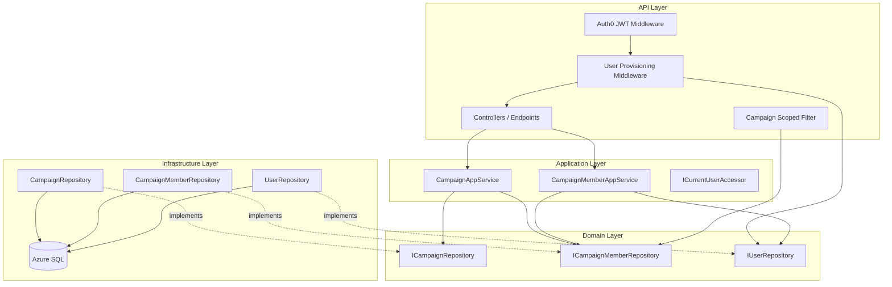
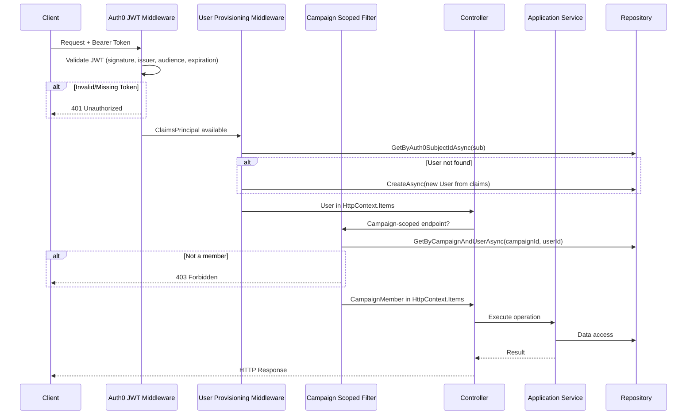

# Design Document: Auth and Campaigns

## Overview

This design establishes the authentication, user provisioning, campaign CRUD, member management, and campaign-scoped authorization layers for the Nornis API. It bridges the existing domain/infrastructure layers (entities, repositories, EF Core) with the API surface by introducing application services, middleware, DTOs, and authorization policies.

The implementation follows the existing clean architecture:
- **Nornis.Api** — Authentication middleware, authorization policies, controllers, request/response DTOs.
- **Nornis.Application** — Use-case orchestration services with authorization enforcement.
- **Nornis.Domain** — Existing entities and repository interfaces (unchanged).
- **Nornis.Infrastructure** — Existing EF Core implementations (unchanged).

**Key Design Decisions:**

1. **Authenticated by default** — The API uses `FallbackPolicy = RequireAuthenticatedUser` so every endpoint requires a valid JWT unless explicitly marked `[AllowAnonymous]`. Only `/health` is anonymous.
2. **User provisioning as middleware** — A custom middleware resolves or creates the Nornis `User` from JWT claims on every authenticated request, making the user available via `HttpContext.Items` to downstream handlers.
3. **Application services enforce authorization** — Campaign membership and role checks live in application services, not solely in controller attributes. This ensures authorization is tested independently of the HTTP layer.
4. **Campaign-scoped authorization via policy + filter** — An `IEndpointFilter` resolves campaign membership from the route `{campaignId}` parameter and injects it into the request context. Application services verify role requirements.
5. **DTOs as records** — Request/response models use C# records for immutability and conciseness.
6. **FsCheck.NUnit for property-based testing** — Consistent with the domain-data-layer design, property tests use FsCheck integrated with NUnit.

## Architecture



**Request Flow:**



## Components and Interfaces

### API Layer (`Nornis.Api`)

**Folder Structure:**
```
Nornis.Api/
├── Authentication/
│   └── Auth0Extensions.cs
├── Middleware/
│   └── UserProvisioningMiddleware.cs
├── Filters/
│   └── CampaignMemberFilter.cs
├── Controllers/
│   ├── CampaignsController.cs
│   └── CampaignMembersController.cs
├── Contracts/
│   ├── Requests/
│   │   ├── CreateCampaignRequest.cs
│   │   ├── UpdateCampaignRequest.cs
│   │   ├── AddCampaignMemberRequest.cs
│   │   └── UpdateCampaignMemberRoleRequest.cs
│   └── Responses/
│       ├── CampaignResponse.cs
│       ├── CampaignListItemResponse.cs
│       ├── CampaignMemberResponse.cs
│       └── ErrorResponse.cs
├── Extensions/
│   └── HttpContextExtensions.cs
└── Program.cs
```

### Application Layer (`Nornis.Application`)

**Folder Structure:**
```
Nornis.Application/
├── Services/
│   ├── ICampaignService.cs
│   ├── CampaignService.cs
│   ├── ICampaignMemberService.cs
│   └── CampaignMemberService.cs
├── Models/
│   ├── CreateCampaignCommand.cs
│   ├── UpdateCampaignCommand.cs
│   ├── AddMemberCommand.cs
│   ├── UpdateMemberRoleCommand.cs
│   └── CampaignWithRoleDto.cs
├── Authorization/
│   └── CampaignRoleExtensions.cs
└── Errors/
    ├── AppError.cs
    └── AppResult.cs
```

### Key Interfaces

```csharp
// Application layer - Campaign operations
public interface ICampaignService
{
    Task<AppResult<Campaign>> CreateAsync(CreateCampaignCommand command, CancellationToken ct);
    Task<AppResult<Campaign>> GetByIdAsync(Guid campaignId, Guid requestingUserId, CancellationToken ct);
    Task<AppResult<Campaign>> UpdateAsync(UpdateCampaignCommand command, CancellationToken ct);
    Task<AppResult<IReadOnlyList<CampaignWithRoleDto>>> ListForUserAsync(Guid userId, CancellationToken ct);
}

// Application layer - Member operations
public interface ICampaignMemberService
{
    Task<AppResult<CampaignMember>> AddMemberAsync(AddMemberCommand command, CancellationToken ct);
    Task<AppResult> RemoveMemberAsync(Guid campaignId, Guid targetUserId, Guid actingUserId, CancellationToken ct);
    Task<AppResult<CampaignMember>> UpdateRoleAsync(UpdateMemberRoleCommand command, CancellationToken ct);
    Task<AppResult<IReadOnlyList<CampaignMember>>> ListMembersAsync(Guid campaignId, Guid requestingUserId, CancellationToken ct);
}
```

### Result Type

```csharp
public record AppError(int StatusCode, string Code, string Message);

public class AppResult<T>
{
    public T? Value { get; }
    public AppError? Error { get; }
    public bool IsSuccess => Error is null;

    private AppResult(T value) { Value = value; }
    private AppResult(AppError error) { Error = error; }

    public static AppResult<T> Success(T value) => new(value);
    public static AppResult<T> Fail(AppError error) => new(error);
}

public class AppResult
{
    public AppError? Error { get; }
    public bool IsSuccess => Error is null;

    private AppResult() { }
    private AppResult(AppError error) { Error = error; }

    public static AppResult Success() => new();
    public static AppResult Fail(AppError error) => new(error);
}
```

### Campaign Role Hierarchy

```csharp
public static class CampaignRoleExtensions
{
    public static int Rank(this CampaignRole role) => role switch
    {
        CampaignRole.GM => 3,
        CampaignRole.Player => 2,
        CampaignRole.Observer => 1,
        _ => 0
    };

    public static bool IsAtLeast(this CampaignRole role, CampaignRole required)
        => role.Rank() >= required.Rank();
}
```

### User Provisioning Middleware

```csharp
public class UserProvisioningMiddleware
{
    private readonly RequestDelegate _next;
    private readonly ILogger<UserProvisioningMiddleware> _logger;

    public UserProvisioningMiddleware(RequestDelegate next, ILogger<UserProvisioningMiddleware> logger)
    {
        _next = next;
        _logger = logger;
    }

    public async Task InvokeAsync(HttpContext context, IUserRepository userRepository)
    {
        if (!context.User.Identity?.IsAuthenticated ?? true)
        {
            await _next(context);
            return;
        }

        var sub = context.User.FindFirstValue(ClaimTypes.NameIdentifier)
                  ?? context.User.FindFirstValue("sub");

        if (string.IsNullOrEmpty(sub))
        {
            context.Response.StatusCode = 401;
            return;
        }

        var email = context.User.FindFirstValue(ClaimTypes.Email)
                    ?? context.User.FindFirstValue("email");

        if (string.IsNullOrEmpty(email))
        {
            context.Response.StatusCode = 401;
            return;
        }

        try
        {
            var user = await userRepository.GetByAuth0SubjectIdAsync(sub, context.RequestAborted);

            if (user is null)
            {
                var nickname = context.User.FindFirstValue("nickname") ?? sub;
                user = await userRepository.CreateAsync(new User
                {
                    Id = Guid.NewGuid(),
                    Auth0SubjectId = sub,
                    Username = nickname,
                    Email = email,
                    CreatedAt = DateTimeOffset.UtcNow,
                    UpdatedAt = DateTimeOffset.UtcNow
                }, context.RequestAborted);
            }

            context.Items["NornisUser"] = user;
        }
        catch (DbUpdateException) // Concurrent creation race
        {
            var user = await userRepository.GetByAuth0SubjectIdAsync(sub, context.RequestAborted);
            if (user is not null)
            {
                context.Items["NornisUser"] = user;
            }
            else
            {
                _logger.LogError("User provisioning failed for sub {Sub}", sub);
                context.Response.StatusCode = 503;
                return;
            }
        }
        catch (OperationCanceledException)
        {
            throw;
        }
        catch (Exception ex)
        {
            _logger.LogError(ex, "User provisioning infrastructure error for sub {Sub}", sub);
            context.Response.StatusCode = 503;
            return;
        }

        await _next(context);
    }
}
```

### Campaign Scoped Endpoint Filter

```csharp
public class CampaignMemberFilter : IEndpointFilter
{
    public async ValueTask<object?> InvokeAsync(
        EndpointFilterInvocationContext context,
        EndpointFilterDelegate next)
    {
        var httpContext = context.HttpContext;
        var user = httpContext.GetNornisUser();
        var campaignIdStr = httpContext.GetRouteValue("campaignId")?.ToString();

        if (!Guid.TryParse(campaignIdStr, out var campaignId))
        {
            return Results.NotFound();
        }

        var memberRepo = httpContext.RequestServices
            .GetRequiredService<ICampaignMemberRepository>();

        var member = await memberRepo.GetByCampaignAndUserAsync(
            campaignId, user.Id, httpContext.RequestAborted);

        if (member is null)
        {
            // Return 403 regardless of campaign existence for non-members (Req 8.5)
            return Results.Forbid();
        }

        httpContext.Items["CampaignMember"] = member;
        return await next(context);
    }
}
```

## Data Models

### Request DTOs

```csharp
public record CreateCampaignRequest(
    string Name,
    string? Description = null,
    string? GameSystem = null);

public record UpdateCampaignRequest(
    string? Name = null,
    string? Description = null,
    string? GameSystem = null);

public record AddCampaignMemberRequest(
    Guid UserId,
    string Role);

public record UpdateCampaignMemberRoleRequest(
    string Role);
```

### Response DTOs

```csharp
public record CampaignResponse(
    Guid Id,
    string Name,
    string? Description,
    string? GameSystem,
    Guid CreatedByUserId,
    DateTimeOffset CreatedAt,
    DateTimeOffset UpdatedAt,
    string? MyRole = null);

public record CampaignListItemResponse(
    Guid Id,
    string Name,
    string? Description,
    string? GameSystem,
    string MyRole);

public record CampaignMemberResponse(
    Guid Id,
    Guid CampaignId,
    Guid UserId,
    string Role,
    string? DisplayName,
    string? CharacterName,
    DateTimeOffset JoinedAt);

public record ErrorResponse(
    string Code,
    string Message);
```

### Application Commands

```csharp
public record CreateCampaignCommand(
    string Name,
    string? Description,
    string? GameSystem,
    Guid CreatingUserId);

public record UpdateCampaignCommand(
    Guid CampaignId,
    string? Name,
    string? Description,
    string? GameSystem,
    Guid ActingUserId);

public record AddMemberCommand(
    Guid CampaignId,
    Guid TargetUserId,
    CampaignRole Role,
    Guid ActingUserId);

public record UpdateMemberRoleCommand(
    Guid CampaignId,
    Guid TargetUserId,
    CampaignRole NewRole,
    Guid ActingUserId);

public record CampaignWithRoleDto(
    Campaign Campaign,
    CampaignRole Role);
```

### API Endpoint Design

| Method | Route | Auth | Description |
|--------|-------|------|-------------|
| GET | `/health` | Anonymous | Health check |
| POST | `/api/campaigns` | Authenticated | Create campaign |
| GET | `/api/campaigns` | Authenticated | List user's campaigns |
| GET | `/api/campaigns/{campaignId}` | Member | Get campaign details |
| PUT | `/api/campaigns/{campaignId}` | GM | Update campaign settings |
| GET | `/api/campaigns/{campaignId}/members` | Member | List campaign members |
| POST | `/api/campaigns/{campaignId}/members` | GM | Add member |
| PUT | `/api/campaigns/{campaignId}/members/{userId}` | GM | Update member role |
| DELETE | `/api/campaigns/{campaignId}/members/{userId}` | GM | Remove member |


## Correctness Properties

*A property is a characteristic or behavior that should hold true across all valid executions of a system — essentially, a formal statement about what the system should do. Properties serve as the bridge between human-readable specifications and machine-verifiable correctness guarantees.*

### Property 1: User Provisioning Idempotence

*For any* existing User with a given Auth0SubjectId, invoking user provisioning multiple times with that same subject identifier should always return the same User record without creating duplicates or modifying the existing record.

**Validates: Requirements 2.1, 2.3**

### Property 2: User Provisioning Creates Correct User from Claims

*For any* valid claims tuple (sub, nickname, email) where no User exists for that sub, provisioning should create a User with Auth0SubjectId equal to sub, Username equal to nickname (or sub if nickname is absent), and Email equal to email.

**Validates: Requirements 2.2**

### Property 3: Campaign Creation Field Mapping

*For any* valid campaign creation input (Name 1–100 non-whitespace characters, optional Description, optional GameSystem) and authenticated user, creating a campaign should return a Campaign with the provided Name, Description, and GameSystem, a non-empty Id, CreatedByUserId equal to the acting user's Id, and CreatedAt/UpdatedAt set to approximately the current time.

**Validates: Requirements 3.1, 3.4, 3.5, 3.6**

### Property 4: Campaign Creator Becomes GM

*For any* successfully created campaign, the creating user should be a CampaignMember of that campaign with the GM role.

**Validates: Requirements 3.2**

### Property 5: Campaign Name Validation Rejects Invalid Names

*For any* string that is null, empty, composed entirely of whitespace, or longer than 100 characters, both campaign creation and campaign update operations should reject the input with a validation error.

**Validates: Requirements 3.3, 4.6**

### Property 6: Campaign Update Modifies Only Specified Fields

*For any* existing campaign and any subset of updatable fields (Name, Description, GameSystem) provided by a GM, after update, the specified fields should reflect the new values, unspecified fields should remain unchanged, and UpdatedAt should be later than the previous UpdatedAt.

**Validates: Requirements 4.1, 4.5**

### Property 7: Non-GM Operations Are Denied

*For any* campaign member with role Player or Observer, attempting to update campaign settings, add members, remove members, or change member roles should be denied with a 403 Forbidden response.

**Validates: Requirements 4.2, 5.2**

### Property 8: Role Hierarchy Enforcement

*For any* pair of CampaignRoles (actualRole, requiredRole), access to an operation requiring requiredRole should be granted if and only if actualRole.Rank >= requiredRole.Rank, using the hierarchy GM (3) > Player (2) > Observer (1).

**Validates: Requirements 8.3, 8.4**

### Property 9: Non-Member Access Denied

*For any* user who is not a CampaignMember of a given campaign, accessing any campaign-scoped endpoint for that campaign should return HTTP 403 Forbidden, regardless of whether the campaign exists.

**Validates: Requirements 8.1, 8.2, 8.5**

### Property 10: Member List Ordering

*For any* campaign with N members (N ≥ 1), listing members should return exactly N entries where each entry's JoinedAt is less than or equal to the next entry's JoinedAt (ascending order).

**Validates: Requirements 6.1, 6.4**

### Property 11: Campaign Listing Completeness and Exclusivity

*For any* authenticated user, listing their campaigns should return exactly the set of campaigns where a CampaignMember record exists for that user — no more, no less — with each entry including the user's CampaignRole in that campaign.

**Validates: Requirements 7.1, 7.2, 7.3**

## Error Handling

### HTTP Status Code Strategy

| Scenario | Status Code | Response Body |
|----------|-------------|---------------|
| Missing/invalid/expired JWT | 401 Unauthorized | No body (handled by auth middleware) |
| Missing email claim in JWT | 401 Unauthorized | No body |
| User provisioning infra failure | 503 Service Unavailable | `ErrorResponse` with code `provisioning_failed` |
| Validation failure (bad input) | 400 Bad Request | `ErrorResponse` with code and field details |
| Non-member accessing campaign | 403 Forbidden | `ErrorResponse` with code `access_denied` |
| Insufficient role | 403 Forbidden | `ErrorResponse` with code `insufficient_role` |
| Resource not found (for members) | 404 Not Found | `ErrorResponse` with code `not_found` |
| Conflict (duplicate member, last GM) | 409 Conflict | `ErrorResponse` with code and explanation |
| Unexpected server error | 500 Internal Server Error | `ErrorResponse` with generic message |

### Error Response Format

```json
{
  "code": "validation_error",
  "message": "Campaign name must be between 1 and 100 characters."
}
```

### Global Exception Handling

A global exception handler middleware catches unhandled exceptions and:
1. Logs the full exception with structured context (correlation ID, user ID, operation).
2. Returns a generic 500 response without stack trace or internal details.
3. Handles `OperationCanceledException` as request cancellation (no error response needed).
4. Handles `DbUpdateConcurrencyException` as 409 Conflict where applicable.

### Validation Strategy

- Request validation happens at the controller/endpoint level using simple guard checks on DTOs.
- Business rule validation (e.g., "last GM" check) happens in application services.
- Both produce `AppResult.Fail(...)` with appropriate error codes that controllers map to HTTP status codes.

### Structured Logging

All errors are logged with:
- Correlation ID (from request headers or generated)
- User ID (if resolved)
- Campaign ID (if applicable)
- Operation name
- Error code

Sensitive data (tokens, raw auth headers) is never logged.

## Testing Strategy

### Unit Tests (`Nornis.Application.Tests`)

Focus on application service logic with mocked repositories:

- **CampaignService**: Creation with valid/invalid names, field mapping, creator-becomes-GM invariant, update authorization, update field behavior.
- **CampaignMemberService**: Add/remove/role-change authorization, duplicate detection, last-GM protection, role hierarchy checks.
- **CampaignRoleExtensions**: Rank ordering, IsAtLeast comparisons.

### Integration Tests (`Nornis.Api.Tests`)

Focus on the full HTTP pipeline:

- JWT validation (valid, expired, wrong issuer, missing).
- Anonymous access to `/health`.
- User provisioning from claims (new user, existing user, missing email).
- Campaign CRUD through HTTP endpoints.
- Member management through HTTP endpoints.
- Authorization enforcement (non-member, insufficient role).
- Concurrent user provisioning race condition.

Use `WebApplicationFactory<Program>` with an in-memory or SQLite EF Core provider and a test JWT issuer.

### Property-Based Tests (`Nornis.Application.Tests`)

**Library:** FsCheck.NUnit (FsCheck integrated with NUnit)

**Configuration:** Minimum 100 iterations per property test.

**Tag format:** `Feature: auth-and-campaigns, Property {number}: {property_text}`

Property tests will focus on the application service layer with mocked repositories (in-memory dictionaries) to keep tests fast and deterministic.

**Properties to implement:**

1. **User provisioning idempotence** — Generate random valid User records. Call provisioning lookup repeatedly. Assert the same user is returned each time without modification.
2. **User provisioning creation from claims** — Generate random valid (sub, nickname, email) tuples. Call provisioning create. Assert field mapping is correct.
3. **Campaign creation field mapping** — Generate random valid campaign names (1–100 non-whitespace chars), optional descriptions, optional game systems. Create campaign. Assert all fields map correctly.
4. **Campaign creator becomes GM** — Generate random valid campaign creations. Assert creator membership with GM role exists.
5. **Campaign name validation** — Generate random invalid names (empty, whitespace-only, >100 chars). Assert both create and update reject them.
6. **Campaign update modifies only specified fields** — Generate random existing campaigns and random subsets of update fields. Assert only specified fields change.
7. **Non-GM operations denied** — Generate random non-GM roles (Player, Observer). Attempt GM-only operations. Assert failure.
8. **Role hierarchy enforcement** — Generate all pairs of (actual, required) roles. Assert access decision matches rank comparison.
9. **Non-member access denied** — Generate random users not in a campaign. Attempt campaign-scoped operations. Assert 403-equivalent failure.
10. **Member list ordering** — Generate random sets of members with random JoinedAt values. List members. Assert ordering is ascending by JoinedAt.
11. **Campaign listing completeness** — Generate random user-to-campaign membership mappings. List campaigns for a user. Assert the returned set matches exactly their memberships.

### Custom Generators

FsCheck generators for:
- **ValidCampaignName**: Non-empty, non-whitespace strings between 1–100 characters.
- **InvalidCampaignName**: Empty string, whitespace-only strings, strings > 100 characters.
- **ValidClaimsTuple**: (sub: non-empty string, nickname: optional non-empty string, email: valid email format).
- **CampaignRole**: One of GM, Player, Observer.
- **NonGmRole**: Player or Observer only.

### Test Data Conventions

Per steering rules, use realistic campaign examples:
- Campaign: "Black Harbor Investigation"
- Characters: Captain Voss, Tavrin
- Users: realistic display names
- Roles: GM for campaign creator, Player/Observer for others
