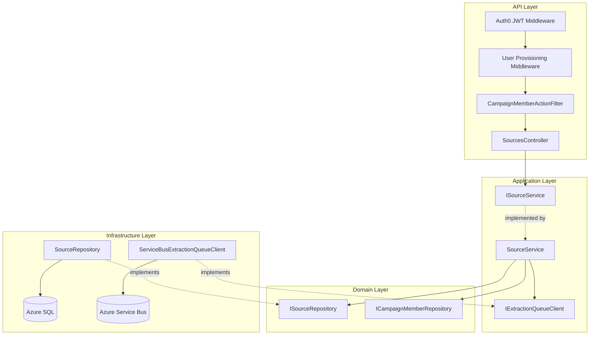
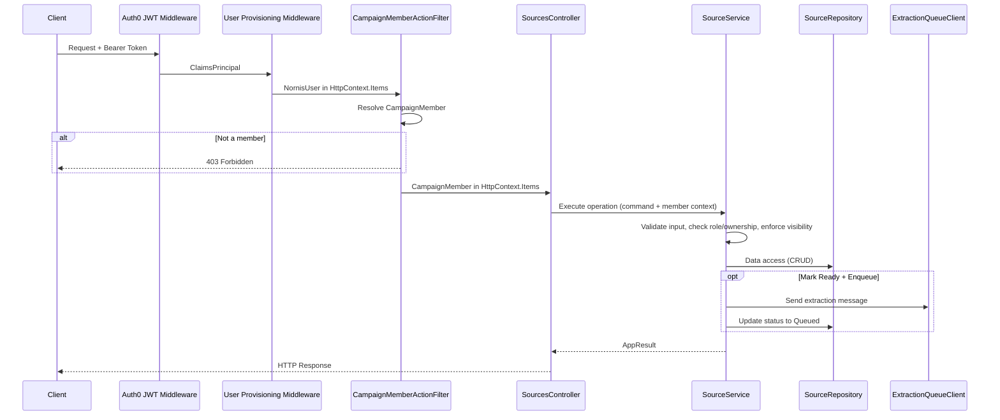
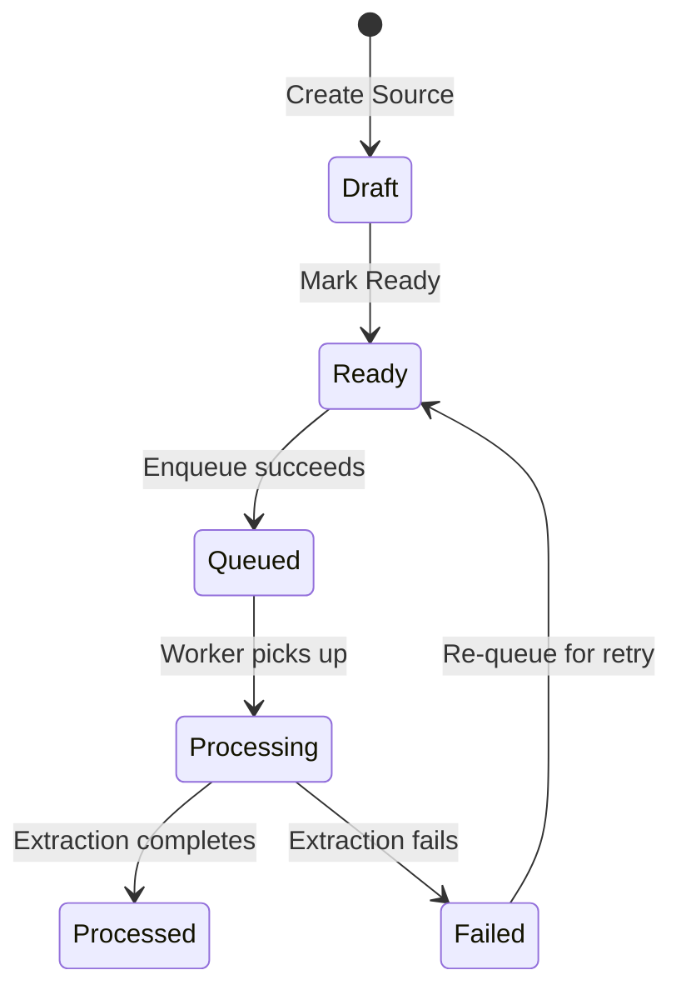

# Design Document: Campaign Sources

## Overview

This design implements Source CRUD operations for the Nornis API — the full lifecycle management of campaign source material including creation, retrieval, update, deletion, listing, status transitions, visibility enforcement, and extraction queue integration. Sources are the entry point to the MVP loop (Source → AI extraction → Review proposals → Artifacts → Ask).

The implementation follows the established clean architecture:
- **Nornis.Api** — SourcesController, request/response DTOs, CampaignMemberActionFilter for campaign-scoped authorization.
- **Nornis.Application** — ISourceService/SourceService orchestrating authorization, validation, state machine enforcement, and Service Bus integration.
- **Nornis.Domain** — Existing Source entity, enums, and ISourceRepository interface (extended with Update and Delete).
- **Nornis.Infrastructure** — SourceRepository extensions, IExtractionQueueClient implementation via Azure Service Bus.

**Key Design Decisions:**

1. **Service layer owns all business rules** — Visibility enforcement, processing status state machine, ownership checks, and role-based access all live in SourceService. The controller is thin, delegating to the service and mapping results to HTTP responses.
2. **Visibility = not-found for unauthorized reads** — When a member cannot see a source due to visibility rules, the system returns not-found rather than forbidden. This prevents information leakage about source existence.
3. **Processing status as explicit state machine** — Valid transitions are enforced in SourceService with a static transition map. Invalid transitions return a domain-specific error.
4. **Mark-Ready triggers enqueue atomically** — When a source transitions to Ready, the service immediately enqueues an extraction message. If enqueue fails, the source stays at Ready. On success, it transitions to Queued.
5. **Repository interface extended minimally** — Only `UpdateAsync` and `DeleteAsync` are added to ISourceRepository. Filtered queries reuse the existing `ListByCampaignAsync` with visibility parameters.
6. **Extraction messages contain only identifiers** — The Service Bus message carries Source Id and Campaign Id only, keeping message size minimal and avoiding stale data issues.
7. **FsCheck.NUnit for property-based testing** — Consistent with the existing auth-and-campaigns patterns, using custom Arbitraries and in-memory fakes.

## Architecture



**Request Flow:**



**Processing Status State Machine:**



## Components and Interfaces

### API Layer (`Nornis.Api`)

**New/Modified Files:**
```
Nornis.Api/
├── Controllers/
│   └── SourcesController.cs          (NEW)
├── Contracts/
│   ├── Requests/
│   │   ├── CreateSourceRequest.cs     (NEW)
│   │   └── UpdateSourceRequest.cs     (NEW)
│   └── Responses/
│       ├── SourceResponse.cs          (NEW)
│       └── SourceListItemResponse.cs  (NEW)
```

### Application Layer (`Nornis.Application`)

**New/Modified Files:**
```
Nornis.Application/
├── Services/
│   ├── ISourceService.cs              (NEW)
│   └── SourceService.cs               (NEW)
├── Models/
│   ├── CreateSourceCommand.cs         (NEW)
│   ├── UpdateSourceCommand.cs         (NEW)
│   └── MarkSourceReadyCommand.cs      (NEW)
├── Messaging/
│   └── IExtractionQueueClient.cs      (NEW)
```

### Infrastructure Layer (`Nornis.Infrastructure`)

**New/Modified Files:**
```
Nornis.Infrastructure/
├── Persistence/
│   └── Repositories/
│       └── SourceRepository.cs        (MODIFIED — add Update, Delete)
├── Messaging/
│   └── ServiceBusExtractionQueueClient.cs  (NEW)
```

### Key Interfaces

```csharp
// Application layer — Source operations
public interface ISourceService
{
    Task<AppResult<Source>> CreateAsync(CreateSourceCommand command, CancellationToken ct);
    Task<AppResult<Source>> GetByIdAsync(Guid sourceId, Guid campaignId, Guid requestingUserId, CampaignRole role, CancellationToken ct);
    Task<AppResult<Source>> UpdateAsync(UpdateSourceCommand command, CancellationToken ct);
    Task<AppResult> DeleteAsync(Guid sourceId, Guid campaignId, Guid actingUserId, CampaignRole role, CancellationToken ct);
    Task<AppResult<IReadOnlyList<Source>>> ListByCampaignAsync(Guid campaignId, Guid requestingUserId, CampaignRole role, CancellationToken ct);
    Task<AppResult<Source>> MarkReadyAsync(MarkSourceReadyCommand command, CancellationToken ct);
}

// Application layer — Extraction queue abstraction
public interface IExtractionQueueClient
{
    Task SendExtractionMessageAsync(Guid sourceId, Guid campaignId, CancellationToken ct);
}
```

### Source Service Implementation Responsibilities

The `SourceService` encapsulates:

1. **Input validation** — Title length (1–200, non-blank), Body length (≤100,000), Uri length (≤2,048), enum value validation for SourceType and VisibilityScope.
2. **Role enforcement** — Observers cannot create/update/delete. Players cannot set GMOnly visibility.
3. **Ownership enforcement** — Only the source creator or a GM can update/delete/mark-ready.
4. **Visibility filtering** — Private sources visible only to creator + GMs. GMOnly visible only to GMs. PartyVisible visible to all members.
5. **Processing status guards** — Updates blocked when Queued/Processing/Processed. Deletes blocked when Queued/Processing.
6. **State machine transitions** — Mark-ready only from Draft. Enqueue triggers Ready→Queued. Failed→Ready for retries.
7. **Extraction enqueue** — On successful mark-ready, immediately send to queue and transition to Queued. On queue failure, leave at Ready and return error.

### Visibility Decision Logic

```csharp
// Pseudocode for visibility check
bool CanSeeSource(Source source, Guid userId, CampaignRole role) => source.Visibility switch
{
    VisibilityScope.PartyVisible => true,
    VisibilityScope.Private => role == CampaignRole.GM || source.CreatedByUserId == userId,
    VisibilityScope.GMOnly => role == CampaignRole.GM,
    _ => false
};
```

### Extended Repository Interface

```csharp
public interface ISourceRepository
{
    Task<Source> CreateAsync(Source source, CancellationToken cancellationToken = default);
    Task<Source?> GetByIdAsync(Guid id, CancellationToken cancellationToken = default);
    Task<IReadOnlyList<Source>> ListByCampaignAsync(Guid campaignId, VisibilityScope? visibility = null, CancellationToken cancellationToken = default);
    Task UpdateProcessingStatusAsync(Guid id, SourceProcessingStatus status, CancellationToken cancellationToken = default);
    Task<Source> UpdateAsync(Source source, CancellationToken cancellationToken = default);       // NEW
    Task DeleteAsync(Guid id, CancellationToken cancellationToken = default);                     // NEW
}
```

### Processing Status Transition Map

```csharp
private static readonly Dictionary<SourceProcessingStatus, HashSet<SourceProcessingStatus>> ValidTransitions = new()
{
    [SourceProcessingStatus.Draft] = new() { SourceProcessingStatus.Ready },
    [SourceProcessingStatus.Ready] = new() { SourceProcessingStatus.Queued },
    [SourceProcessingStatus.Queued] = new() { SourceProcessingStatus.Processing },
    [SourceProcessingStatus.Processing] = new() { SourceProcessingStatus.Processed, SourceProcessingStatus.Failed },
    [SourceProcessingStatus.Processed] = new(),
    [SourceProcessingStatus.Failed] = new() { SourceProcessingStatus.Ready },
};
```

### API Endpoint Design

| Method | Route | Auth | Description |
|--------|-------|------|-------------|
| POST | `/api/campaigns/{campaignId}/sources` | GM or Player | Create source |
| GET | `/api/campaigns/{campaignId}/sources` | Member | List sources (visibility-filtered) |
| GET | `/api/campaigns/{campaignId}/sources/{sourceId}` | Member | Get source by id (visibility-enforced) |
| PUT | `/api/campaigns/{campaignId}/sources/{sourceId}` | Creator or GM | Update source |
| DELETE | `/api/campaigns/{campaignId}/sources/{sourceId}` | Creator or GM | Delete source |
| POST | `/api/campaigns/{campaignId}/sources/{sourceId}/ready` | Creator or GM | Mark source as ready (triggers enqueue) |

## Data Models

### Request DTOs

```csharp
public record CreateSourceRequest(
    string Title,
    string Type,
    string Visibility,
    string? Body = null,
    string? Uri = null,
    DateTimeOffset? OccurredAt = null);

public record UpdateSourceRequest(
    string? Title = null,
    string? Body = null,
    string? Uri = null,
    DateTimeOffset? OccurredAt = null,
    string? Type = null,
    string? Visibility = null);
```

### Response DTOs

```csharp
public record SourceResponse(
    Guid Id,
    Guid CampaignId,
    string Type,
    string Title,
    string? Body,
    string? Uri,
    DateTimeOffset? OccurredAt,
    DateTimeOffset CreatedAt,
    Guid CreatedByUserId,
    string Visibility,
    string ProcessingStatus);

public record SourceListItemResponse(
    Guid Id,
    Guid CampaignId,
    string Type,
    string Title,
    DateTimeOffset? OccurredAt,
    DateTimeOffset CreatedAt,
    Guid CreatedByUserId,
    string Visibility,
    string ProcessingStatus);
```

### Application Commands

```csharp
public record CreateSourceCommand(
    Guid CampaignId,
    string Title,
    SourceType Type,
    VisibilityScope Visibility,
    Guid CreatingUserId,
    CampaignRole CreatingUserRole,
    string? Body = null,
    string? Uri = null,
    DateTimeOffset? OccurredAt = null);

public record UpdateSourceCommand(
    Guid SourceId,
    Guid CampaignId,
    Guid ActingUserId,
    CampaignRole ActingUserRole,
    string? Title = null,
    string? Body = null,
    string? Uri = null,
    DateTimeOffset? OccurredAt = null,
    SourceType? Type = null,
    VisibilityScope? Visibility = null);

public record MarkSourceReadyCommand(
    Guid SourceId,
    Guid CampaignId,
    Guid ActingUserId,
    CampaignRole ActingUserRole);
```

### Extraction Message

```csharp
public record ExtractionMessage(
    Guid SourceId,
    Guid CampaignId);
```

This message is serialized as JSON and placed on the `source-extraction` Azure Service Bus queue.


## Correctness Properties

*A property is a characteristic or behavior that should hold true across all valid executions of a system — essentially, a formal statement about what the system should do. Properties serve as the bridge between human-readable specifications and machine-verifiable correctness guarantees.*

### Property 1: Source Creation Field Mapping

*For any* valid source creation input (Title 1–200 non-blank chars, valid SourceType, valid VisibilityScope, optional Body ≤100,000 chars, optional Uri ≤2,048 chars, optional OccurredAt), creating a source should return a Source with: the provided Title, Type, Visibility, Body, Uri, OccurredAt correctly stored; ProcessingStatus set to Draft; CreatedByUserId matching the acting user; CreatedAt set to approximately the current UTC time; and a non-empty Id.

**Validates: Requirements 1.1, 1.2, 1.3, 1.4**

### Property 2: Invalid Titles Are Rejected

*For any* string that is null, empty, composed entirely of whitespace, or longer than 200 characters, both source creation and source update operations should reject the input with a validation error without modifying any stored data.

**Validates: Requirements 1.5, 3.4**

### Property 3: Players Cannot Set GMOnly Visibility

*For any* source creation or update request where the acting user has role Player and the requested VisibilityScope is GMOnly, the service should reject the request with a validation error without modifying any stored data.

**Validates: Requirements 1.9, 3.6, 9.5**

### Property 4: Only Creator or GM Can Mutate a Source

*For any* existing source and any campaign member who is neither the source's creator nor a GM, attempting to update, delete, or mark-ready that source should be denied with a forbidden error.

**Validates: Requirements 1.8, 3.2, 4.2, 6.3**

### Property 5: Visibility Enforcement on Get

*For any* source in a campaign and any campaign member, retrieving that source by Id should return the source details if and only if the member can see it according to visibility rules (PartyVisible: all members; Private: creator or GM; GMOnly: GM only). When visibility denies access, the response should be not-found (not forbidden).

**Validates: Requirements 2.2, 2.3, 2.4, 2.7, 9.1, 9.2, 9.3, 9.4**

### Property 6: Visibility Enforcement on List

*For any* set of sources in a campaign and any campaign member, listing sources should return exactly the subset of sources the member is authorized to see: GMs see all sources; Players see PartyVisible sources plus their own Private sources; Observers see only PartyVisible sources.

**Validates: Requirements 5.1, 5.2, 5.3**

### Property 7: Processing Status Guards on Update

*For any* source with ProcessingStatus of Queued, Processing, or Processed, any update request (regardless of whether the actor is the creator or a GM) should be rejected with an error indicating the source cannot be modified in its current processing state.

**Validates: Requirements 3.3**

### Property 8: Processing Status Guards on Delete

*For any* source with ProcessingStatus of Queued or Processing, any delete request (regardless of whether the actor is the creator or a GM) should be rejected with an error indicating the source cannot be deleted while being processed.

**Validates: Requirements 4.3**

### Property 9: Processing Status State Machine

*For any* pair of (currentStatus, targetStatus) from the SourceProcessingStatus enum, a status transition should succeed if and only if the pair matches one of the valid transitions: Draft→Ready, Ready→Queued, Queued→Processing, Processing→Processed, Processing→Failed, Failed→Ready. All other transitions should be rejected.

**Validates: Requirements 8.1, 8.2, 8.3, 8.4**

### Property 10: Mark Ready Enqueues and Transitions to Queued

*For any* source in Draft status where the acting user is the creator or a GM, marking the source as ready should: place an extraction message on the queue containing the Source Id and Campaign Id, and transition the ProcessingStatus to Queued.

**Validates: Requirements 6.1, 7.1, 7.2**

### Property 11: Failed Enqueue Leaves Source at Ready

*For any* source in Draft status where the extraction queue client fails, marking the source as ready should leave the ProcessingStatus at Ready (not Queued) and return an error indicating the enqueue operation failed.

**Validates: Requirements 7.3**

### Property 12: List Ordering

*For any* campaign with one or more visible sources, listing sources should return them ordered by CreatedAt descending (most recent first).

**Validates: Requirements 5.4**

## Error Handling

### HTTP Status Code Strategy

| Scenario | Status Code | Response Body |
|----------|-------------|---------------|
| Missing/invalid/expired JWT | 401 Unauthorized | No body (handled by auth middleware) |
| Non-member accessing campaign source endpoints | 403 Forbidden | `ErrorResponse` with code `access_denied` |
| Observer attempting to create/update/delete | 403 Forbidden | `ErrorResponse` with code `insufficient_role` |
| Non-creator non-GM attempting mutation | 403 Forbidden | `ErrorResponse` with code `forbidden` |
| Validation failure (invalid title, body length, enum) | 400 Bad Request | `ErrorResponse` with code `validation_error` |
| Player attempting GMOnly visibility | 400 Bad Request | `ErrorResponse` with code `validation_error` |
| Source not found (or invisible) | 404 Not Found | `ErrorResponse` with code `not_found` |
| Processing status blocks mutation | 409 Conflict | `ErrorResponse` with code `invalid_status` |
| Invalid status transition | 409 Conflict | `ErrorResponse` with code `invalid_transition` |
| Extraction queue failure | 502 Bad Gateway | `ErrorResponse` with code `enqueue_failed` |
| Unexpected server error | 500 Internal Server Error | `ErrorResponse` with generic message |

### Error Response Format

```json
{
  "code": "validation_error",
  "message": "Source title must be between 1 and 200 characters."
}
```

### Validation Strategy

Validation is enforced in layers:

1. **Controller level** — Enum string parsing (SourceType, VisibilityScope). If the client sends an invalid enum string, the controller returns 400 before calling the service.
2. **Service level** — All business validation (title length, body length, uri length, role checks, ownership checks, processing status guards, visibility enforcement, state machine transitions).

Both produce `AppResult.Fail(...)` with appropriate error codes that the controller maps to HTTP responses using the same `MapError` pattern established in `CampaignsController`.

### Visibility as Not-Found

When a member requests a source they cannot see due to visibility rules, the service returns a 404 not-found error — not 403 forbidden. This prevents information leakage about the existence of private or GM-only sources.

### Processing Status Conflict Pattern

When a mutation is blocked by processing status, the service returns a 409 Conflict with a descriptive message:
- Update blocked: `"Source cannot be modified while in {status} status."`
- Delete blocked: `"Source cannot be deleted while in {status} status."`
- Invalid transition: `"Cannot transition from {current} to {target}."`

### Queue Failure Handling

If `IExtractionQueueClient.SendExtractionMessageAsync` throws, the service:
1. Catches the exception.
2. Leaves the source at Ready status (does not transition to Queued).
3. Returns `AppResult.Fail(...)` with a 502 error code and message indicating the enqueue failed.
4. Logs the failure with correlation context (source Id, campaign Id).

The source remains at Ready and can be retried by calling mark-ready again (or a future retry mechanism).

## Testing Strategy

### Unit Tests (`Nornis.Application.Tests`)

Focus on SourceService logic with mocked/in-memory repositories and a fake queue client:

- **Creation**: Valid input field mapping, invalid title rejection, invalid body/uri length rejection, Observer rejection, Player GMOnly rejection, CreatedAt/CreatedByUserId assignment.
- **Get by Id**: Visibility enforcement (Private/GMOnly/PartyVisible × GM/Player/Observer/Creator), not-found for missing sources.
- **Update**: Ownership/role authorization, field update isolation (only specified fields change), processing status guards, title validation, GMOnly restriction for Players.
- **Delete**: Ownership/role authorization, processing status guards, successful deletion in allowed statuses.
- **List**: Visibility filtering per role, ordering by CreatedAt descending, empty campaign returns empty list.
- **Mark Ready**: Draft→Ready→Queued happy path, non-Draft rejection, ownership authorization.
- **Enqueue failure**: Source stays at Ready when queue fails.
- **State Machine**: All valid transitions succeed, all invalid transitions fail.

### Integration Tests (`Nornis.Api.Tests`)

Focus on the full HTTP pipeline:

- CampaignMemberActionFilter enforcement on all source endpoints.
- Full CRUD lifecycle through HTTP endpoints.
- Enum validation at controller level (invalid SourceType/Visibility strings → 400).
- Role-based access through HTTP (Observer create → 403, Player GMOnly → 400).
- Visibility enforcement through HTTP (Private source → 404 for other Players).
- Processing status conflict responses.
- Service Bus integration (using a test fake or Azure SDK mock).

Use `WebApplicationFactory<Program>` with an in-memory EF Core provider and a fake `IExtractionQueueClient`.

### Property-Based Tests (`Nornis.Application.Tests`)

**Library:** FsCheck.NUnit (FsCheck 3.x integrated with NUnit)

**Configuration:** Minimum 100 iterations per property test.

**Tag format:** `Feature: campaign-sources, Property {number}: {property_text}`

Property tests will focus on the SourceService layer with in-memory repositories (extending the existing `InMemory*Repository` fake pattern) and a configurable fake `IExtractionQueueClient`.

**Properties to implement:**

1. **Source creation field mapping** — Generate random valid titles (1–200 non-whitespace), random SourceTypes, random VisibilityScopes, optional body/uri/occurredAt. Create source. Assert all fields stored correctly, status is Draft, CreatedByUserId matches acting user.
2. **Invalid titles rejected** — Generate random invalid titles (empty, whitespace-only, >200 chars). Attempt create and update. Assert validation error returned and no data modified.
3. **Players cannot set GMOnly visibility** — Generate random valid source inputs with role=Player and visibility=GMOnly. Attempt create and update. Assert validation error.
4. **Only creator or GM can mutate** — Generate random sources with random owners. Have a different Player attempt update/delete/mark-ready. Assert forbidden error.
5. **Visibility enforcement on get** — Generate random sources with mixed visibilities and random members with various roles. Call get-by-id. Assert result matches the visibility decision function.
6. **Visibility enforcement on list** — Generate random sets of sources with mixed visibilities/owners. Call list for different roles. Assert returned set equals the expected visible subset.
7. **Processing status guards on update** — Generate random sources in Queued/Processing/Processed. Attempt update by creator/GM. Assert rejection with status conflict error.
8. **Processing status guards on delete** — Generate random sources in Queued/Processing. Attempt delete by creator/GM. Assert rejection.
9. **Processing status state machine** — Generate all pairs of (current, target) statuses. Attempt transition. Assert success iff pair is in valid transitions map.
10. **Mark ready enqueues and transitions** — Generate random Draft sources. Mark ready with succeeding queue client. Assert queue received message with correct ids and source status is Queued.
11. **Failed enqueue leaves source at Ready** — Generate random Draft sources. Configure queue client to fail. Mark ready. Assert source remains at Ready and error is returned.
12. **List ordering** — Generate random source sets with random CreatedAt values. List sources. Assert ordering is CreatedAt descending.

### Custom Generators

FsCheck generators for:
- **ValidSourceTitle**: Non-empty, non-whitespace strings between 1–200 characters.
- **InvalidSourceTitle**: Empty string, whitespace-only strings, strings > 200 characters.
- **ValidSourceBody**: Optional strings ≤ 100,000 characters (or null).
- **ValidSourceUri**: Optional strings ≤ 2,048 characters (or null).
- **SourceType**: One of the defined enum values.
- **VisibilityScope**: One of Private, GMOnly, PartyVisible.
- **CampaignRole**: GM, Player, or Observer.
- **SourceProcessingStatus**: One of Draft, Ready, Queued, Processing, Processed, Failed.
- **SourceScenario**: A composite generator that produces a Source entity with random valid field values.
- **VisibilityScenario**: A composite generator producing (Source, requestingUserId, CampaignRole) tuples for testing visibility decisions.

### Test Data Conventions

Per steering rules, use realistic campaign examples:
- Campaign: "Black Harbor Investigation"
- Source titles: "Session 4 — Questioning Captain Voss", "Tavrin's Journal — The Silver Key"
- Users: Captain Voss, Tavrin, Kelda (GM), Jorin (Observer)
- Source types: SessionNote, JournalEntry, GMNote

### Fake Infrastructure

- **InMemorySourceRepository**: Implements `ISourceRepository` with an in-memory dictionary. Supports Create, GetById, ListByCampaign, Update, Delete, UpdateProcessingStatus.
- **FakeExtractionQueueClient**: Implements `IExtractionQueueClient`. Records sent messages for assertion. Configurable to throw on demand for failure scenario testing.
