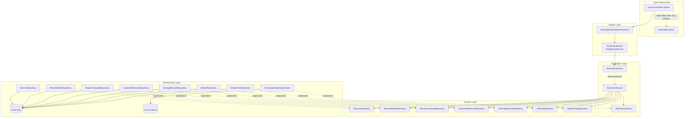
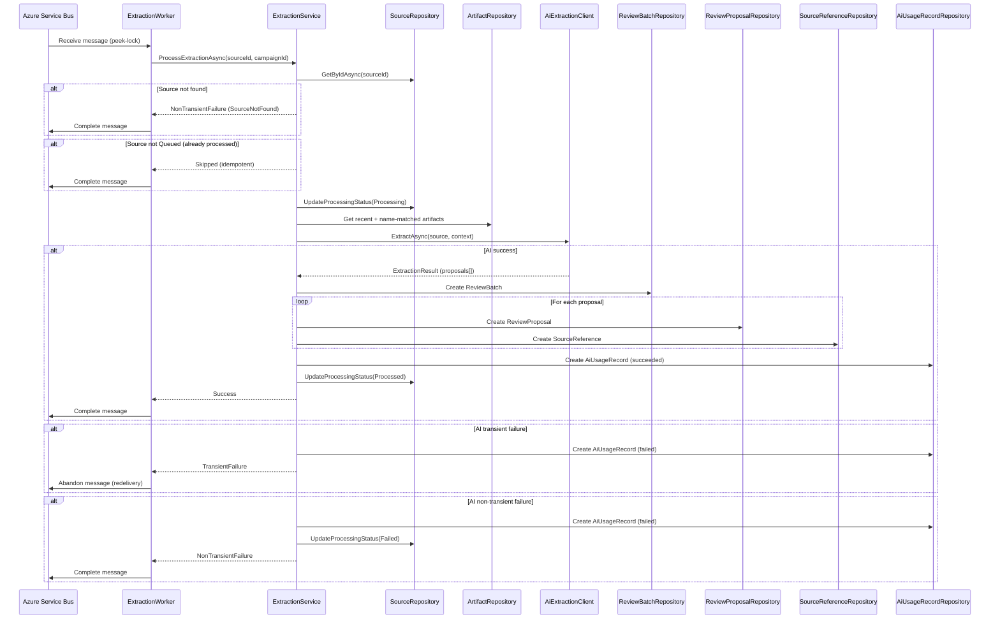
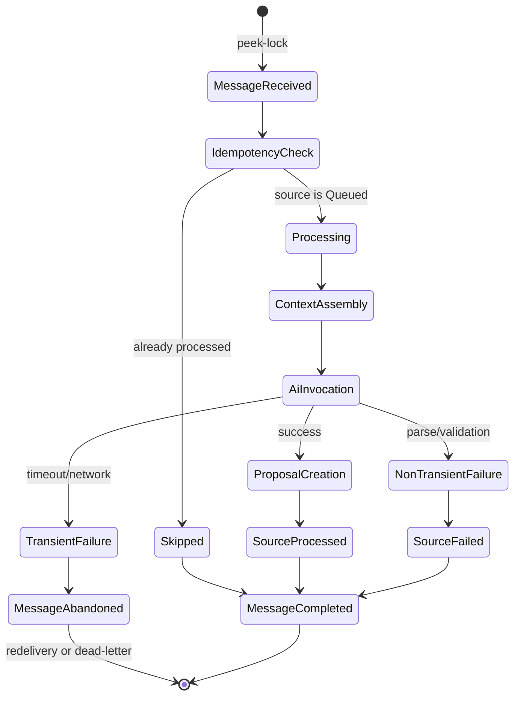

# Design Document: Async Source Extraction

## Overview

This design implements the async source extraction worker — the nornis-worker service that consumes messages from the `source-extraction` Azure Service Bus queue, orchestrates the extraction pipeline, and produces ReviewBatch/ReviewProposal records from AI-generated structured output. The worker is the critical bridge between sources (in Queued status) and the review queue.

The implementation follows the established clean architecture:
- **Nornis.Worker** — `ExtractionWorker` (BackgroundService) that listens to Azure Service Bus using peek-lock mode, deserializes `ExtractionMessage`, and delegates to the application layer.
- **Nornis.Application** — `IExtractionService`/`ExtractionService` orchestrating the full extraction workflow: idempotency checks, source retrieval, context assembly, AI invocation, proposal creation, usage tracking, and failure handling.
- **Nornis.Application** — `IAiExtractionClient` interface defining the contract for AI invocation with structured output.
- **Nornis.Infrastructure** — `AzureOpenAiExtractionClient` implementing the AI call to Azure OpenAI with structured output schema, timeout enforcement, and response validation.
- **Nornis.Infrastructure** — `ServiceBusExtractionProcessor` wrapping `ServiceBusProcessor` for message reception and lock management.

**Key Design Decisions:**

1. **Worker is thin, service is rich** — The Worker's BackgroundService only receives messages and delegates to `IExtractionService`. All business logic, state transitions, and error classification live in the application layer. This keeps the worker testable and avoids coupling business logic to Azure SDK mechanics.

2. **Idempotency via source status check** — Before processing, the service checks whether the source is still in Queued status and whether a ReviewBatch already exists. This provides natural idempotency without separate idempotency tables.

3. **AI client behind interface** — `IAiExtractionClient` abstracts Azure OpenAI. The application layer only sees a clean contract: source content in, structured proposals out. This allows fake implementations for testing without AI calls.

4. **Atomic batch creation** — ReviewBatch, all ReviewProposals, and all SourceReferences are created in a single database transaction. If any persist fails, the entire extraction output is rolled back.

5. **Failure classification drives message handling** — The service classifies failures as transient (timeout, network, service unavailable) or non-transient (source not found, empty body, parse failure). Transient failures abandon the message for redelivery; non-transient failures complete the message after marking the source as Failed.

6. **Visibility inheritance is enforced, not trusted** — Even though the AI system prompt instructs visibility matching, the service explicitly overwrites proposal visibility to match the source's VisibilityScope. Defense in depth against AI misbehavior.

7. **Context assembly uses dual strategy** — Recently-updated artifacts plus name-matched artifacts are merged and deduplicated. This gives the AI broad campaign awareness plus specific relevance to the source content.

8. **Usage tracking always fires** — An `AiUsageRecord` is created for every AI invocation, success or failure. Token counts may be zero on failures where the response is unavailable.

## Architecture



**Extraction Pipeline Sequence:**



**Message Flow State Machine:**



## Components and Interfaces

### Worker Layer (`Nornis.Worker`)

**New/Modified Files:**
```
Nornis.Worker/
├── Program.cs                         (MODIFIED — register services, configure SB)
├── Worker.cs                          (REMOVED — replaced by ExtractionWorker)
├── ExtractionWorker.cs                (NEW — BackgroundService consuming messages)
└── Configuration/
    └── WorkerOptions.cs               (NEW — strongly-typed configuration)
```

### Application Layer (`Nornis.Application`)

**New/Modified Files:**
```
Nornis.Application/
├── Services/
│   ├── IExtractionService.cs          (NEW)
│   └── ExtractionService.cs           (NEW)
├── Ai/
│   ├── IAiExtractionClient.cs         (NEW — AI client interface)
│   ├── ExtractionRequest.cs           (NEW — input model for AI call)
│   ├── ExtractionResult.cs            (NEW — structured output model)
│   └── ExtractionProposal.cs          (NEW — individual proposal from AI)
├── Models/
│   └── ExtractionOutcome.cs           (NEW — result type for worker)
└── Configuration/
    └── ExtractionOptions.cs           (NEW — AI model, timeout, context limits, pricing)
```

### Infrastructure Layer (`Nornis.Infrastructure`)

**New/Modified Files:**
```
Nornis.Infrastructure/
├── Ai/
│   └── AzureOpenAiExtractionClient.cs (NEW — Azure OpenAI integration)
├── Messaging/
│   └── ServiceBusExtractionProcessor.cs (NEW — message reception wrapper)
└── Persistence/
    └── Repositories/
        ├── ArtifactRepository.cs      (MODIFIED — add context query methods)
        └── ReviewBatchRepository.cs   (MODIFIED — add GetBySourceIdAsync)
```

### Key Interfaces

```csharp
// Application layer — Extraction orchestration
public interface IExtractionService
{
    Task<ExtractionOutcome> ProcessExtractionAsync(
        Guid sourceId,
        Guid campaignId,
        CancellationToken ct);
}

// Application layer — AI client abstraction
public interface IAiExtractionClient
{
    Task<AiExtractionResponse> ExtractAsync(
        ExtractionRequest request,
        CancellationToken ct);
}
```

### ExtractionService Responsibilities

The `ExtractionService` orchestrates the full extraction pipeline:

1. **Idempotency check** — Verify source exists, is in Queued status, and has no existing ReviewBatch in Pending/InReview/Completed status.
2. **Status transition** — Move source from Queued to Processing.
3. **Empty body short-circuit** — If source body is null/empty/whitespace, create a Completed ReviewBatch with zero proposals, mark source Processed.
4. **Context assembly** — Load recent artifacts and name-matched artifacts, merge/deduplicate, respect visibility scope.
5. **AI invocation** — Call `IAiExtractionClient` with assembled request.
6. **Response validation** — Verify AI response conforms to schema constraints (proposal limits, field lengths, enum values).
7. **Atomic proposal creation** — Create ReviewBatch + ReviewProposals + SourceReferences in single transaction.
8. **Visibility enforcement** — Override proposal visibility to match source VisibilityScope.
9. **Usage tracking** — Create AiUsageRecord regardless of success/failure.
10. **Failure classification** — Return appropriate `ExtractionOutcome` for the worker to act on.

### Worker Message Handling Logic

```csharp
// Pseudocode for worker message handling
async Task ProcessMessageAsync(ProcessMessageEventArgs args)
{
    var message = Deserialize<ExtractionMessage>(args.Message.Body);
    var outcome = await _extractionService.ProcessExtractionAsync(
        message.SourceId, message.CampaignId, args.CancellationToken);

    switch (outcome.Type)
    {
        case OutcomeType.Success:
        case OutcomeType.Skipped:
        case OutcomeType.NonTransientFailure:
            await args.CompleteMessageAsync(args.Message);
            break;

        case OutcomeType.TransientFailure:
            await args.AbandonMessageAsync(args.Message);
            break;
    }
}
```

### Visibility-Scoped Context Assembly

```csharp
// Determines which visibility scopes to include when assembling artifact context
IReadOnlyList<VisibilityScope> GetAllowedContextScopes(VisibilityScope sourceVisibility) =>
    sourceVisibility switch
    {
        VisibilityScope.Private => [VisibilityScope.Private], // creator-only context
        VisibilityScope.GMOnly => [VisibilityScope.GMOnly, VisibilityScope.PartyVisible],
        VisibilityScope.PartyVisible => [VisibilityScope.PartyVisible],
        _ => [VisibilityScope.PartyVisible]
    };
```

### Extended Repository Interfaces

The following methods need to be added to existing repository interfaces:

```csharp
// IReviewBatchRepository — add:
Task<ReviewBatch?> GetBySourceIdAsync(Guid sourceId, CancellationToken cancellationToken = default);

// IArtifactRepository — add:
Task<IReadOnlyList<Artifact>> ListRecentByCampaignAsync(
    Guid campaignId,
    IReadOnlyList<VisibilityScope> allowedVisibilities,
    int maxCount,
    CancellationToken cancellationToken = default);

Task<IReadOnlyList<Artifact>> ListByNamesInTextAsync(
    Guid campaignId,
    string text,
    IReadOnlyList<VisibilityScope> allowedVisibilities,
    CancellationToken cancellationToken = default);

// IArtifactFactRepository — add:
Task<IReadOnlyList<ArtifactFact>> ListByArtifactIdsAsync(
    IReadOnlyList<Guid> artifactIds,
    int maxPerArtifact,
    CancellationToken cancellationToken = default);
```

## Data Models

### Configuration Models

```csharp
public class ExtractionOptions
{
    public string AiModel { get; set; } = string.Empty;
    public string AiEndpoint { get; set; } = string.Empty;
    public int AiTimeoutSeconds { get; set; } = 60;
    public int MaxArtifactContextCount { get; set; } = 50;
    public int MaxFactsPerArtifact { get; set; } = 20;
    public int MaxParseRetryAttempts { get; set; } = 2;
    public Dictionary<string, ModelPricing> ModelPricing { get; set; } = new();
}

public class ModelPricing
{
    public decimal InputPerMillionTokensUsd { get; set; }
    public decimal OutputPerMillionTokensUsd { get; set; }
}
```

### AI Request/Response Models

```csharp
// Input to the AI client
public class ExtractionRequest
{
    public required string SourceBody { get; init; }
    public required string SourceTitle { get; init; }
    public required string SourceType { get; init; }
    public required string SourceVisibility { get; init; }
    public DateTimeOffset? OccurredAt { get; init; }
    public IReadOnlyList<ArtifactContext> ExistingArtifacts { get; init; } = [];
}

public class ArtifactContext
{
    public required Guid Id { get; init; }
    public required string Name { get; init; }
    public required string Type { get; init; }
    public string? Summary { get; init; }
    public IReadOnlyList<FactContext> Facts { get; init; } = [];
}

public class FactContext
{
    public required string Predicate { get; init; }
    public required string Value { get; init; }
}

// Output from the AI client
public class AiExtractionResponse
{
    public required IReadOnlyList<ExtractionProposal> Proposals { get; init; }
    public required int InputTokens { get; init; }
    public required int OutputTokens { get; init; }
    public required int TotalTokens { get; init; }
    public required int DurationMs { get; init; }
    public required string Model { get; init; }
}

public class ExtractionProposal
{
    public required string ChangeType { get; init; }
    public required string TargetType { get; init; }
    public Guid? TargetId { get; init; }
    public required object ProposedValue { get; init; }
    public required string Rationale { get; init; }
    public decimal? Confidence { get; init; }
}
```

### Extraction Outcome Model

```csharp
public enum OutcomeType
{
    Success,
    Skipped,
    TransientFailure,
    NonTransientFailure
}

public class ExtractionOutcome
{
    public required OutcomeType Type { get; init; }
    public string? ErrorCategory { get; init; }
    public string? ErrorMessage { get; init; }
    public Guid? ReviewBatchId { get; init; }
    public int ProposalCount { get; init; }

    public static ExtractionOutcome Succeeded(Guid reviewBatchId, int proposalCount) =>
        new() { Type = OutcomeType.Success, ReviewBatchId = reviewBatchId, ProposalCount = proposalCount };

    public static ExtractionOutcome SkippedIdempotent(string reason) =>
        new() { Type = OutcomeType.Skipped, ErrorMessage = reason };

    public static ExtractionOutcome Transient(string category, string message) =>
        new() { Type = OutcomeType.TransientFailure, ErrorCategory = category, ErrorMessage = message };

    public static ExtractionOutcome NonTransient(string category, string message) =>
        new() { Type = OutcomeType.NonTransientFailure, ErrorCategory = category, ErrorMessage = message };
}
```

### Structured Output JSON Schema (sent to Azure OpenAI)

```json
{
  "type": "object",
  "properties": {
    "proposals": {
      "type": "array",
      "minItems": 0,
      "maxItems": 50,
      "items": {
        "type": "object",
        "properties": {
          "changeType": {
            "type": "string",
            "enum": ["CreateArtifact", "UpdateArtifact", "MergeArtifact", "AddFact", "UpdateFact", "AddRelationship", "UpdateRelationship"]
          },
          "targetType": {
            "type": "string",
            "enum": ["Artifact", "ArtifactFact", "ArtifactRelationship"]
          },
          "targetId": {
            "type": ["string", "null"],
            "format": "uuid"
          },
          "proposedValue": {
            "type": "object"
          },
          "rationale": {
            "type": "string",
            "minLength": 1,
            "maxLength": 500
          },
          "confidence": {
            "type": "number",
            "minimum": 0.0,
            "maximum": 1.0
          }
        },
        "required": ["changeType", "targetType", "proposedValue", "rationale", "confidence"]
      }
    }
  },
  "required": ["proposals"]
}
```

### Error Categories

```csharp
public static class ErrorCategories
{
    public const string TransientError = "TransientError";
    public const string SourceNotFound = "SourceNotFound";
    public const string EmptySourceBody = "EmptySourceBody";
    public const string ValidationFailure = "ValidationFailure";
    public const string AiCallFailure = "AiCallFailure";
    public const string ParseFailure = "ParseFailure";
    public const string Timeout = "Timeout";
}
```

### Worker Configuration (appsettings)

```json
{
  "Extraction": {
    "AiModel": "gpt-4o",
    "AiEndpoint": "https://<resource>.openai.azure.com/",
    "AiTimeoutSeconds": 60,
    "MaxArtifactContextCount": 50,
    "MaxFactsPerArtifact": 20,
    "MaxParseRetryAttempts": 2,
    "ModelPricing": {
      "gpt-4o": {
        "InputPerMillionTokensUsd": 2.50,
        "OutputPerMillionTokensUsd": 10.00
      }
    }
  },
  "ServiceBus": {
    "ConnectionString": "<from-keyvault>",
    "QueueName": "source-extraction",
    "MaxConcurrentCalls": 1,
    "PrefetchCount": 0,
    "MaxAutoLockRenewalDuration": "00:05:00"
  }
}
```


## Correctness Properties

*A property is a characteristic or behavior that should hold true across all valid executions of a system — essentially, a formal statement about what the system should do. Properties serve as the bridge between human-readable specifications and machine-verifiable correctness guarantees.*

### Property 1: Successful Extraction State Transitions

*For any* source in Queued status with a non-empty body, when the AI client returns a valid response with one or more proposals, the ExtractionService SHALL transition the source through Queued → Processing → Processed, and the final source status SHALL be Processed.

**Validates: Requirements 1.1, 1.2**

### Property 2: Non-Queued Sources and Existing Batches Are Skipped

*For any* source whose ProcessingStatus is not Queued (Draft, Ready, Processing, Processed, or Failed), or any source that already has a ReviewBatch in Pending, InReview, or Completed status, processing the extraction message SHALL return a Skipped outcome without creating new ReviewBatch, ReviewProposal, or AiUsageRecord records, and without modifying the source's ProcessingStatus.

**Validates: Requirements 1.4, 2.1, 2.2**

### Property 3: Non-Transient Failures Transition Source to Failed

*For any* source in Processing status where a non-transient error occurs (parse failure after retries exhausted, validation failure, or malformed AI structured output), the ExtractionService SHALL transition the source ProcessingStatus to Failed and return a NonTransientFailure outcome.

**Validates: Requirements 1.7, 10.1, 10.3**

### Property 4: Transient Failures Leave Source and Batch Unchanged

*For any* source in Processing status where a transient failure occurs (timeout, network error, or service unavailability), the ExtractionService SHALL NOT transition the source ProcessingStatus to Failed or Processed, SHALL NOT modify any existing ReviewBatch status, and SHALL return a TransientFailure outcome.

**Validates: Requirements 10.2**

### Property 5: Empty Body Short-Circuits to Completed Batch

*For any* source in Queued status whose Body is null, empty, or composed entirely of whitespace characters, the ExtractionService SHALL skip AI invocation, create a ReviewBatch with Status=Completed and zero ReviewProposal records, and transition the source ProcessingStatus to Processed.

**Validates: Requirements 3.2**

### Property 6: Source Fields Correctly Mapped to AI Request

*For any* source with non-empty Body, the ExtractionRequest passed to IAiExtractionClient SHALL contain the source's Body, Title, Type name, and Visibility name. If the source's OccurredAt is non-null, the request SHALL include it; if OccurredAt is null, the request's OccurredAt SHALL be null.

**Validates: Requirements 3.3**

### Property 7: Context Assembly Merge, Dedup, Ordering, and Limit

*For any* campaign with N artifacts (where N exceeds the configured MaxArtifactContextCount), the assembled context SHALL contain at most MaxArtifactContextCount artifacts, with name-matched artifacts appearing before recently-updated artifacts, and no artifact appearing more than once in the list.

**Validates: Requirements 4.1, 4.2, 4.3**

### Property 8: Context Payload Respects Facts Limit

*For any* artifact included in the context that has more than MaxFactsPerArtifact facts, the context payload SHALL include exactly MaxFactsPerArtifact facts for that artifact ordered by UpdatedAt descending, and each fact SHALL include its Predicate and Value.

**Validates: Requirements 4.4**

### Property 9: Context Assembly Respects Visibility Scope

*For any* source with a given VisibilityScope, the artifacts included in the context SHALL only contain artifacts whose visibility is permitted for that scope: Private sources include only Private artifacts (of the same creator); GMOnly sources include GMOnly and PartyVisible artifacts; PartyVisible sources include only PartyVisible artifacts.

**Validates: Requirements 4.5**

### Property 10: Invalid AI Responses Are Treated as Failures

*For any* AI response JSON that violates the structured output schema (missing required fields, changeType not in allowed values, rationale exceeding 500 characters, confidence outside 0.0–1.0, or proposals exceeding 50), the ExtractionService SHALL NOT create a ReviewBatch and SHALL classify the result as a non-transient failure.

**Validates: Requirements 5.5, 7.6**

### Property 11: AiUsageRecord Always Created

*For any* extraction that reaches the AI invocation step (source has non-empty body and passes idempotency checks), an AiUsageRecord SHALL be created with the correct CampaignId, SourceId, OperationType=SourceExtraction, Model name, and DurationMs ≥ 0 — regardless of whether the AI call succeeds or fails.

**Validates: Requirements 6.1, 6.3**

### Property 12: Cost Calculation Correctness

*For any* AI response with InputTokens and OutputTokens and a configured ModelPricing with InputPerMillionTokensUsd and OutputPerMillionTokensUsd, the EstimatedCostUsd SHALL equal (InputTokens × InputPerMillionTokensUsd / 1,000,000) + (OutputTokens × OutputPerMillionTokensUsd / 1,000,000).

**Validates: Requirements 6.2**

### Property 13: Extraction Output Record Creation

*For any* successful AI response containing N proposals (N ≥ 1), the ExtractionService SHALL create exactly one ReviewBatch (with CampaignId, SourceId, Status=Pending, CreatedAt ≈ now), exactly N ReviewProposal records (each with correct ChangeType, TargetType, TargetId, ProposedValueJson ≤ 50,000 chars, Rationale, Confidence between 0.00–1.00, Status=Pending), and exactly N SourceReference records (each with TargetType=ReviewProposal, TargetId=the proposal's Id, and SourceId=the extraction source's Id).

**Validates: Requirements 7.1, 7.2, 7.3, 7.4**

### Property 14: Proposal Visibility Always Matches Source Visibility

*For any* source with any VisibilityScope and any AI response containing proposals (regardless of what visibility the AI suggests in ProposedValueJson), every persisted ReviewProposal's visibility within ProposedValueJson SHALL match the source's VisibilityScope — Private sources produce only Private proposals, GMOnly sources produce only GMOnly proposals, and PartyVisible sources produce only PartyVisible proposals.

**Validates: Requirements 8.1, 8.2**

## Error Handling

### Failure Classification

The ExtractionService classifies every failure into one of two categories that determine message handling:

| Failure Type | Category | Message Action | Source Status | Examples |
|---|---|---|---|---|
| Transient | TransientError | Abandon (redelivery) | Unchanged | AI timeout, network failure, 429 rate limit, 503 unavailable |
| Non-transient | Various | Complete | Failed | Source not found, empty body, validation failure, parse failure after retries |

### Error Category Constants

| Category | Meaning | Retry? |
|---|---|---|
| `TransientError` | Temporary infrastructure issue | Yes (via redelivery) |
| `SourceNotFound` | Source Id does not exist in DB | No |
| `EmptySourceBody` | Source body is null/empty/whitespace | No (creates Completed batch) |
| `ValidationFailure` | Source metadata fails validation | No |
| `AiCallFailure` | AI call returned non-transient HTTP error | No |
| `ParseFailure` | AI response failed structured output validation after retries | No |
| `Timeout` | AI call exceeded configured timeout | Yes (transient) |

### Parse Retry Strategy

When the AI response fails schema validation, the service retries up to `MaxParseRetryAttempts` (default 2) before classifying as non-transient ParseFailure:

1. First attempt: AI call + parse
2. If parse fails: retry AI call (attempt 2)
3. If parse fails again: retry AI call (attempt 3)
4. If parse fails a third time: classify as non-transient ParseFailure

### Transient Failure Handling

When a transient failure occurs:
1. Create AiUsageRecord with `Succeeded=false`, `ErrorCode=TransientError`, tokens zero if unavailable.
2. Do NOT modify source ProcessingStatus (leave at Processing).
3. Return `ExtractionOutcome.Transient(...)`.
4. Worker abandons the message — Service Bus will redeliver after visibility timeout.
5. After max delivery count (5), Service Bus moves message to dead-letter queue.

**Important:** The source remains at Processing status during transient retries. If the message is dead-lettered, the source stays at Processing. An operational process (manual or scheduled) should detect stuck Processing sources and transition them to Failed.

### Non-Transient Failure Handling

When a non-transient failure occurs:
1. Create AiUsageRecord with `Succeeded=false`, appropriate `ErrorCode`, tokens if available.
2. Transition source ProcessingStatus to Failed.
3. If a ReviewBatch was created during this attempt, set its status to Failed.
4. Return `ExtractionOutcome.NonTransient(...)`.
5. Worker completes the message — removes it from the queue permanently.

### Atomic Transaction Failure

If the database transaction for creating ReviewBatch + ReviewProposals + SourceReferences fails:
1. The entire transaction rolls back (no partial records).
2. The failure is classified as non-transient.
3. Source transitions to Failed.
4. AiUsageRecord is created outside the proposal transaction (so it persists even on rollback).

### Dead-Letter Queue Handling

Messages in the dead-letter queue are not automatically processed. Operators should:
1. Monitor dead-letter count via metrics.
2. Investigate stuck sources in Processing status.
3. Manually transition sources to Failed or re-queue via the Source API (Failed → Ready → Queued).

### Logging Strategy

All failures emit structured logs with:
- `CorrelationId`: Unique per message processing attempt
- `SourceId`: The source being processed
- `CampaignId`: The campaign containing the source
- `ErrorCategory`: One of the defined category constants
- `AttemptNumber`: Current delivery attempt count
- `DurationMs`: Time spent before failure
- `ErrorMessage`: Human-readable failure description

## Testing Strategy

### Unit Tests (`Nornis.Application.Tests`)

Focus on ExtractionService logic with mocked repositories and a fake AI client:

- **Idempotency**: Source not Queued → skipped. Existing ReviewBatch in Pending/InReview/Completed → skipped.
- **Empty body short-circuit**: Null, empty, whitespace-only bodies → Completed batch with zero proposals.
- **Field mapping**: Source fields correctly assembled into ExtractionRequest.
- **Context assembly**: Recent artifacts limited and ordered. Name-matched artifacts found. Merge/dedup correct. Visibility filtering applied.
- **Proposal creation**: Correct ReviewBatch, ReviewProposal, and SourceReference fields. One-to-one mapping from AI proposals.
- **Visibility enforcement**: ProposedValueJson visibility always matches source regardless of AI response.
- **Cost calculation**: EstimatedCostUsd arithmetic for various token counts.
- **Usage tracking**: AiUsageRecord always created, correct Succeeded flag and ErrorCode.
- **Failure classification**: Timeout → transient. Network error → transient. Parse failure → non-transient after retries.
- **State transitions**: Queued→Processing→Processed on success. Queued→Processing→Failed on non-transient failure. Unchanged on transient failure.
- **Atomic rollback**: Simulated DB failure mid-batch → no partial records.

### Unit Tests (`Nornis.Infrastructure.Tests`)

Focus on AzureOpenAiExtractionClient:

- **Structured output parsing**: Valid JSON → correct ExtractionProposal objects.
- **Schema validation**: Missing fields, wrong types, out-of-range values → parse failure.
- **Timeout enforcement**: Slow response → timeout error.
- **Error handling**: 429, 503, network exception → appropriate error responses.
- **System prompt construction**: Prompt contains visibility instructions, truth state defaults.

### Integration Tests (`Nornis.Worker.Tests`)

Focus on worker message handling:

- **End-to-end happy path**: Message received → extraction → proposals created → message completed.
- **Transient failure → abandon**: AI timeout → message abandoned → redeliverable.
- **Non-transient failure → complete**: Parse failure → source Failed → message completed.
- **Configuration validation**: Missing required config → fail fast at startup.
- **ServiceBusProcessor configuration**: Peek-lock mode, max concurrent calls, lock renewal.

### Property-Based Tests (`Nornis.Application.Tests`)

**Library:** FsCheck.NUnit (FsCheck 3.x integrated with NUnit)

**Configuration:** Minimum 100 iterations per property test.

**Tag format:** `Feature: async-source-extraction, Property {number}: {property_text}`

Property tests will exercise the ExtractionService layer with in-memory repository fakes and a configurable fake `IAiExtractionClient`.

**Properties to implement:**

1. **Successful extraction state transitions** — Generate random sources in Queued status with random non-empty bodies. Configure fake AI client to return valid responses with 1–50 proposals. Assert source ends at Processed.
2. **Non-Queued/existing-batch skip** — Generate sources in all non-Queued statuses OR with existing ReviewBatches in Pending/InReview/Completed. Assert Skipped outcome with no new records.
3. **Non-transient failures → Failed** — Generate sources in Queued status. Configure fake AI client to return parse failures. Assert source transitions to Failed.
4. **Transient failures → unchanged** — Generate sources in Queued status. Configure fake AI client to throw timeout/network exceptions. Assert source status is NOT Failed, outcome is TransientFailure.
5. **Empty body short-circuit** — Generate sources with null, empty, or whitespace-only bodies (random whitespace patterns). Assert no AI call, ReviewBatch with Status=Completed, zero proposals, source=Processed.
6. **Source field mapping** — Generate random sources with various field combinations. Assert ExtractionRequest passed to fake AI client contains matching fields.
7. **Context assembly merge/dedup/limit** — Generate campaigns with N>MaxCount artifacts (some name-matched, some recent, some overlapping). Assert context has ≤MaxCount artifacts, name-matched first, no duplicates.
8. **Context facts limit** — Generate artifacts with >20 facts. Assert context includes exactly 20 facts per artifact ordered by UpdatedAt descending.
9. **Context visibility scope** — Generate campaigns with mixed-visibility artifacts and sources of each visibility. Assert only permitted artifacts appear in context.
10. **Invalid AI response → failure** — Generate random invalid JSON structures. Assert non-transient failure outcome, no batch created.
11. **AiUsageRecord always created** — Generate mixed success/failure scenarios. Assert AiUsageRecord exists for every AI invocation.
12. **Cost calculation** — Generate random (inputTokens, outputTokens, inputRate, outputRate) tuples. Assert EstimatedCostUsd matches formula.
13. **Extraction output records** — Generate valid AI responses with 1–50 proposals. Assert exactly 1 ReviewBatch + N ReviewProposals + N SourceReferences with correct field mapping.
14. **Visibility enforcement** — Generate sources of each VisibilityScope and AI responses with mismatched visibilities. Assert all persisted proposal visibilities match source.

### Custom Generators

FsCheck generators for:
- **ValidSourceBody**: Non-empty, non-whitespace strings between 1–100,000 characters.
- **EmptySourceBody**: Null, empty string, or strings composed entirely of whitespace (spaces, tabs, newlines in random combinations).
- **ExtractionProposalGen**: Random valid proposals with valid ChangeType, TargetType, rationale 1–500 chars, confidence 0.0–1.0.
- **InvalidExtractionResponse**: JSON objects missing required fields, wrong enum values, rationale >500 chars, confidence outside range, >50 proposals.
- **ArtifactWithFacts**: Artifacts with random numbers of facts (0–50), various visibilities and UpdatedAt values.
- **TokenCounts**: Random (inputTokens, outputTokens) pairs with realistic ranges (0–100,000).
- **ModelPricingGen**: Random pricing rates (0.01–100.00 per million tokens).
- **SourceVisibilityScenario**: Composite generating (Source, List<Artifact>) tuples for visibility testing.

### Fake Infrastructure

- **InMemorySourceRepository**: Existing pattern extended to support ProcessingStatus transitions.
- **InMemoryReviewBatchRepository**: Dictionary-backed with `GetBySourceIdAsync`.
- **InMemoryReviewProposalRepository**: Dictionary-backed.
- **InMemorySourceReferenceRepository**: Dictionary-backed.
- **InMemoryAiUsageRecordRepository**: Dictionary-backed.
- **InMemoryArtifactRepository**: Extended with `ListRecentByCampaignAsync` and `ListByNamesInTextAsync`.
- **FakeAiExtractionClient**: Configurable to return success, throw transient errors, or return invalid responses. Records all requests for assertion.

### Test Data Conventions

Per steering rules, use realistic campaign examples:
- Campaign: "Black Harbor Investigation"
- Sources: "Session 4 — Questioning Captain Voss", "Tavrin's Journal — The Silver Key"
- Artifacts: Captain Voss (Character), Black Harbor (Location), Silver Key (Item), Missing Caravan (Thread)
- Facts: "Captain Voss denied knowing about the missing caravan", "Silver Key found in Voss's quarters"
