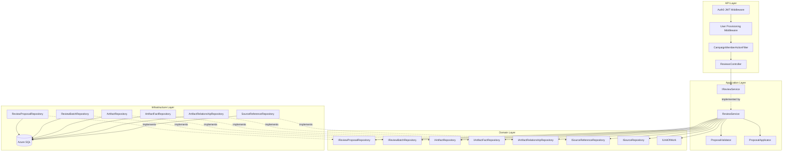
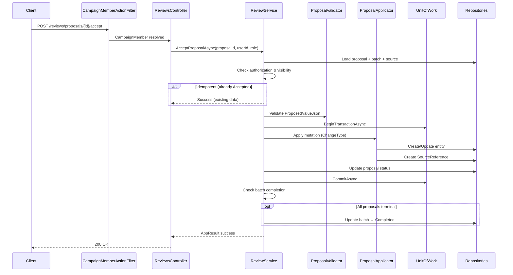
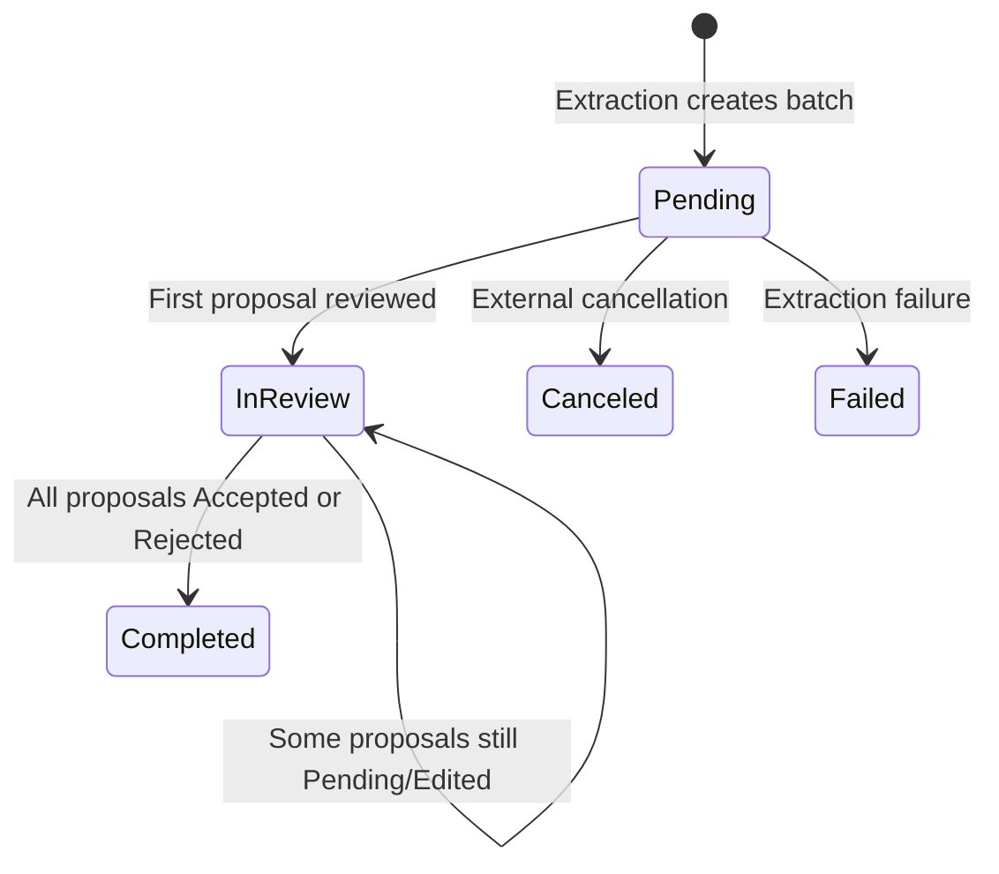

# Design Document: Review Proposal Workflow

## Overview

This design implements the Review Proposal Workflow — the API and application service layer for reviewing, accepting, rejecting, and editing ReviewProposals generated by the async source extraction worker. This is the critical bridge in the MVP loop where "AI proposes, users decide" becomes reality.

The implementation follows the established clean architecture:
- **Nornis.Api** — ReviewsController, request/response DTOs, CampaignMemberActionFilter for campaign-scoped authorization.
- **Nornis.Application** — IReviewService/ReviewService orchestrating authorization, visibility filtering, proposal validation, knowledge graph mutation, batch lifecycle management, and transactional consistency.
- **Nornis.Domain** — Existing ReviewProposal, ReviewBatch entities and repository interfaces (extended with new query methods).
- **Nornis.Infrastructure** — Repository extensions for filtered/paginated queries.

**Key Design Decisions:**

1. **Service layer owns all business rules** — Authorization, visibility filtering, proposal status guards, JSON schema validation, knowledge graph mutation, batch lifecycle, and idempotency all live in ReviewService.
2. **Visibility = not-found for unauthorized operations** — When a member cannot see a proposal due to source visibility rules, the system returns not-found rather than forbidden. This prevents information leakage.
3. **Per-proposal transactions in batch operations** — Each proposal in a batch is processed in its own transaction. Batch status updates happen outside the proposal transaction.
4. **Idempotent terminal states** — Accepting an already-accepted proposal or rejecting an already-rejected proposal returns success without side effects.
5. **ProposedValueJson schema validation** — Each ChangeType has a corresponding JSON schema. Validation occurs before any mutation.
6. **Sequential batch processing** — Batch operations process proposals in the order submitted to maintain consistency when proposals reference shared artifacts.
7. **FsCheck.NUnit for property-based testing** — Consistent with existing patterns using custom Arbitraries and in-memory fakes.

## Architecture



**Accept Proposal Flow:**



**Batch Status Lifecycle:**



## Components and Interfaces

### API Layer (`Nornis.Api`)

**New Files:**
```
Nornis.Api/
├── Controllers/
│   └── ReviewsController.cs                    (NEW)
├── Contracts/
│   ├── Requests/
│   │   ├── EditProposalRequest.cs              (NEW)
│   │   ├── BatchAcceptRequest.cs               (NEW)
│   │   └── BatchRejectRequest.cs               (NEW)
│   └── Responses/
│       ├── ReviewProposalResponse.cs           (NEW)
│       ├── ReviewQueueResponse.cs              (NEW)
│       ├── AcceptProposalResponse.cs           (NEW)
│       ├── RejectProposalResponse.cs           (NEW)
│       ├── EditProposalResponse.cs             (NEW)
│       └── BatchOperationResponse.cs           (NEW)
```

### Application Layer (`Nornis.Application`)

**New Files:**
```
Nornis.Application/
├── Services/
│   ├── IReviewService.cs                       (NEW)
│   └── ReviewService.cs                        (NEW)
├── Models/
│   ├── ReviewQueueQuery.cs                     (NEW)
│   ├── ReviewQueueResult.cs                    (NEW)
│   ├── AcceptProposalCommand.cs                (NEW)
│   ├── RejectProposalCommand.cs                (NEW)
│   ├── EditProposalCommand.cs                  (NEW)
│   ├── BatchAcceptCommand.cs                   (NEW)
│   ├── BatchRejectCommand.cs                   (NEW)
│   └── BatchOperationResult.cs                 (NEW)
├── Validation/
│   ├── IProposalValidator.cs                   (NEW)
│   └── ProposalValidator.cs                    (NEW)
├── Application/
│   ├── IProposalApplicator.cs                  (NEW)
│   └── ProposalApplicator.cs                   (NEW)
```

### Domain Layer (`Nornis.Domain`)

**Modified Files:**
```
Nornis.Domain/
├── Repositories/
│   ├── IReviewProposalRepository.cs            (MODIFIED — add filtered queries)
│   └── IReviewBatchRepository.cs               (MODIFIED — add CompletedAt update)
```

### Key Interfaces

```csharp
// Application layer — Review operations
public interface IReviewService
{
    Task<AppResult<ReviewQueueResult>> ListReviewQueueAsync(
        ReviewQueueQuery query, CancellationToken ct);

    Task<AppResult<AcceptProposalResult>> AcceptProposalAsync(
        AcceptProposalCommand command, CancellationToken ct);

    Task<AppResult<RejectProposalResult>> RejectProposalAsync(
        RejectProposalCommand command, CancellationToken ct);

    Task<AppResult<EditProposalResult>> EditProposalAsync(
        EditProposalCommand command, CancellationToken ct);

    Task<AppResult<BatchOperationResult>> BatchAcceptAsync(
        BatchAcceptCommand command, CancellationToken ct);

    Task<AppResult<BatchOperationResult>> BatchRejectAsync(
        BatchRejectCommand command, CancellationToken ct);
}

// Validates ProposedValueJson against ChangeType-specific schemas
public interface IProposalValidator
{
    AppResult ValidateProposedValue(string json, ReviewChangeType changeType);
}

// Applies the proposed mutation to the knowledge graph
public interface IProposalApplicator
{
    Task<AppResult<ApplyResult>> ApplyAsync(
        ReviewProposal proposal,
        ReviewBatch batch,
        CancellationToken ct);
}

public record ApplyResult(
    Guid EntityId,
    SourceReferenceTargetType TargetType);
```

### Extended Repository Interfaces

```csharp
// IReviewProposalRepository — additions
public interface IReviewProposalRepository
{
    // Existing methods...
    Task<ReviewProposal> CreateAsync(ReviewProposal proposal, CancellationToken cancellationToken = default);
    Task<ReviewProposal?> GetByIdAsync(Guid id, CancellationToken cancellationToken = default);
    Task<IReadOnlyList<ReviewProposal>> ListByReviewBatchAsync(Guid reviewBatchId, CancellationToken cancellationToken = default);
    Task<IReadOnlyList<ReviewProposal>> ListPendingByCampaignAsync(Guid campaignId, CancellationToken cancellationToken = default);
    Task<ReviewProposal> UpdateAsync(ReviewProposal proposal, CancellationToken cancellationToken = default);

    // NEW — paginated query with batch/source join for visibility filtering
    Task<(IReadOnlyList<ReviewProposal> Proposals, bool HasMore)> ListReviewQueueAsync(
        Guid campaignId,
        IReadOnlyList<Guid> allowedSourceIds,
        Guid? filterByBatchId,
        int limit,
        CancellationToken cancellationToken = default);
}

// IReviewBatchRepository — additions
public interface IReviewBatchRepository
{
    // Existing methods...
    Task<ReviewBatch> CreateAsync(ReviewBatch batch, CancellationToken cancellationToken = default);
    Task<ReviewBatch?> GetByIdAsync(Guid id, CancellationToken cancellationToken = default);
    Task<ReviewBatch?> GetBySourceIdAsync(Guid sourceId, CancellationToken cancellationToken = default);
    Task<IReadOnlyList<ReviewBatch>> ListByCampaignAsync(Guid campaignId, CancellationToken cancellationToken = default);
    Task UpdateStatusAsync(Guid id, ReviewBatchStatus status, CancellationToken cancellationToken = default);

    // NEW — update status with CompletedAt
    Task UpdateCompletedAsync(Guid id, DateTimeOffset completedAt, CancellationToken cancellationToken = default);
}
```

### ReviewService Implementation Responsibilities

The `ReviewService` encapsulates:

1. **Visibility filtering** — Determines which sources are visible to the requesting user based on role and source VisibilityScope. Uses this to derive the set of allowedSourceIds for proposal queries.
2. **Authorization enforcement** — GMs can review any proposal. Players can only review proposals from their own sources. Observers are always denied.
3. **Proposal status guards** — Only Pending or Edited proposals can be accepted, rejected, or edited. Terminal states are handled idempotently or with conflict errors.
4. **ProposedValueJson validation** — Delegates to IProposalValidator for schema-specific validation before acceptance or editing.
5. **Knowledge graph mutation** — Delegates to IProposalApplicator for ChangeType-specific entity creation/updates within a transaction.
6. **SourceReference creation** — After successful entity mutation, creates a SourceReference linking the batch's source to the new/updated entity.
7. **Batch lifecycle management** — Transitions batch from Pending→InReview on first review, InReview→Completed when all proposals reach terminal state.
8. **Idempotency** — Detects when a proposal is already in the target terminal state and returns success without side effects.
9. **Transactional consistency** — Wraps entity mutation + SourceReference + proposal status update in a single transaction per proposal.

### Visibility Decision Logic

```csharp
// Determines which sources (and therefore proposals) a user can see
IReadOnlyList<Guid> GetAllowedSourceIds(
    IReadOnlyList<Source> campaignSources,
    Guid userId,
    CampaignRole role)
{
    return role switch
    {
        CampaignRole.GM => campaignSources.Select(s => s.Id).ToList(),
        CampaignRole.Player => campaignSources
            .Where(s => s.Visibility == VisibilityScope.PartyVisible
                     || (s.Visibility == VisibilityScope.Private && s.CreatedByUserId == userId))
            .Where(s => s.CreatedByUserId == userId) // Players only see proposals from own sources
            .Select(s => s.Id).ToList(),
        CampaignRole.Observer => [],
        _ => []
    };
}
```

Note: The Player filter is the intersection of two rules — (a) visibility permits seeing the source AND (b) the Player authored the source. Since Players can only review proposals from sources they created, and Private sources are only visible to the creator, the effective rule simplifies to: Players see proposals from their own PartyVisible and Private sources. They never see proposals from other users' sources regardless of visibility.

### Authorization Check for Operations

```csharp
AppResult CheckReviewAuthorization(
    CampaignRole role,
    Guid actingUserId,
    Source source)
{
    return role switch
    {
        CampaignRole.Observer => AppResult.Fail(new AppError(403, "forbidden", "Observers cannot review proposals.")),
        CampaignRole.Player when source.CreatedByUserId != actingUserId
            => AppResult.Fail(new AppError(403, "forbidden", "Players can only review proposals from their own sources.")),
        _ => AppResult.Success()
    };
}
```

### ProposalApplicator — ChangeType Dispatch

```csharp
public class ProposalApplicator : IProposalApplicator
{
    public async Task<AppResult<ApplyResult>> ApplyAsync(
        ReviewProposal proposal, ReviewBatch batch, CancellationToken ct)
    {
        return proposal.ChangeType switch
        {
            ReviewChangeType.CreateArtifact => await ApplyCreateArtifact(proposal, batch, ct),
            ReviewChangeType.UpdateArtifact => await ApplyUpdateArtifact(proposal, ct),
            ReviewChangeType.MergeArtifact => await ApplyMergeArtifact(proposal, batch, ct),
            ReviewChangeType.AddFact => await ApplyAddFact(proposal, ct),
            ReviewChangeType.UpdateFact => await ApplyUpdateFact(proposal, ct),
            ReviewChangeType.AddRelationship => await ApplyAddRelationship(proposal, batch, ct),
            ReviewChangeType.UpdateRelationship => await ApplyUpdateRelationship(proposal, ct),
            _ => AppResult<ApplyResult>.Fail(new AppError(400, "unknown_change_type", "..."))
        };
    }
}
```

### API Endpoint Design

| Method | Route | Auth | Description |
|--------|-------|------|-------------|
| GET | `/api/campaigns/{campaignId}/reviews/proposals` | GM or Player | List review queue (filtered by role/visibility) |
| POST | `/api/campaigns/{campaignId}/reviews/proposals/{proposalId}/accept` | GM or authorized Player | Accept proposal |
| POST | `/api/campaigns/{campaignId}/reviews/proposals/{proposalId}/reject` | GM or authorized Player | Reject proposal |
| POST | `/api/campaigns/{campaignId}/reviews/proposals/{proposalId}/edit` | GM or authorized Player | Edit proposal's ProposedValueJson |
| POST | `/api/campaigns/{campaignId}/reviews/proposals/batch-accept` | GM or authorized Player | Batch accept proposals |
| POST | `/api/campaigns/{campaignId}/reviews/proposals/batch-reject` | GM or authorized Player | Batch reject proposals |

**Query parameters for GET /proposals:**
- `batchId` (optional Guid) — filter to a specific ReviewBatch

## Data Models

### ProposedValueJson Schemas

Each ChangeType expects a specific JSON structure in ProposedValueJson:

**CreateArtifact:**
```json
{
  "name": "Captain Voss",
  "type": "Character",
  "summary": "A harbor captain suspected of involvement...",
  "visibility": "PartyVisible",
  "confidence": 0.85
}
```

**UpdateArtifact:**
```json
{
  "name": "Captain Voss",
  "summary": "Updated summary...",
  "visibility": "PartyVisible",
  "confidence": 0.9,
  "status": "Active"
}
```

**MergeArtifact:**
```json
{
  "sourceArtifactId": "guid-of-source-artifact",
  "name": "Merged Name",
  "summary": "Combined summary...",
  "visibility": "PartyVisible",
  "confidence": 0.9
}
```

**AddFact:**
```json
{
  "predicate": "location",
  "value": "Black Harbor",
  "confidence": 0.8,
  "truthState": "Likely",
  "visibility": "PartyVisible"
}
```

**UpdateFact:**
```json
{
  "value": "Updated value",
  "confidence": 0.9,
  "truthState": "Confirmed",
  "visibility": "PartyVisible"
}
```

**AddRelationship:**
```json
{
  "artifactAId": "guid-a",
  "artifactBId": "guid-b",
  "type": "LocatedIn",
  "description": "Captain Voss is located in Black Harbor",
  "confidence": 0.85,
  "truthState": "Likely",
  "visibility": "PartyVisible"
}
```

**UpdateRelationship:**
```json
{
  "type": "SuspectedIn",
  "description": "Updated description...",
  "confidence": 0.9,
  "truthState": "Confirmed",
  "visibility": "PartyVisible"
}
```

### Request DTOs

```csharp
public record EditProposalRequest(string ProposedValueJson);

public record BatchAcceptRequest(IReadOnlyList<Guid> ProposalIds);

public record BatchRejectRequest(IReadOnlyList<Guid> ProposalIds);
```

### Response DTOs

```csharp
public record ReviewProposalResponse(
    Guid Id,
    Guid ReviewBatchId,
    string ChangeType,
    string TargetType,
    Guid? TargetId,
    string ProposedValueJson,
    string? Rationale,
    decimal? Confidence,
    string Status,
    DateTimeOffset CreatedAt);

public record ReviewQueueResponse(
    IReadOnlyList<ReviewProposalResponse> Proposals,
    bool HasMore);

public record AcceptProposalResponse(
    Guid ProposalId,
    string Status,
    DateTimeOffset ReviewedAt,
    Guid ReviewedByUserId,
    Guid? CreatedEntityId);

public record RejectProposalResponse(
    Guid ProposalId,
    string Status,
    DateTimeOffset ReviewedAt,
    Guid ReviewedByUserId);

public record EditProposalResponse(
    Guid ProposalId,
    string Status,
    string ProposedValueJson,
    DateTimeOffset ReviewedAt,
    Guid ReviewedByUserId);

public record BatchOperationResponse(
    IReadOnlyList<Guid> Succeeded,
    IReadOnlyList<BatchFailureItem> Failed);

public record BatchFailureItem(
    Guid ProposalId,
    string Code,
    string Message);
```

### Application Commands

```csharp
public record ReviewQueueQuery(
    Guid CampaignId,
    Guid ActingUserId,
    CampaignRole ActingUserRole,
    Guid? FilterByBatchId = null);

public record ReviewQueueResult(
    IReadOnlyList<ReviewProposal> Proposals,
    bool HasMore);

public record AcceptProposalCommand(
    Guid ProposalId,
    Guid CampaignId,
    Guid ActingUserId,
    CampaignRole ActingUserRole);

public record RejectProposalCommand(
    Guid ProposalId,
    Guid CampaignId,
    Guid ActingUserId,
    CampaignRole ActingUserRole);

public record EditProposalCommand(
    Guid ProposalId,
    Guid CampaignId,
    Guid ActingUserId,
    CampaignRole ActingUserRole,
    string NewProposedValueJson);

public record BatchAcceptCommand(
    IReadOnlyList<Guid> ProposalIds,
    Guid CampaignId,
    Guid ActingUserId,
    CampaignRole ActingUserRole);

public record BatchRejectCommand(
    IReadOnlyList<Guid> ProposalIds,
    Guid CampaignId,
    Guid ActingUserId,
    CampaignRole ActingUserRole);

public record AcceptProposalResult(
    Guid ProposalId,
    ReviewProposalStatus Status,
    DateTimeOffset ReviewedAt,
    Guid ReviewedByUserId,
    Guid? CreatedEntityId);

public record RejectProposalResult(
    Guid ProposalId,
    ReviewProposalStatus Status,
    DateTimeOffset ReviewedAt,
    Guid ReviewedByUserId);

public record EditProposalResult(
    Guid ProposalId,
    ReviewProposalStatus Status,
    string ProposedValueJson,
    DateTimeOffset ReviewedAt,
    Guid ReviewedByUserId);

public record BatchOperationResult(
    IReadOnlyList<Guid> Succeeded,
    IReadOnlyList<BatchFailureDetail> Failed);

public record BatchFailureDetail(
    Guid ProposalId,
    string Code,
    string Message);
```

### ProposalValidator — JSON Schema Models

```csharp
// Deserialization targets for ProposedValueJson validation
public record CreateArtifactPayload(
    string Name,
    string Type,
    string? Summary,
    string? Visibility,
    decimal? Confidence);

public record UpdateArtifactPayload(
    string? Name,
    string? Summary,
    string? Visibility,
    decimal? Confidence,
    string? Status);

public record MergeArtifactPayload(
    Guid SourceArtifactId,
    string? Name,
    string? Summary,
    string? Visibility,
    decimal? Confidence);

public record AddFactPayload(
    string Predicate,
    string Value,
    decimal? Confidence,
    string? TruthState,
    string? Visibility);

public record UpdateFactPayload(
    string? Value,
    decimal? Confidence,
    string? TruthState,
    string? Visibility);

public record AddRelationshipPayload(
    Guid ArtifactAId,
    Guid ArtifactBId,
    string Type,
    string? Description,
    decimal? Confidence,
    string? TruthState,
    string? Visibility);

public record UpdateRelationshipPayload(
    string? Type,
    string? Description,
    decimal? Confidence,
    string? TruthState,
    string? Visibility);
```

**Validation Rules per ChangeType:**
- **CreateArtifact**: `Name` required (1–200 chars), `Type` must be valid ArtifactType enum string.
- **UpdateArtifact**: At least one field must be non-null.
- **MergeArtifact**: `SourceArtifactId` required (non-empty GUID).
- **AddFact**: `Predicate` required (1–500 chars), `Value` required (1–4000 chars).
- **UpdateFact**: At least one field must be non-null.
- **AddRelationship**: `ArtifactAId` and `ArtifactBId` required (non-empty GUIDs), `Type` required (1–200 chars).
- **UpdateRelationship**: At least one field must be non-null.
- **All**: Total JSON length ≤ 32,768 characters.

### Batch Lifecycle Management

```csharp
// Called after each proposal state change (accept/reject/edit)
async Task UpdateBatchLifecycleAsync(Guid batchId, CancellationToken ct)
{
    var batch = await _reviewBatchRepository.GetByIdAsync(batchId, ct);
    if (batch is null) return;

    // Don't touch Canceled or Failed batches
    if (batch.Status is ReviewBatchStatus.Canceled or ReviewBatchStatus.Failed)
        return;

    var proposals = await _reviewProposalRepository.ListByReviewBatchAsync(batchId, ct);

    if (batch.Status == ReviewBatchStatus.Pending)
    {
        // First review transitions to InReview
        await _reviewBatchRepository.UpdateStatusAsync(batchId, ReviewBatchStatus.InReview, ct);
        batch.Status = ReviewBatchStatus.InReview;
    }

    // Check if all proposals are in terminal state
    var allTerminal = proposals.All(p =>
        p.Status is ReviewProposalStatus.Accepted or ReviewProposalStatus.Rejected);

    if (allTerminal && proposals.Count > 0 &&
        batch.Status == ReviewBatchStatus.InReview)
    {
        await _reviewBatchRepository.UpdateCompletedAsync(
            batchId, DateTimeOffset.UtcNow, ct);
    }
}
```

### Visibility Default for Created Entities

When ProposedValueJson specifies a `visibility` field, use that value. When it does not, default to the VisibilityScope of the source associated with the proposal's ReviewBatch:

```csharp
VisibilityScope ResolveVisibility(string? proposedVisibility, Source source)
{
    if (proposedVisibility is not null &&
        Enum.TryParse<VisibilityScope>(proposedVisibility, ignoreCase: true, out var parsed))
    {
        return parsed;
    }
    return source.Visibility;
}
```

## Correctness Properties

*A property is a characteristic or behavior that should hold true across all valid executions of a system — essentially, a formal statement about what the system should do. Properties serve as the bridge between human-readable specifications and machine-verifiable correctness guarantees.*

### Property 1: Visibility Filtering

*For any* campaign with sources of mixed VisibilityScope (Private, GMOnly, PartyVisible) owned by different users, and any campaign member requesting the review queue: a GM SHALL see all pending proposals regardless of source author or visibility; a Player SHALL see only pending proposals from sources the Player created (excluding proposals from GMOnly sources created by others); an Observer SHALL see zero proposals. The returned set SHALL equal exactly the subset permitted by these rules.

**Validates: Requirements 1.1, 1.2, 1.3, 1.4, 1.5, 1.6, 7.1, 7.2, 7.3**

### Property 2: Authorization Enforcement

*For any* review operation (accept, reject, or edit) and any proposal in a campaign: a GM SHALL be authorized regardless of source author; a Player SHALL be authorized only if the source associated with the proposal's ReviewBatch was created by that Player; an Observer SHALL always be denied with 403.

**Validates: Requirements 6.1, 6.2, 6.3, 6.4**

### Property 3: Invisible Proposals Treated as Not-Found

*For any* proposal that a user cannot see due to visibility rules (Private source where user is not the creator and not a GM; GMOnly source where user is not a GM), any review operation (accept, reject, edit) or batch inclusion SHALL respond with a not-found error rather than a forbidden error.

**Validates: Requirements 3.5, 7.4, 7.6**

### Property 4: Accept Transitions Status and Sets Metadata

*For any* proposal with Status Pending or Edited that is accepted by an authorized reviewer, the proposal's Status SHALL transition to Accepted, ReviewedAt SHALL be set to approximately the current UTC timestamp, and ReviewedByUserId SHALL be set to the acting user's Id.

**Validates: Requirements 2.1**

### Property 5: CreateArtifact Acceptance Creates Correct Artifact

*For any* valid CreateArtifact proposal with well-formed ProposedValueJson containing Name, Type, Summary, Visibility, and Confidence fields, acceptance SHALL create an Artifact with those field values, CampaignId from the ReviewBatch, Status Active, and CreatedAt/UpdatedAt set to the current UTC timestamp. The proposal's TargetId SHALL be updated to the newly created Artifact's Id.

**Validates: Requirements 2.2, 9.1**

### Property 6: Update Acceptance Updates Existing Entity

*For any* proposal with ChangeType UpdateArtifact, UpdateFact, or UpdateRelationship where the TargetId references an existing entity in the campaign, acceptance SHALL update only the fields specified in ProposedValueJson (non-null values) and set UpdatedAt to the current UTC timestamp, leaving unspecified fields unchanged.

**Validates: Requirements 2.3, 2.5, 2.7**

### Property 7: Add Acceptance Creates Correct Entity

*For any* valid AddFact proposal where TargetId references an existing Artifact, acceptance SHALL create an ArtifactFact with ArtifactId equal to TargetId and fields from ProposedValueJson. *For any* valid AddRelationship proposal where both ArtifactAId and ArtifactBId reference existing Artifacts, acceptance SHALL create an ArtifactRelationship with the specified fields.

**Validates: Requirements 2.4, 2.6, 9.2, 9.3**

### Property 8: MergeArtifact Reassigns and Archives

*For any* valid MergeArtifact proposal where both TargetId and SourceArtifactId reference existing Artifacts in the campaign, acceptance SHALL: update the target Artifact fields from ProposedValueJson, reassign all ArtifactFacts from the source Artifact to the target Artifact, reassign all ArtifactRelationships from the source Artifact to the target Artifact (removing any that would become self-referencing), and set the source Artifact's Status to Archived.

**Validates: Requirements 9.5**

### Property 9: Accept Creates SourceReference

*For any* accepted proposal (regardless of ChangeType), a SourceReference SHALL be created with SourceId equal to the ReviewBatch's SourceId, TargetType corresponding to the entity type created/updated, and TargetId equal to the entity Id.

**Validates: Requirements 2.8**

### Property 10: Reject Transitions Status Without Knowledge Graph Changes

*For any* proposal with Status Pending or Edited that is rejected by an authorized reviewer, the proposal's Status SHALL transition to Rejected, ReviewedAt and ReviewedByUserId SHALL be set, and no Artifact, ArtifactFact, ArtifactRelationship, or SourceReference records SHALL be created or modified.

**Validates: Requirements 3.1, 3.2**

### Property 11: Edit Replaces JSON Without Mutating Knowledge Graph

*For any* proposal with Status Pending or Edited, a valid edit request SHALL replace the entire ProposedValueJson with the submitted value, transition Status to Edited, set ReviewedAt and ReviewedByUserId, and SHALL NOT create or modify any Artifact, ArtifactFact, ArtifactRelationship, or SourceReference.

**Validates: Requirements 4.1, 4.6**

### Property 12: Edited Proposals Allow Subsequent Accept or Reject

*For any* proposal with Status Edited, both acceptance (following Requirement 2 logic with the edited ProposedValueJson) and rejection (following Requirement 3 logic) SHALL succeed.

**Validates: Requirements 4.2**

### Property 13: Batch Operations Process Each Proposal Correctly

*For any* batch accept or batch reject request containing 1–50 unique proposal Ids, each proposal SHALL be processed following the same logic as single-proposal acceptance or rejection respectively, in the order the Ids appear in the request.

**Validates: Requirements 5.1, 5.2, 5.6**

### Property 14: Batch Partial Failure Reports Correct Partitioning

*For any* batch operation containing a mix of valid and invalid proposals (unauthorized, non-existent, wrong status, invisible), the response SHALL correctly partition proposal Ids into succeeded and failed lists with accurate error reasons. Processing SHALL continue past individual failures.

**Validates: Requirements 5.3, 5.5**

### Property 15: First Review Transitions Batch to InReview

*For any* ReviewBatch with Status Pending, when the first proposal in that batch is accepted, rejected, or edited, the batch Status SHALL transition from Pending to InReview.

**Validates: Requirements 8.1, 3.6**

### Property 16: All Proposals Terminal Transitions Batch to Completed

*For any* ReviewBatch with Status InReview, when the last non-terminal proposal in that batch reaches Status Accepted or Rejected, the batch Status SHALL transition to Completed and CompletedAt SHALL be set to the current UTC timestamp.

**Validates: Requirements 8.2**

### Property 17: Batch Not Completed While Non-Terminal Proposals Remain

*For any* ReviewBatch containing at least one proposal with Status Pending or Edited, the batch Status SHALL NOT be Completed.

**Validates: Requirements 8.3**

### Property 18: Idempotent Terminal State

*For any* proposal with Status Accepted, accepting it again SHALL return success containing the existing ReviewedAt and ReviewedByUserId without creating additional entities or modifying the proposal. *For any* proposal with Status Rejected, rejecting it again SHALL return success without state changes.

**Validates: Requirements 10.1, 10.2**

### Property 19: Cross-State Terminal Transition Error

*For any* proposal with Status Accepted, attempting to reject it SHALL return an error. *For any* proposal with Status Rejected, attempting to accept it SHALL return an error.

**Validates: Requirements 10.3**

### Property 20: Accepted Entity Visibility Defaults

*For any* accepted proposal where ProposedValueJson does not specify a VisibilityScope, the created entity's Visibility SHALL be set to the VisibilityScope of the source associated with the proposal's ReviewBatch. When ProposedValueJson does specify a valid VisibilityScope, the entity SHALL use that value.

**Validates: Requirements 7.5**

### Property 21: Review Queue Ordering

*For any* set of pending proposals in a campaign, the review queue SHALL return proposals ordered by CreatedAt ascending within each ReviewBatch, with ReviewBatches ordered by CreatedAt ascending.

**Validates: Requirements 1.8**

### Property 22: Review Queue Pagination

*For any* campaign with more than 200 matching proposals, the review queue SHALL return exactly 200 proposals and include a HasMore indicator set to true. When 200 or fewer proposals match, HasMore SHALL be false.

**Validates: Requirements 1.11**

## Error Handling

### HTTP Status Code Strategy

| Scenario | Status Code | Error Code | Message |
|----------|-------------|------------|---------|
| Missing/invalid JWT | 401 | — | Handled by auth middleware |
| Non-member of campaign | 403 | `access_denied` | You are not a member of this campaign |
| Observer attempting any review operation | 403 | `forbidden` | Observers cannot review proposals |
| Player reviewing another user's source proposals | 403 | `forbidden` | Players can only review proposals from their own sources |
| Proposal not found (or invisible) | 404 | `not_found` | Proposal not found |
| ReviewBatch not found in campaign | 404 | `batch_not_found` | Review batch not found in this campaign |
| ProposedValueJson malformed or fails schema | 400 | `invalid_payload` | Proposal payload is malformed: {details} |
| ProposedValueJson exceeds 32,768 chars | 400 | `payload_too_large` | Proposal payload exceeds maximum allowed size |
| Target entity not found for update | 400 | `target_not_found` | Target entity {TargetId} not found |
| Artifact reference not found for AddRelationship | 400 | `artifact_not_found` | Artifact {Id} not found |
| Attempting to accept a Rejected proposal | 409 | `conflicting_state` | Cannot accept a proposal that has been rejected |
| Attempting to reject an Accepted proposal | 409 | `conflicting_state` | Cannot reject a proposal that has been accepted |
| Attempting to edit Accepted/Rejected proposal | 409 | `conflicting_state` | Only Pending or Edited proposals can be edited |
| Batch size < 1 or > 50 | 400 | `invalid_batch_size` | Batch must contain between 1 and 50 proposal Ids |
| Transaction failure | 500 | `transaction_failed` | Operation could not be completed |
| Unresolvable source/batch for authorization | 500 | `authorization_error` | Proposal cannot be authorized |

### Error Response Format

Uses the existing `ErrorResponse` record:
```json
{
  "code": "conflicting_state",
  "message": "Cannot accept a proposal that has been rejected."
}
```

### Batch Operation Error Reporting

Batch operations return 200 with a body containing succeeded and failed lists:
```json
{
  "succeeded": ["guid-1", "guid-2"],
  "failed": [
    { "proposalId": "guid-3", "code": "not_found", "message": "Proposal not found" },
    { "proposalId": "guid-4", "code": "conflicting_state", "message": "Cannot accept a rejected proposal" }
  ]
}
```

A batch operation returns 400 only for invalid batch-level input (size < 1 or > 50). Once processing begins, individual failures do not change the HTTP status code.

### Idempotency Response

Idempotent requests (accept already-accepted, reject already-rejected) return 200 with the existing proposal's ReviewedAt and ReviewedByUserId. The response shape is identical to a fresh acceptance/rejection.

## Testing Strategy

### Unit Tests (`Nornis.Application.Tests`)

Focus on ReviewService, ProposalValidator, and ProposalApplicator with mocked/in-memory repositories:

**ReviewService — List Queue:**
- GM sees all pending proposals, Player sees only own-source proposals, Observer gets empty.
- GMOnly source proposals hidden from Players. Private source proposals hidden from non-creator non-GMs.
- PartyVisible proposals visible to authorized reviewers.
- Ordering: CreatedAt ascending within batches, batches ordered by CreatedAt ascending.
- Pagination: max 200, HasMore flag correct.
- Filter by BatchId returns only matching batch proposals.
- Non-existent BatchId returns not-found.

**ReviewService — Accept:**
- Happy path: Pending/Edited → Accepted with correct metadata.
- CreateArtifact/UpdateArtifact/AddFact/UpdateFact/AddRelationship/UpdateRelationship/MergeArtifact each tested.
- SourceReference created on acceptance.
- Invalid ProposedValueJson rejected before mutation.
- Non-existent target entity rejected.
- Idempotent: already-accepted returns success.
- Conflicting: reject-then-accept returns error.
- Batch lifecycle transitions on first accept and completion.

**ReviewService — Reject:**
- Happy path: Pending/Edited → Rejected with correct metadata.
- No knowledge graph changes.
- Idempotent: already-rejected returns success.
- Conflicting: accepted-then-reject returns error.
- Batch lifecycle transitions.

**ReviewService — Edit:**
- Happy path: JSON replaced, Status → Edited.
- No knowledge graph mutation.
- Invalid JSON or >32768 chars rejected.
- Accepted/Rejected proposals cannot be edited.
- Edited proposal subsequently accepted applies edited JSON.

**ReviewService — Batch Operations:**
- Each proposal processed individually.
- Partial failure reports correct partitioning.
- Duplicate Ids deduplicated.
- Size validation (1–50).
- Authorization checked per proposal.
- Sequential processing order.

**ProposalValidator:**
- Each ChangeType validated against its schema.
- Missing required fields rejected.
- Invalid enum strings rejected.
- Length limits enforced.

**ProposalApplicator:**
- Each ChangeType creates/updates correct entity.
- MergeArtifact reassignment and archival logic.
- Self-referencing relationships removed on merge.
- Visibility defaults to source visibility when not specified.

### Integration Tests (`Nornis.Api.Tests`)

- CampaignMemberActionFilter applied to all review endpoints.
- Full review workflow through HTTP: list → accept → verify artifact created.
- Authorization through HTTP (Observer → 403, Player unauthorized → 403).
- Visibility enforcement through HTTP (invisible → 404).
- Batch operations through HTTP.
- Transaction rollback on failure (verify no partial state).

### Property-Based Tests (`Nornis.Application.Tests`)

**Library:** FsCheck.NUnit (FsCheck 3.x integrated with NUnit)

**Configuration:** Minimum 100 iterations per property test.

**Tag format:** `Feature: review-proposal-workflow, Property {number}: {property_text}`

**Properties to implement:**

1. **Visibility filtering** — Generate random campaigns with mixed-visibility sources owned by different users, create pending proposals. Request queue as GM/Player/Observer. Assert returned set matches visibility rules exactly.
2. **Authorization enforcement** — Generate random proposals from mixed-author sources. Attempt accept/reject/edit as GM/Player/Observer. Assert GM always succeeds, Player succeeds only for own sources, Observer always fails with 403.
3. **Invisible proposals treated as not-found** — Generate proposals from GMOnly/Private sources. Attempt operations as unauthorized users. Assert not-found (not forbidden).
4. **Accept transitions status and sets metadata** — Generate random Pending/Edited proposals. Accept. Assert Status=Accepted, ReviewedAt set, ReviewedByUserId set.
5. **CreateArtifact creates correct artifact** — Generate random valid CreateArtifact payloads. Accept. Assert artifact created with correct fields and proposal TargetId updated.
6. **Update acceptance updates existing entity** — Generate existing artifacts/facts/relationships and Update proposals. Accept. Assert only specified fields changed, UpdatedAt set, others unchanged.
7. **Add acceptance creates correct entity** — Generate random AddFact and AddRelationship proposals with valid target references. Accept. Assert entities created with correct field mapping.
8. **MergeArtifact reassigns and archives** — Generate two artifacts with facts and relationships. Create merge proposal. Accept. Assert reassignment, self-ref removal, archival.
9. **Accept creates SourceReference** — Accept any proposal type. Assert SourceReference created with correct SourceId, TargetType, TargetId.
10. **Reject transitions without knowledge graph changes** — Generate random proposals. Reject. Assert Status=Rejected, no entities created/modified.
11. **Edit replaces JSON without mutating graph** — Generate random proposals with valid new JSON. Edit. Assert ProposedValueJson replaced, Status=Edited, no knowledge graph changes.
12. **Edited proposals allow subsequent accept/reject** — Generate edited proposals. Accept or reject. Assert success.
13. **Batch processes each proposal correctly** — Generate batch of pending proposals. Batch accept/reject. Assert each processed correctly.
14. **Batch partial failure reports correct partitioning** — Generate batch with mix of valid/invalid proposals. Assert correct succeeded/failed partition.
15. **First review transitions batch to InReview** — Generate batch in Pending. Review first proposal. Assert batch becomes InReview.
16. **All proposals terminal transitions batch to Completed** — Generate batch in InReview. Bring all proposals to terminal. Assert batch becomes Completed with CompletedAt set.
17. **Batch not completed while non-terminal remain** — Generate batch with some non-terminal proposals. Assert batch stays InReview.
18. **Idempotent terminal state** — Accept an already-accepted proposal. Assert success with original timestamps. Reject an already-rejected proposal. Assert same.
19. **Cross-state terminal transition error** — Accept a rejected proposal. Assert error. Reject an accepted proposal. Assert error.
20. **Accepted entity visibility defaults** — Generate proposals without visibility in JSON. Accept. Assert entity inherits source visibility. Generate proposals with explicit visibility. Assert entity uses specified value.
21. **Review queue ordering** — Generate proposals with random timestamps across batches. List. Assert ordering invariant.
22. **Review queue pagination** — Generate >200 proposals. List. Assert exactly 200 returned with HasMore=true.

### Custom Generators

FsCheck generators for:
- **ValidCreateArtifactPayload**: Random Name (1–200 chars), valid ArtifactType string, optional Summary, optional Visibility, optional Confidence (0–1).
- **ValidAddFactPayload**: Random Predicate (1–500 chars), Random Value (1–4000 chars), optional Confidence, optional TruthState, optional Visibility.
- **ValidAddRelationshipPayload**: Random ArtifactAId, ArtifactBId (non-empty GUIDs), Random Type (1–200 chars), optional fields.
- **InvalidProposedValueJson**: Malformed JSON, missing required fields, >32768 chars.
- **ReviewScenario**: Composite generator producing (campaign, sources, batches, proposals, member) tuples with realistic visibility/role combinations.
- **CampaignRole**: GM, Player, or Observer.
- **VisibilityScope**: Private, GMOnly, or PartyVisible.
- **ReviewProposalStatus**: One of Pending, Accepted, Rejected, Edited.
- **ReviewChangeType**: One of the defined enum values.

### Test Data Conventions

Per steering rules, use realistic campaign examples:
- Campaign: "Black Harbor Investigation"
- Sources: "Session 4 — Questioning Captain Voss", "Tavrin's Journal"
- Artifacts: Captain Voss, Black Harbor, Silver Key, Missing Caravan
- Users: Kelda (GM), Tavrin (Player), Jorin (Observer)
- Batches: "Extraction from Session 4", "Extraction from Tavrin's Journal"

### Fake Infrastructure

- **InMemoryReviewProposalRepository**: Implements `IReviewProposalRepository` with in-memory dictionary. Supports the new `ListReviewQueueAsync` with filtering.
- **InMemoryReviewBatchRepository**: Implements `IReviewBatchRepository` with in-memory dictionary. Supports `UpdateCompletedAsync`.
- **InMemoryArtifactRepository/FactRepository/RelationshipRepository**: Extended from existing patterns.
- **InMemorySourceRepository**: For loading source visibility during authorization.
- **InMemoryUnitOfWork**: Implements `IUnitOfWork` with configurable failure for testing rollback scenarios.
