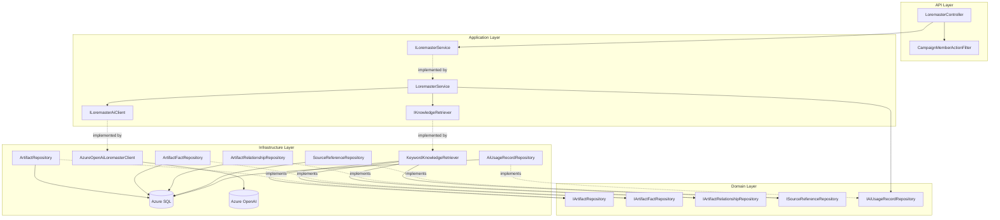
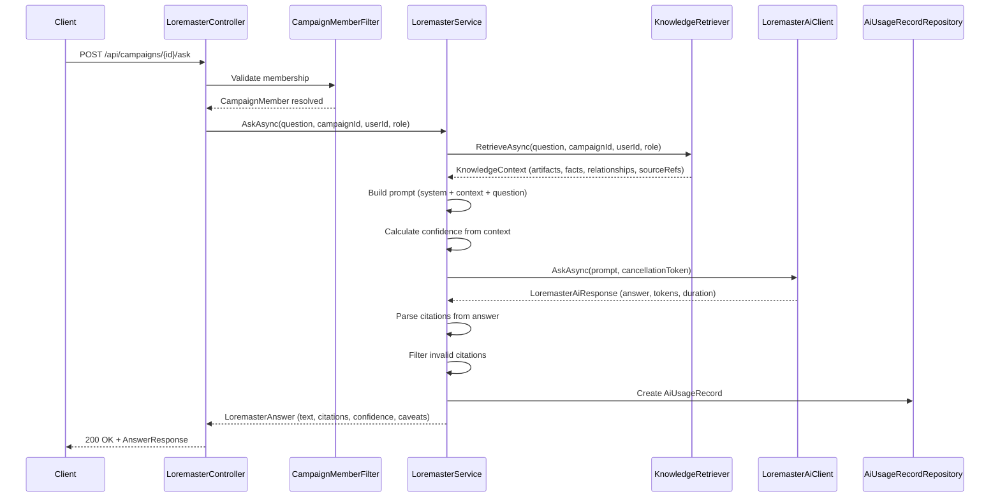

# Design Document: Ask the Loremaster

## Overview

This design implements the "Ask the Loremaster" feature — a conversational AI endpoint that allows campaign members to ask questions about their campaign and receive AI-generated answers grounded in accepted campaign knowledge. The Loremaster retrieves relevant Artifacts, ArtifactFacts, ArtifactRelationships, and SourceReferences, respects visibility and campaign membership, cites sources, and admits when information is unknown.

The implementation follows the established clean architecture:
- **Nornis.Api** — `LoremasterController` accepting questions and returning structured answers, protected by `CampaignMemberActionFilter`.
- **Nornis.Application** — `ILoremasterService`/`LoremasterService` orchestrating knowledge retrieval, prompt construction, AI invocation, citation parsing, confidence calculation, and usage tracking.
- **Nornis.Application** — `IKnowledgeRetriever` interface abstracting the retrieval mechanism (MVP: keyword match, future: vector search).
- **Nornis.Application** — `ILoremasterAiClient` interface defining the contract for AI question-answering calls.
- **Nornis.Infrastructure** — `AzureOpenAiLoremasterClient` implementing the AI call to Azure OpenAI.
- **Nornis.Infrastructure** — `KeywordKnowledgeRetriever` implementing MVP retrieval via SQL name/keyword matching.

**Key Design Decisions:**

1. **Retrieval behind abstraction** — `IKnowledgeRetriever` isolates the retrieval strategy from the orchestration service. MVP uses `KeywordKnowledgeRetriever` (SQL name matching + recent artifacts). This is swappable to vector search (Azure AI Search) without changing `LoremasterService`.

2. **Separate AI client from extraction** — `ILoremasterAiClient` is distinct from `IAiExtractionClient`. Ask uses a chat completion with a system prompt + user question + knowledge context, whereas extraction uses structured output. Different concerns, different interfaces.

3. **Visibility enforcement at retrieval boundary** — The `IKnowledgeRetriever` accepts allowed visibility scopes and the requesting user ID. All filtering happens at the SQL query level, not post-hoc in memory. The Loremaster never sees data the user shouldn't access.

4. **Citation as structured instruction** — The AI is instructed to cite sources using bracket notation referencing artifact/fact IDs provided in the context. The service parses these markers and maps them to real Citation objects. Invalid citations are silently dropped rather than fabricated.

5. **Confidence is computed, not AI-generated** — The Confidence_Indicator (High/Medium/Low) is determined by the service based on the quantity and quality of retrieved knowledge, not delegated to the AI model. This keeps confidence deterministic and testable.

6. **Usage tracking always fires** — Following the extraction pattern, an `AiUsageRecord` with `OperationType=AskLoremaster` is created for every AI invocation regardless of outcome.

7. **No conversation persistence for MVP** — The domain model includes Conversation/ConversationMessage entities, but MVP defers persistence. The endpoint accepts an optional `conversationContext` parameter for future multi-turn support but does not store history.

## Architecture



**Ask Flow Sequence:**



## Components and Interfaces

### API Layer (`Nornis.Api`)

**New Files:**
```
Nornis.Api/
├── Controllers/
│   └── LoremasterController.cs           (NEW)
├── Contracts/
│   ├── Requests/
│   │   └── AskLoremasterRequest.cs       (NEW)
│   └── Responses/
│       ├── AskAnswerResponse.cs          (NEW)
│       └── CitationResponse.cs           (NEW)
```

### Application Layer (`Nornis.Application`)

**New Files:**
```
Nornis.Application/
├── Services/
│   ├── ILoremasterService.cs             (NEW)
│   └── LoremasterService.cs              (NEW)
├── Ai/
│   ├── ILoremasterAiClient.cs            (NEW)
│   ├── LoremasterAiRequest.cs            (NEW)
│   └── LoremasterAiResponse.cs           (NEW)
├── Knowledge/
│   ├── IKnowledgeRetriever.cs            (NEW)
│   ├── KnowledgeContext.cs               (NEW)
│   ├── KnowledgeItem.cs                  (NEW)
│   └── Citation.cs                       (NEW)
├── Configuration/
│   └── LoremasterOptions.cs              (NEW)
└── Models/
    └── LoremasterAnswer.cs               (NEW)
```

### Infrastructure Layer (`Nornis.Infrastructure`)

**New Files:**
```
Nornis.Infrastructure/
├── Ai/
│   ├── AzureOpenAiLoremasterClient.cs    (NEW)
│   └── FakeLoremasterAiClient.cs         (NEW)
├── Knowledge/
│   └── KeywordKnowledgeRetriever.cs      (NEW)
```

### Key Interfaces

```csharp
// Application layer — Loremaster orchestration
public interface ILoremasterService
{
    Task<AppResult<LoremasterAnswer>> AskAsync(
        AskLoremasterCommand command,
        CancellationToken ct);
}

// Application layer — Knowledge retrieval abstraction
public interface IKnowledgeRetriever
{
    Task<KnowledgeContext> RetrieveAsync(
        string question,
        Guid campaignId,
        Guid userId,
        CampaignRole role,
        CancellationToken ct);
}

// Application layer — AI client abstraction
public interface ILoremasterAiClient
{
    Task<LoremasterAiResponse> AskAsync(
        LoremasterAiRequest request,
        CancellationToken ct);
}
```

### LoremasterService Responsibilities

The `LoremasterService` orchestrates the full Ask pipeline:

1. **Input validation** — Reject empty/whitespace or over-2000-character questions.
2. **Determine visibility scopes** — Based on the requesting user's role and ID, determine which visibility scopes are permitted.
3. **Knowledge retrieval** — Delegate to `IKnowledgeRetriever` to load relevant artifacts, facts, relationships, and source references.
4. **Confidence calculation** — Compute confidence indicator (High/Medium/Low) based on quantity and quality of retrieved knowledge.
5. **Prompt construction** — Build system prompt + knowledge context + user question. Include truth state qualifiers for Rumor/Disputed items. Include hallucination guardrails and citation instructions.
6. **AI invocation** — Call `ILoremasterAiClient` with the prompt and cancellation token.
7. **Citation parsing** — Extract citation markers from the AI response and map them to known source references. Drop invalid citations.
8. **Caveat assembly** — Identify caveats (e.g., "Some information is marked as rumor," "Limited sources available").
9. **Usage tracking** — Create `AiUsageRecord` with `OperationType=AskLoremaster`.
10. **Response assembly** — Return `LoremasterAnswer` with answer text, citations, confidence, and caveats.

### KeywordKnowledgeRetriever Logic (MVP)

The MVP retrieval strategy mirrors the extraction context assembly pattern:

1. **Name-matched artifacts** — Use `IArtifactRepository.ListByNamesInTextAsync(campaignId, question, allowedVisibilities)` to find artifacts whose names appear in the question text.
2. **Recent artifacts** — Use `IArtifactRepository.ListRecentByCampaignAsync(campaignId, allowedVisibilities, maxCount)` to provide broader campaign context.
3. **Merge and deduplicate** — Name-matched artifacts first, then recent, deduplicated by ID, capped at `MaxRetrievalCount`.
4. **Load facts** — Use `IArtifactFactRepository.ListByArtifactIdsAsync(artifactIds, maxPerArtifact)` filtered by visibility.
5. **Load relationships** — Use `IArtifactRelationshipRepository.ListByArtifactIdsAsync(artifactIds)` filtered by visibility.
6. **Load source references** — Use `ISourceReferenceRepository.ListByTargetIdsAsync(factIds + relationshipIds)` to get citations.

### Visibility Scope Resolution

```csharp
static IReadOnlyList<VisibilityScope> GetAllowedScopes(CampaignRole role, Guid userId) =>
    role switch
    {
        CampaignRole.GM => [VisibilityScope.PartyVisible, VisibilityScope.GMOnly, VisibilityScope.Private],
        CampaignRole.Player => [VisibilityScope.PartyVisible, VisibilityScope.Private],
        CampaignRole.Observer => [VisibilityScope.PartyVisible],
        _ => [VisibilityScope.PartyVisible]
    };
```

Private items are further filtered to only include those owned by the requesting user (enforced at the repository query level using `CreatedByUserId` or equivalent ownership field on related entities).

### Confidence Indicator Logic

Confidence is deterministic, computed from the retrieved knowledge context:

```csharp
ConfidenceLevel DetermineConfidence(KnowledgeContext context)
{
    if (context.Artifacts.Count == 0)
        return ConfidenceLevel.Low;

    var confirmedFactCount = context.Facts
        .Count(f => f.TruthState is TruthState.Confirmed or TruthState.Likely);

    var totalFactCount = context.Facts.Count;
    var hasRelationships = context.Relationships.Count > 0;
    var hasSourceReferences = context.SourceReferences.Count > 0;

    if (confirmedFactCount >= 3 && hasRelationships && hasSourceReferences)
        return ConfidenceLevel.High;

    if (confirmedFactCount >= 1 || totalFactCount >= 2)
        return ConfidenceLevel.Medium;

    return ConfidenceLevel.Low;
}
```

### Prompt Construction Strategy

The prompt is assembled from three parts:

1. **System prompt** — Defines the Loremaster persona, grounding rules, citation format, truth state handling, and anti-hallucination instructions. This is a static template stored in the application layer.

2. **Knowledge context block** — Serialized artifacts, facts (with truth states), relationships, and source references formatted for the AI. Each item gets a stable reference ID that the AI can cite.

3. **User question** — The raw question text from the request.

**System Prompt Template (key instructions):**
- Ground all answers in the provided campaign knowledge only.
- Cite sources using `[ref:ID]` notation where ID matches a provided reference.
- When a fact is marked Rumor or Disputed, qualify the claim (e.g., "Rumor suggests...").
- If the provided context does not contain relevant information, acknowledge this directly.
- Do not invent campaign facts, events, or relationships not present in the context.
- Keep answers concise and focused on what the campaign sources support.

### Citation Parsing

The AI is instructed to use `[ref:ID]` markers in its response. The service:

1. Extracts all `[ref:...]` markers via regex.
2. Maps each ID to a known artifact, fact, relationship, or source reference from the retrieved context.
3. Creates a `Citation` object for each valid reference.
4. Silently drops markers that reference IDs not present in the retrieved context.
5. Returns cleaned answer text with citation markers preserved for UI rendering.

### Controller Design

```csharp
[ApiController]
[Route("api/campaigns/{campaignId:guid}/ask")]
[ServiceFilter(typeof(CampaignMemberActionFilter))]
public class LoremasterController : ControllerBase
{
    private readonly ILoremasterService _loremasterService;

    public LoremasterController(ILoremasterService loremasterService)
    {
        _loremasterService = loremasterService;
    }

    [HttpPost]
    public async Task<IActionResult> Ask(
        Guid campaignId,
        [FromBody] AskLoremasterRequest request,
        CancellationToken ct)
    {
        var user = HttpContext.GetNornisUser();
        var member = HttpContext.GetCampaignMember();

        var command = new AskLoremasterCommand(
            CampaignId: campaignId,
            Question: request.Question,
            UserId: user.Id,
            UserRole: member.Role,
            ConversationContext: request.ConversationContext);

        var result = await _loremasterService.AskAsync(command, ct);

        if (!result.IsSuccess)
            return MapError(result.Error!);

        var answer = result.Value!;
        return Ok(ToAnswerResponse(answer));
    }
}
```

### Extended Repository Interfaces

The following methods need to be added to existing repository interfaces:

```csharp
// IArtifactRelationshipRepository — add:
Task<IReadOnlyList<ArtifactRelationship>> ListByArtifactIdsAsync(
    IReadOnlyList<Guid> artifactIds,
    IReadOnlyList<VisibilityScope> allowedVisibilities,
    CancellationToken cancellationToken = default);

// ISourceReferenceRepository — add:
Task<IReadOnlyList<SourceReference>> ListByTargetIdsAsync(
    IReadOnlyList<Guid> targetIds,
    CancellationToken cancellationToken = default);
```

## Data Models

### Configuration

```csharp
public class LoremasterOptions
{
    public string AiModel { get; set; } = string.Empty;
    public string AiEndpoint { get; set; } = string.Empty;
    public int AiTimeoutSeconds { get; set; } = 30;
    public int MaxRetrievalCount { get; set; } = 30;
    public int MaxFactsPerArtifact { get; set; } = 15;
    public int MaxContextTokens { get; set; } = 8000;
    public int MaxQuestionLength { get; set; } = 2000;
    public Dictionary<string, ModelPricing> ModelPricing { get; set; } = new();
}
```

### Command and Response Models

```csharp
// Command passed from controller to service
public record AskLoremasterCommand(
    Guid CampaignId,
    string Question,
    Guid UserId,
    CampaignRole UserRole,
    string? ConversationContext);

// Final answer returned by the service
public class LoremasterAnswer
{
    public required string AnswerText { get; init; }
    public required IReadOnlyList<Citation> Citations { get; init; }
    public required ConfidenceLevel Confidence { get; init; }
    public required IReadOnlyList<string> Caveats { get; init; }
}

public enum ConfidenceLevel
{
    High,
    Medium,
    Low
}

public class Citation
{
    public required string ReferenceId { get; init; }
    public required CitationType Type { get; init; }
    public required string DisplayName { get; init; }
    public Guid? ArtifactId { get; init; }
    public Guid? FactId { get; init; }
    public Guid? RelationshipId { get; init; }
    public Guid? SourceId { get; init; }
}

public enum CitationType
{
    Artifact,
    Fact,
    Relationship,
    Source
}
```

### Knowledge Retrieval Models

```csharp
// Output from IKnowledgeRetriever
public class KnowledgeContext
{
    public required IReadOnlyList<KnowledgeArtifact> Artifacts { get; init; }
    public required IReadOnlyList<KnowledgeFact> Facts { get; init; }
    public required IReadOnlyList<KnowledgeRelationship> Relationships { get; init; }
    public required IReadOnlyList<KnowledgeSourceReference> SourceReferences { get; init; }
}

public class KnowledgeArtifact
{
    public required Guid Id { get; init; }
    public required string Name { get; init; }
    public required string Type { get; init; }
    public string? Summary { get; init; }
    public required string ReferenceId { get; init; } // stable ref for citation
}

public class KnowledgeFact
{
    public required Guid Id { get; init; }
    public required Guid ArtifactId { get; init; }
    public required string Predicate { get; init; }
    public required string Value { get; init; }
    public required TruthState TruthState { get; init; }
    public required string ReferenceId { get; init; }
}

public class KnowledgeRelationship
{
    public required Guid Id { get; init; }
    public required Guid ArtifactAId { get; init; }
    public required Guid ArtifactBId { get; init; }
    public required string Type { get; init; }
    public string? Description { get; init; }
    public required TruthState TruthState { get; init; }
    public required string ReferenceId { get; init; }
}

public class KnowledgeSourceReference
{
    public required Guid Id { get; init; }
    public required Guid SourceId { get; init; }
    public required Guid TargetId { get; init; }
    public string? Quote { get; init; }
    public required string ReferenceId { get; init; }
}
```

### AI Request/Response Models

```csharp
// Input to the AI client
public class LoremasterAiRequest
{
    public required string SystemPrompt { get; init; }
    public required string UserMessage { get; init; }
    public required string Model { get; init; }
    public required int TimeoutSeconds { get; init; }
}

// Output from the AI client
public class LoremasterAiResponse
{
    public required string AnswerText { get; init; }
    public required int InputTokens { get; init; }
    public required int OutputTokens { get; init; }
    public required int TotalTokens { get; init; }
    public required int DurationMs { get; init; }
    public required string Model { get; init; }
}
```

### API Request/Response DTOs

```csharp
// Request DTO
public record AskLoremasterRequest(
    string Question,
    string? ConversationContext = null);

// Response DTO
public record AskAnswerResponse(
    string Answer,
    IReadOnlyList<CitationResponse> Citations,
    string Confidence,
    IReadOnlyList<string> Caveats);

public record CitationResponse(
    string ReferenceId,
    string Type,
    string DisplayName,
    Guid? ArtifactId,
    Guid? FactId,
    Guid? RelationshipId,
    Guid? SourceId);
```

### Configuration (appsettings)

```json
{
  "Loremaster": {
    "AiModel": "gpt-4o",
    "AiEndpoint": "https://<resource>.openai.azure.com/",
    "AiTimeoutSeconds": 30,
    "MaxRetrievalCount": 30,
    "MaxFactsPerArtifact": 15,
    "MaxContextTokens": 8000,
    "MaxQuestionLength": 2000,
    "ModelPricing": {
      "gpt-4o": {
        "InputPerMillionTokensUsd": 2.50,
        "OutputPerMillionTokensUsd": 10.00
      }
    }
  }
}
```

## Correctness Properties

*A property is a characteristic or behavior that should hold true across all valid executions of a system — essentially, a formal statement about what the system should do. Properties serve as the bridge between human-readable specifications and machine-verifiable correctness guarantees.*

### Property 1: Invalid Questions Are Rejected

*For any* string that is empty, composed entirely of whitespace, or exceeds 2000 characters, the LoremasterService SHALL reject the question and return a validation error without invoking the AI client or the knowledge retriever.

**Validates: Requirements 2.2**

### Property 2: Visibility Filter Correctness

*For any* campaign role (GM, Player, Observer), requesting user ID, and any set of knowledge items with mixed visibility scopes and owners, the visibility filter SHALL return exactly those items permitted for that role: GMs see PartyVisible + GMOnly + own Private; Players see PartyVisible + own Private; Observers see only PartyVisible. Private items owned by a different user SHALL never be included regardless of role.

**Validates: Requirements 3.1, 3.2, 3.3, 3.4**

### Property 3: Keyword-Based Artifact Retrieval

*For any* question text containing the exact name of an artifact in the campaign (case-insensitive), the knowledge retriever SHALL include that artifact in the retrieved context, provided the artifact's visibility is permitted for the requesting user's role.

**Validates: Requirements 4.1**

### Property 4: Retrieved Knowledge Respects Visibility

*For any* set of artifacts retrieved by the knowledge retriever, all associated ArtifactFacts and ArtifactRelationships loaded into the knowledge context SHALL have a visibility scope permitted for the requesting user's role. No fact or relationship with a disallowed visibility SHALL appear in the context.

**Validates: Requirements 4.2, 4.3**

### Property 5: Retrieval Count Cap

*For any* campaign with N artifacts (where N exceeds the configured MaxRetrievalCount), the knowledge retriever SHALL return at most MaxRetrievalCount artifacts, with no artifact appearing more than once.

**Validates: Requirements 4.5**

### Property 6: Prompt Contains Question and Context

*For any* valid question and non-empty knowledge context, the prompt sent to the AI client SHALL contain the original question text and at least one artifact name from the retrieved context.

**Validates: Requirements 5.1**

### Property 7: Truth State Qualification in Prompt

*For any* knowledge context containing facts or relationships with TruthState of Rumor or Disputed, the formatted context block in the prompt SHALL include the truth state label alongside those items, enabling the AI to qualify claims appropriately.

**Validates: Requirements 6.2**

### Property 8: Citation Parsing Produces Only Valid References

*For any* AI response containing citation markers (`[ref:ID]`), the parsed citation list SHALL only contain Citation objects whose reference IDs match items present in the retrieved knowledge context. Markers referencing unknown IDs SHALL be silently excluded from the citations list.

**Validates: Requirements 7.1, 7.3**

### Property 9: Confidence Indicator Determination

*For any* knowledge context, the computed confidence SHALL be Low when no artifacts are retrieved, Medium when at least 1 confirmed/likely fact exists or at least 2 total facts exist, and High when at least 3 confirmed/likely facts plus relationships plus source references exist. The result SHALL always be one of High, Medium, or Low.

**Validates: Requirements 8.4**

### Property 10: AiUsageRecord Always Created

*For any* Ask invocation that reaches the AI call step (valid question, retrieval succeeds), an AiUsageRecord SHALL be created with OperationType=AskLoremaster, the correct CampaignId, UserId, Model, InputTokens, OutputTokens, TotalTokens, EstimatedCostUsd, DurationMs, and Succeeded flag — regardless of whether the AI call succeeds or fails.

**Validates: Requirements 9.1, 9.2, 9.3**

### Property 11: Cost Calculation Correctness

*For any* AI response with InputTokens and OutputTokens and a configured ModelPricing, the EstimatedCostUsd SHALL equal `(InputTokens × InputPerMillionTokensUsd / 1,000,000) + (OutputTokens × OutputPerMillionTokensUsd / 1,000,000)`.

**Validates: Requirements 9.4**

### Property 12: Error Responses Never Expose Internals

*For any* error that occurs during the Ask pipeline (AI failure, retrieval failure, unexpected exception), the error response returned to the client SHALL never contain stack traces, internal exception messages, AI prompt content, or retrieved knowledge content.

**Validates: Requirements 10.4**

## Error Handling

### Error Classification

The LoremasterService maps errors to appropriate HTTP status codes:

| Error Source | HTTP Status | Error Code | User Message |
|---|---|---|---|
| Empty/too-long question | 400 | `invalid_question` | Descriptive validation message |
| AI timeout | 503 | `service_unavailable` | "The Loremaster is temporarily unavailable. Please try again." |
| AI service error (5xx) | 503 | `service_unavailable` | "The Loremaster is temporarily unavailable. Please try again." |
| AI rate limiting (429) | 429 | `rate_limited` | "Too many requests. Please try again in a moment." |
| Knowledge retrieval failure | 500 | `internal_error` | "Something went wrong. Please try again." |
| Unexpected exception | 500 | `internal_error` | "Something went wrong. Please try again." |
| No relevant knowledge found | 200 | — | Answer acknowledges lack of information, Low confidence |

### Error Handling Strategy

1. **Validation errors** — Return immediately with 400. No AI call, no usage tracking.
2. **Retrieval failures** — Log full context (correlation ID, campaign ID, user ID, exception). Return 500 with generic message.
3. **AI timeouts and service errors** — Create AiUsageRecord with `Succeeded=false`. Return 503.
4. **AI rate limiting** — Create AiUsageRecord with `Succeeded=false`, `ErrorCode="RateLimited"`. Return 429.
5. **Unexpected exceptions** — Log full context. Create AiUsageRecord if AI was invoked. Return 500.

### Security Constraints

Error responses MUST NOT contain:
- Stack traces or exception details
- AI prompt content or system prompt text
- Retrieved campaign knowledge
- Internal service names or infrastructure details
- Raw AI response content on failure

All error details are logged server-side with appropriate correlation IDs for diagnosis.

## Testing Strategy

### Property-Based Testing

Use [FsCheck](https://fscheck.github.io/FsCheck/) with NUnit for property-based tests. FsCheck is the standard .NET PBT library and integrates cleanly with NUnit.

**Configuration:** Each property test runs a minimum of 100 iterations.

**Property test tagging format:** `Feature: ask-loremaster, Property {N}: {title}`

Property tests target the following pure/deterministic logic:

| Property | Component Under Test | Test Location |
|---|---|---|
| 1: Invalid question rejection | `LoremasterService.AskAsync` | `Nornis.Application.Tests` |
| 2: Visibility filter correctness | `KeywordKnowledgeRetriever` visibility logic | `Nornis.Application.Tests` |
| 3: Keyword artifact retrieval | `KeywordKnowledgeRetriever` name matching | `Nornis.Infrastructure.Tests` |
| 4: Retrieved knowledge visibility | `KeywordKnowledgeRetriever` fact/relationship filtering | `Nornis.Application.Tests` |
| 5: Retrieval count cap | `KeywordKnowledgeRetriever` max count | `Nornis.Application.Tests` |
| 6: Prompt contains question and context | `LoremasterService` prompt builder | `Nornis.Application.Tests` |
| 7: Truth state in prompt | `LoremasterService` prompt builder | `Nornis.Application.Tests` |
| 8: Citation parsing validity | `LoremasterService` citation parser | `Nornis.Application.Tests` |
| 9: Confidence determination | `LoremasterService` confidence logic | `Nornis.Application.Tests` |
| 10: Usage record always created | `LoremasterService` usage tracking | `Nornis.Application.Tests` |
| 11: Cost calculation | `LoremasterService` cost calculation | `Nornis.Application.Tests` |
| 12: Error response safety | `LoremasterController` error mapping | `Nornis.Api.Tests` |

### Unit Tests (Example-Based)

Focus areas for example-based NUnit tests:

- **Controller**: Valid request → 200 with AnswerResponse structure; auth/membership enforced; optional conversationContext accepted.
- **Service**: Empty knowledge → Low confidence + acknowledgment answer; system prompt contains grounding/citation/anti-hallucination instructions; cancellation token propagation.
- **Error mapping**: AI timeout → 503; rate limit → 429; retrieval exception → 500; no stack traces in responses.
- **Integration**: CampaignMemberActionFilter rejects non-members with 403.

### AI Testing

- Use `FakeLoremasterAiClient` in unit/property tests that returns configurable responses.
- Golden sample questions with known campaign data and expected answer characteristics.
- Do not rely on live AI calls in CI.
- Optional scheduled evaluation tests outside core CI for answer quality.

### Authorization Tests

- Non-member request → 403, no campaign existence leak.
- GM receives GMOnly content in answers.
- Player does NOT receive GMOnly content.
- Observer receives only PartyVisible content.
- Private content of other users never appears.
