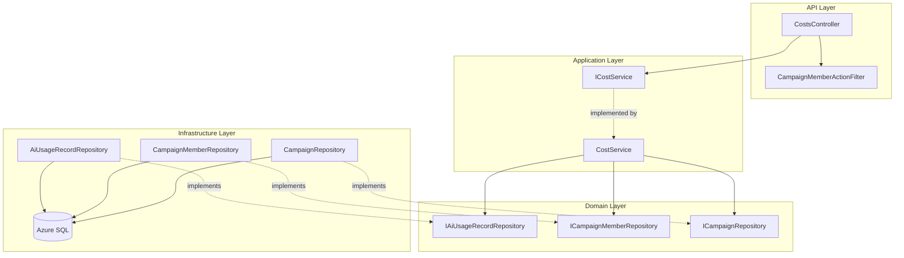
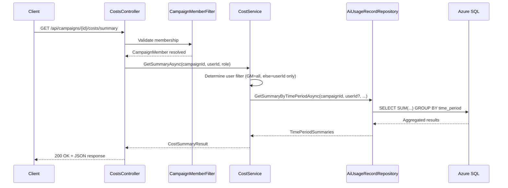

# Design Document: Cost Dashboard

## Overview

This design implements the Cost Dashboard API — a set of endpoints that aggregate and serve AI token usage and estimated cost data from `AiUsageRecords`. The dashboard enables campaign owners and members to understand AI usage patterns, broken down by time period, campaign, user, operation type, and model, with role-based access control ensuring GMs see full campaign costs while Players and Observers see only their own usage.

The implementation follows the established clean architecture:
- **Nornis.Api** — `CostsController` exposing cost summary and breakdown endpoints, protected by `CampaignMemberActionFilter`.
- **Nornis.Application** — `ICostService`/`CostService` orchestrating aggregation logic with role-based filtering and date range support.
- **Nornis.Domain** — Extended `IAiUsageRecordRepository` with aggregation query methods.
- **Nornis.Infrastructure** — Repository implementation using EF Core LINQ projections for efficient SQL-side aggregation.

**Key Design Decisions:**

1. **SQL-side aggregation** — Aggregation (SUM, GROUP BY) happens in the database via EF Core LINQ projections, not by pulling all records into memory. This keeps performance predictable as usage data grows.

2. **Pre-calculated cost** — The service sums the `EstimatedCostUsd` value already stored on each `AiUsageRecord`, rather than recalculating from model pricing at query time. This ensures historical accuracy even as model pricing changes.

3. **Role-based filtering at the query level** — For non-GM roles, the userId filter is applied in the repository query predicate. The service never loads data for other users and then filters it in memory.

4. **Reuse of CampaignMemberActionFilter** — Campaign membership authorization reuses the existing filter. No new auth infrastructure is needed.

5. **Cross-campaign view is GM-only** — The "breakdown by campaign" endpoint queries across all campaigns where the requesting user holds a GM role. This is a separate endpoint from the single-campaign summaries.

6. **Structured aggregation DTOs** — A `CostSummary` record encapsulates the aggregate result shape (input tokens, output tokens, total tokens, estimated cost, operation count). All breakdown endpoints return lists of `CostSummary` keyed by the grouping dimension.

## Architecture



**Request Flow:**



## Components and Interfaces

### API Layer (`Nornis.Api`)

**New Files:**
```
Nornis.Api/
├── Controllers/
│   └── CostsController.cs                  (NEW)
├── Contracts/
│   └── Responses/
│       ├── CostSummaryResponse.cs           (NEW)
│       ├── TimePeriodSummaryResponse.cs     (NEW)
│       ├── CampaignCostResponse.cs          (NEW)
│       ├── UserCostResponse.cs              (NEW)
│       ├── OperationTypeCostResponse.cs     (NEW)
│       └── ModelCostResponse.cs             (NEW)
```

### Application Layer (`Nornis.Application`)

**New Files:**
```
Nornis.Application/
├── Services/
│   ├── ICostService.cs                      (NEW)
│   └── CostService.cs                       (NEW)
├── Models/
│   ├── CostSummary.cs                       (NEW)
│   ├── TimePeriodCostResult.cs              (NEW)
│   ├── CampaignCostResult.cs               (NEW)
│   ├── UserCostResult.cs                    (NEW)
│   ├── OperationTypeCostResult.cs           (NEW)
│   └── ModelCostResult.cs                   (NEW)
```

### Domain Layer (`Nornis.Domain`)

**Modified Files:**
```
Nornis.Domain/
├── Repositories/
│   └── IAiUsageRecordRepository.cs          (MODIFIED — add aggregation methods)
```

### Infrastructure Layer (`Nornis.Infrastructure`)

**Modified Files:**
```
Nornis.Infrastructure/
├── Persistence/
│   └── Repositories/
│       └── AiUsageRecordRepository.cs       (MODIFIED — implement aggregation)
```

### Key Interfaces

```csharp
// Application layer — Cost aggregation orchestration
public interface ICostService
{
    Task<AppResult<TimePeriodCostResult>> GetSummaryAsync(
        Guid campaignId,
        Guid userId,
        CampaignRole role,
        CancellationToken ct);

    Task<AppResult<IReadOnlyList<CampaignCostResult>>> GetByCampaignAsync(
        Guid userId,
        CancellationToken ct);

    Task<AppResult<IReadOnlyList<UserCostResult>>> GetByUserAsync(
        Guid campaignId,
        Guid userId,
        CampaignRole role,
        DateTimeOffset? startDate,
        DateTimeOffset? endDate,
        CancellationToken ct);

    Task<AppResult<IReadOnlyList<OperationTypeCostResult>>> GetByOperationTypeAsync(
        Guid campaignId,
        Guid userId,
        CampaignRole role,
        DateTimeOffset? startDate,
        DateTimeOffset? endDate,
        CancellationToken ct);

    Task<AppResult<IReadOnlyList<ModelCostResult>>> GetByModelAsync(
        Guid campaignId,
        Guid userId,
        CampaignRole role,
        DateTimeOffset? startDate,
        DateTimeOffset? endDate,
        CancellationToken ct);
}
```

### Extended Repository Interface

```csharp
// Add to IAiUsageRecordRepository:
Task<CostSummary> AggregateAsync(
    Guid campaignId,
    Guid? userId,
    DateTimeOffset? fromDate,
    DateTimeOffset? toDate,
    CancellationToken cancellationToken = default);

Task<IReadOnlyList<GroupedCostSummary<string>>> AggregateByOperationTypeAsync(
    Guid campaignId,
    Guid? userId,
    DateTimeOffset? fromDate,
    DateTimeOffset? toDate,
    CancellationToken cancellationToken = default);

Task<IReadOnlyList<GroupedCostSummary<string>>> AggregateByModelAsync(
    Guid campaignId,
    Guid? userId,
    DateTimeOffset? fromDate,
    DateTimeOffset? toDate,
    CancellationToken cancellationToken = default);

Task<IReadOnlyList<GroupedCostSummary<Guid>>> AggregateByUserAsync(
    Guid campaignId,
    Guid? userId,
    DateTimeOffset? fromDate,
    DateTimeOffset? toDate,
    CancellationToken cancellationToken = default);

Task<IReadOnlyList<GroupedCostSummary<Guid>>> AggregateByCampaignAsync(
    IReadOnlyList<Guid> campaignIds,
    DateTimeOffset? fromDate,
    DateTimeOffset? toDate,
    CancellationToken cancellationToken = default);
```

### CostService Responsibilities

The `CostService` orchestrates the cost aggregation pipeline:

1. **Role-based user filtering** — Determine whether to pass `userId` to the repository (non-GM) or `null` (GM sees all).
2. **Date range validation** — If both startDate and endDate are provided, validate startDate <= endDate. Return 400 error if invalid.
3. **Time period calculation** — For the summary endpoint, compute the four time period boundaries (today, this week, this month, all-time) in UTC.
4. **Delegation to repository** — Call the appropriate aggregation method with the resolved filters.
5. **User enrichment** — For the by-user breakdown, resolve user IDs to usernames via the campaign member repository.
6. **Campaign enrichment** — For the by-campaign breakdown, resolve campaign IDs to campaign names.
7. **Performance logging** — Log aggregation duration for monitoring.

### Controller Design

```csharp
[ApiController]
[Route("api/campaigns/{campaignId:guid}/costs")]
[ServiceFilter(typeof(CampaignMemberActionFilter))]
public class CostsController : ControllerBase
{
    private readonly ICostService _costService;

    public CostsController(ICostService costService)
    {
        _costService = costService;
    }

    /// <summary>
    /// Returns cost summaries for today, this week, this month, and all-time.
    /// </summary>
    [HttpGet("summary")]
    public async Task<IActionResult> GetSummary(Guid campaignId, CancellationToken ct)
    {
        var user = HttpContext.GetNornisUser();
        var member = HttpContext.GetCampaignMember();
        var result = await _costService.GetSummaryAsync(campaignId, user.Id, member.Role, ct);
        if (!result.IsSuccess) return MapError(result.Error!);
        return Ok(ToTimePeriodResponse(result.Value!));
    }

    /// <summary>
    /// Returns cost breakdown by campaign (GM only, cross-campaign).
    /// </summary>
    [HttpGet("~/api/costs/by-campaign")]
    [ServiceFilter(typeof(CampaignMemberFilter))] // removed — uses user-level auth only
    public async Task<IActionResult> GetByCampaign(CancellationToken ct)
    {
        var user = HttpContext.GetNornisUser();
        var result = await _costService.GetByCampaignAsync(user.Id, ct);
        if (!result.IsSuccess) return MapError(result.Error!);
        return Ok(ToCampaignCostResponse(result.Value!));
    }

    /// <summary>
    /// Returns cost breakdown by user within the campaign.
    /// </summary>
    [HttpGet("by-user")]
    public async Task<IActionResult> GetByUser(
        Guid campaignId,
        [FromQuery] DateTimeOffset? startDate,
        [FromQuery] DateTimeOffset? endDate,
        CancellationToken ct)
    {
        var user = HttpContext.GetNornisUser();
        var member = HttpContext.GetCampaignMember();
        var result = await _costService.GetByUserAsync(
            campaignId, user.Id, member.Role, startDate, endDate, ct);
        if (!result.IsSuccess) return MapError(result.Error!);
        return Ok(ToUserCostResponse(result.Value!));
    }

    /// <summary>
    /// Returns cost breakdown by AI operation type.
    /// </summary>
    [HttpGet("by-operation")]
    public async Task<IActionResult> GetByOperationType(
        Guid campaignId,
        [FromQuery] DateTimeOffset? startDate,
        [FromQuery] DateTimeOffset? endDate,
        CancellationToken ct)
    {
        var user = HttpContext.GetNornisUser();
        var member = HttpContext.GetCampaignMember();
        var result = await _costService.GetByOperationTypeAsync(
            campaignId, user.Id, member.Role, startDate, endDate, ct);
        if (!result.IsSuccess) return MapError(result.Error!);
        return Ok(ToOperationTypeCostResponse(result.Value!));
    }

    /// <summary>
    /// Returns cost breakdown by AI model.
    /// </summary>
    [HttpGet("by-model")]
    public async Task<IActionResult> GetByModel(
        Guid campaignId,
        [FromQuery] DateTimeOffset? startDate,
        [FromQuery] DateTimeOffset? endDate,
        CancellationToken ct)
    {
        var user = HttpContext.GetNornisUser();
        var member = HttpContext.GetCampaignMember();
        var result = await _costService.GetByModelAsync(
            campaignId, user.Id, member.Role, startDate, endDate, ct);
        if (!result.IsSuccess) return MapError(result.Error!);
        return Ok(ToModelCostResponse(result.Value!));
    }

    private IActionResult MapError(AppError error) => error.StatusCode switch
    {
        400 => BadRequest(new ErrorResponse(error.Code, error.Message)),
        _ => StatusCode(500, new ErrorResponse("internal_error", "Something went wrong. Please try again."))
    };
}
```

**Note on the cross-campaign endpoint:** The `GET /api/costs/by-campaign` endpoint is not scoped to a single campaign. It requires only a valid authenticated user (via the `UserProvisioningMiddleware`). The service internally queries all campaigns where the user holds a GM role.

### Repository Implementation Strategy

The `AiUsageRecordRepository` aggregation methods use EF Core LINQ with `GroupBy` and projection to push aggregation to SQL Server:

```csharp
public async Task<CostSummary> AggregateAsync(
    Guid campaignId, Guid? userId,
    DateTimeOffset? fromDate, DateTimeOffset? toDate,
    CancellationToken ct)
{
    var query = _context.AiUsageRecords
        .Where(r => r.CampaignId == campaignId);

    if (userId.HasValue)
        query = query.Where(r => r.UserId == userId.Value);
    if (fromDate.HasValue)
        query = query.Where(r => r.CreatedAt >= fromDate.Value);
    if (toDate.HasValue)
        query = query.Where(r => r.CreatedAt <= toDate.Value);

    var result = await query
        .GroupBy(_ => 1)
        .Select(g => new CostSummary
        {
            TotalInputTokens = g.Sum(r => r.InputTokens),
            TotalOutputTokens = g.Sum(r => r.OutputTokens),
            TotalTokens = g.Sum(r => r.TotalTokens),
            TotalEstimatedCostUsd = g.Sum(r => r.EstimatedCostUsd),
            OperationCount = g.Count()
        })
        .FirstOrDefaultAsync(ct);

    return result ?? CostSummary.Empty;
}
```

### Time Period Boundary Calculation

```csharp
internal static class TimePeriodCalculator
{
    public static (DateTimeOffset Start, DateTimeOffset End) GetTodayRange()
    {
        var now = DateTimeOffset.UtcNow;
        var startOfDay = new DateTimeOffset(now.Date, TimeSpan.Zero);
        return (startOfDay, now);
    }

    public static (DateTimeOffset Start, DateTimeOffset End) GetThisWeekRange()
    {
        var now = DateTimeOffset.UtcNow;
        var today = now.Date;
        var daysSinceMonday = ((int)today.DayOfWeek - 1 + 7) % 7;
        var monday = today.AddDays(-daysSinceMonday);
        return (new DateTimeOffset(monday, TimeSpan.Zero), now);
    }

    public static (DateTimeOffset Start, DateTimeOffset End) GetThisMonthRange()
    {
        var now = DateTimeOffset.UtcNow;
        var firstOfMonth = new DateTimeOffset(now.Year, now.Month, 1, 0, 0, 0, TimeSpan.Zero);
        return (firstOfMonth, now);
    }
}
```

## Data Models

### Aggregation Result Models

```csharp
// Core aggregation result — used everywhere
public record CostSummary
{
    public long TotalInputTokens { get; init; }
    public long TotalOutputTokens { get; init; }
    public long TotalTokens { get; init; }
    public decimal TotalEstimatedCostUsd { get; init; }
    public int OperationCount { get; init; }

    public static CostSummary Empty => new()
    {
        TotalInputTokens = 0,
        TotalOutputTokens = 0,
        TotalTokens = 0,
        TotalEstimatedCostUsd = 0m,
        OperationCount = 0
    };
}

// Generic grouped result
public record GroupedCostSummary<TKey>
{
    public required TKey Key { get; init; }
    public required CostSummary Summary { get; init; }
}
```

### Service Result Models

```csharp
// Summary endpoint result
public record TimePeriodCostResult
{
    public required CostSummary Today { get; init; }
    public required CostSummary ThisWeek { get; init; }
    public required CostSummary ThisMonth { get; init; }
    public required CostSummary AllTime { get; init; }
}

// By-campaign result
public record CampaignCostResult
{
    public required Guid CampaignId { get; init; }
    public required string CampaignName { get; init; }
    public required CostSummary Summary { get; init; }
}

// By-user result
public record UserCostResult
{
    public required Guid UserId { get; init; }
    public required string Username { get; init; }
    public required CostSummary Summary { get; init; }
}

// By-operation-type result
public record OperationTypeCostResult
{
    public required string OperationType { get; init; }
    public required CostSummary Summary { get; init; }
}

// By-model result
public record ModelCostResult
{
    public required string Model { get; init; }
    public required CostSummary Summary { get; init; }
}
```

### API Response DTOs

```csharp
public record CostSummaryResponse(
    long TotalInputTokens,
    long TotalOutputTokens,
    long TotalTokens,
    decimal TotalEstimatedCostUsd,
    int OperationCount);

public record TimePeriodSummaryResponse(
    CostSummaryResponse Today,
    CostSummaryResponse ThisWeek,
    CostSummaryResponse ThisMonth,
    CostSummaryResponse AllTime);

public record CampaignCostResponse(
    Guid CampaignId,
    string CampaignName,
    CostSummaryResponse Summary);

public record UserCostResponse(
    Guid UserId,
    string Username,
    CostSummaryResponse Summary);

public record OperationTypeCostResponse(
    string OperationType,
    CostSummaryResponse Summary);

public record ModelCostResponse(
    string Model,
    CostSummaryResponse Summary);
```

## Correctness Properties

*A property is a characteristic or behavior that should hold true across all valid executions of a system — essentially, a formal statement about what the system should do. Properties serve as the bridge between human-readable specifications and machine-verifiable correctness guarantees.*

### Property 1: Role-Based Record Filtering

*For any* campaign with AiUsageRecords from multiple users, when a non-GM user (Player or Observer) requests cost data, the aggregated result SHALL include only records where `UserId` matches the requesting user. When a GM requests cost data, the result SHALL include records from all users in the campaign.

**Validates: Requirements 2.1, 2.2, 2.3, 2.4, 5.3, 6.5, 7.5**

### Property 2: Aggregation Sum Correctness

*For any* non-empty set of AiUsageRecords matching the applied filters, the resulting `CostSummary` SHALL have `TotalInputTokens` equal to the sum of all matching records' `InputTokens`, `TotalOutputTokens` equal to the sum of `OutputTokens`, `TotalTokens` equal to the sum of `TotalTokens`, `TotalEstimatedCostUsd` equal to the sum of `EstimatedCostUsd`, and `OperationCount` equal to the count of matching records.

**Validates: Requirements 3.6, 9.2, 9.3, 10.2**

### Property 3: Date Range Filtering Correctness

*For any* set of AiUsageRecords and any date range [startDate, endDate], the aggregation SHALL include exactly those records where `CreatedAt >= startDate AND CreatedAt <= endDate`. Records outside the range SHALL be excluded.

**Validates: Requirements 3.2, 3.3, 3.4, 3.5, 5.4, 6.4, 7.4, 8.2, 8.3**

### Property 4: Grouping Produces Correct Partitions

*For any* set of AiUsageRecords grouped by a dimension (operation type, model, or user), the result SHALL contain exactly one entry per distinct key value that has at least one matching record. The sum of `OperationCount` across all groups SHALL equal the total count of matching records. No group SHALL have an `OperationCount` of zero.

**Validates: Requirements 4.1, 5.1, 6.1, 6.2, 7.1, 7.2**

### Property 5: Date Range Validation

*For any* pair of DateTimeOffset values where startDate is strictly after endDate, the Cost_Service SHALL return a validation error (HTTP 400). For any pair where startDate is before or equal to endDate, the service SHALL proceed with aggregation.

**Validates: Requirements 8.4, 8.5**

### Property 6: Cross-Campaign View Shows Only GM Campaigns

*For any* user who is a member of multiple campaigns with varying roles, the by-campaign breakdown SHALL include only those campaigns where the user holds the GM role. Campaigns where the user is a Player or Observer SHALL not appear.

**Validates: Requirements 4.2**

## Error Handling

### Error Classification

| Error Source | HTTP Status | Error Code | User Message |
|---|---|---|---|
| Invalid date range (start > end) | 400 | `invalid_date_range` | "Start date must be before or equal to end date." |
| Invalid campaignId (not a GUID) | 404 | — | Not Found (handled by route constraint + filter) |
| Non-member access | 403 | `access_denied` | "You are not a member of this campaign." |
| Aggregation failure | 500 | `internal_error` | "Something went wrong. Please try again." |
| Unexpected exception | 500 | `internal_error` | "Something went wrong. Please try again." |

### Error Handling Strategy

1. **Validation errors** — Return immediately with 400. No database aggregation query runs.
2. **Authorization** — Handled by `CampaignMemberActionFilter` before the controller action executes. Returns 403 without revealing campaign existence.
3. **Invalid campaign ID format** — The route constraint `{campaignId:guid}` rejects non-GUID values, and the filter returns 404 if parsing fails.
4. **Aggregation failures** — Log full exception context (correlation ID, campaign ID, user ID, aggregation type). Return generic 500 message.
5. **Empty results** — Not an error. Return `CostSummary.Empty` with all zeros for time periods with no data.

### Security Constraints

Error responses MUST NOT contain:
- Stack traces or exception details
- SQL query text
- Internal service names
- User data beyond what the error requires

All error details are logged server-side with correlation IDs for diagnosis via DataDog.

## Testing Strategy

### Property-Based Testing

Use **FsCheck** with NUnit for property-based tests. FsCheck is the standard .NET PBT library and integrates cleanly with NUnit.

**Configuration:** Each property test runs a minimum of 100 iterations.

**Tag format:** `Feature: cost-dashboard, Property {N}: {title}`

Property tests target the aggregation and filtering logic in `CostService`:

| Property | Component Under Test | Test Location |
|---|---|---|
| 1: Role-based filtering | `CostService` user filter logic | `Nornis.Application.Tests` |
| 2: Aggregation sum correctness | `CostService` aggregation logic | `Nornis.Application.Tests` |
| 3: Date range filtering | `CostService` date filter logic | `Nornis.Application.Tests` |
| 4: Grouping partitions | `CostService` grouping logic | `Nornis.Application.Tests` |
| 5: Date range validation | `CostService` validation logic | `Nornis.Application.Tests` |
| 6: Cross-campaign GM filter | `CostService` campaign membership logic | `Nornis.Application.Tests` |

**Test approach:** Property tests will use an in-memory list of `AiUsageRecord` objects and test the pure aggregation/filtering logic directly. The `CostService` will be designed so that the filtering, aggregation, and grouping logic can be tested without a database by injecting a mock repository that returns the generated records.

### Unit Tests (Example-Based)

Focus areas for example-based NUnit tests:

- **Controller**: Valid request → 200 with correct response shape; CampaignMemberActionFilter applied; date parameters parsed correctly.
- **Service**: Empty campaign → all zeros; single record → correct summary; GM vs Player visibility difference with concrete data.
- **Time periods**: Verify `TimePeriodCalculator` boundary logic with known dates (Monday edge cases, month boundaries, year boundaries).
- **Validation**: startDate after endDate → 400; missing dates → no filter applied.
- **Error mapping**: Repository exception → 500 with generic message, no stack trace.

### Integration Tests

- Full request pipeline with authenticated user, campaign membership, and real EF Core aggregation against SQLite in-memory.
- Verify SQL-side aggregation produces same results as manual sum for representative data.
- Authorization: non-member gets 403, Player sees only own data, GM sees all.

### Authorization Tests

Per testing strategy steering:
- Non-member cannot access cost endpoints (403).
- Player sees only their own usage across all breakdown endpoints.
- Observer sees only their own usage.
- GM sees all campaign usage.
- Cross-campaign endpoint only returns GM-role campaigns.
